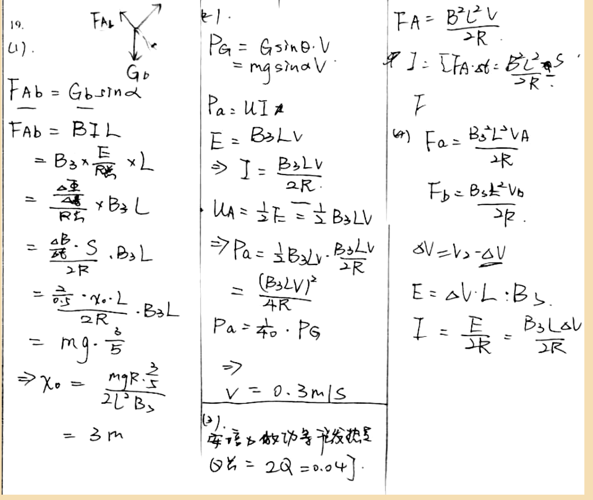

# 审查报告：stu_ans_01

## 1) 样本与任务元信息

- `db_id`: `1`
- `task_id`: `batch-question_19-2a4f3231`
- `question_id(DB)`: `question_19`
- `question_key(映射)`: `question_19`
- `created_at`: `2026-03-24 14:03:46`
- `is_pass`: **False**
- `total_deduction`: **8.0**

## 1.1 标准答案与学生作答图片

### 标准答案


### 学生作答



## 2) Qwen 感知层输出

- `readability_status`: **CLEAR**
- `global_confidence`: **0.93**

### 2.1 结构化元素明细

| element_id | content_type | confidence | raw_content |
|---|---|---:|---|
| `p0_1` | `plain_text` | 0.98 | 19. |
| `p0_2` | `image_diagram` | 0.95 | A force diagram showing two vectors: one labeled F_A pointing upward and to the right, and another labeled G_b pointing downward. The angle between them is marked as α. |
| `p0_3` | `plain_text` | 0.97 | (1). |
| `p0_4` | `latex_formula` | 0.96 | F_{ab} = G_b \sin\alpha |
| `p0_5` | `latex_formula` | 0.95 | F_{ab} = B I L |
| `p0_6` | `latex_formula` | 0.94 | = B_3 \times \frac{E}{R_{总}} \times L |
| `p0_7` | `latex_formula` | 0.93 | = \frac{\Delta B}{\Delta t} \times B_3 L |
| `p0_8` | `latex_formula` | 0.92 | = \frac{\Delta B}{\Delta t} \cdot S \cdot B_3 L |
| `p0_9` | `latex_formula` | 0.91 | = \frac{\dot{B}}{\Delta t} \cdot x_0 \cdot L \cdot B_3 L |
| `p0_10` | `latex_formula` | 0.9 | = mg \cdot \frac{b}{B} |
| `p0_11` | `latex_formula` | 0.89 | \Rightarrow x_0 = \frac{mg R \cdot \frac{2}{5}}{2 L^2 B_3} |
| `p0_12` | `latex_formula` | 0.95 | = 3m |
| `p0_13` | `plain_text` | 0.97 | t-1. |
| `p0_14` | `latex_formula` | 0.96 | P_G = G \sin\theta \cdot V = mg \sin\alpha \cdot V |
| `p0_15` | `latex_formula` | 0.95 | P_a = U I_a |
| `p0_16` | `latex_formula` | 0.94 | E = B_3 L v |
| `p0_17` | `latex_formula` | 0.93 | \Rightarrow I = \frac{B_3 L v}{2R} |
| `p0_18` | `latex_formula` | 0.92 | U_A = \frac{1}{2} E = \frac{1}{2} B_3 L v |
| `p0_19` | `latex_formula` | 0.91 | \Rightarrow P_a = \frac{1}{2} B_3 L v \cdot \frac{B_3 L v}{2R} = \frac{(B_3 L v)^2}{4R} |
| `p0_20` | `latex_formula` | 0.9 | P_a = \frac{1}{40} \cdot P_G |
| `p0_21` | `latex_formula` | 0.89 | \Rightarrow v = 0.3 m/s |
| `p0_22` | `plain_text` | 0.97 | (3). |
| `p0_23` | `plain_text` | 0.95 | <student>安培力做功等于发热是</student> |
| `p0_24` | `latex_formula` | 0.94 | <student>Q = 2Q = 0.04J</student> |
| `p0_25` | `latex_formula` | 0.96 | F_A = \frac{B^2 L^2 v}{2R} |
| `p0_26` | `latex_formula` | 0.95 | \int F_A \cdot dt = \frac{B^2 L^2 S}{2R} |
| `p0_27` | `plain_text` | 0.97 | F |
| `p0_28` | `latex_formula` | 0.94 | F_a = \frac{B_3^2 L^2 v_A}{2R} |
| `p0_29` | `latex_formula` | 0.93 | F_b = \frac{B_3^2 L^2 v_b}{2R} |
| `p0_30` | `latex_formula` | 0.92 | \Delta v = v_2 - \Delta v |
| `p0_31` | `latex_formula` | 0.91 | E = \Delta v \cdot L \cdot B_3 |
| `p0_32` | `latex_formula` | 0.9 | I = \frac{E}{2R} = \frac{B_3 L \Delta v}{2R} |

### 2.2 image_diagram 转译高亮

#### image_diagram 高亮：`p0_2`

```text
A force diagram showing two vectors: one labeled F_A pointing upward and to the right, and another labeled G_b pointing downward. The angle between them is marked as α.
```

## 3) DeepSeek 认知层输出

- 最终判定 `is_fully_correct`: **False**
- 扣分 `total_score_deduction`: **8.0**
- 人工复核标记 `requires_human_review`: **False**
- 系统置信度 `system_confidence`: **0.9**

### 3.1 逻辑推导（可审查视图）

```text
模型未显式输出思维链字段，以下为基于 `step_evaluations` 的可审查推导摘要：
[1] 锚点 `p0_4` -> 正确（NONE）：无补充说明。
[2] 锚点 `p0_12` -> 正确（NONE）：无补充说明。
[3] 锚点 `p0_19` -> 正确（NONE）：无补充说明。
[4] 锚点 `p0_14` -> 正确（NONE）：无补充说明。
[5] 锚点 `p0_20` -> 正确（NONE）：无补充说明。
[6] 锚点 `p0_22` -> 错误（CONCEPTUAL）：Set up the force balance on rod a: BIL + mg sinα = μ mg cosα.
[7] 锚点 `p0_22` -> 错误（CALCULATION）：Solve for the current I and speed v of rod b using the force balance equation.
[8] 锚点 `p0_23` -> 错误（CONCEPTUAL）：Apply energy conservation: mg sinα * s = (1/2) m v^2 + Q_total, where Q_total = 2Q.
[9] 锚点 `p0_24` -> 错误（CALCULATION）：Solve for the distance s from the energy conservation equation.
[10] 锚点 `p0_31` -> 正确（NONE）：无补充说明。
[11] 锚点 `p0_28` -> 错误（CONCEPTUAL）：Write the equation of motion for rod b: mg sinα - B I L = m a.
[12] 锚点 `p0_29` -> 错误（CONCEPTUAL）：Write the equation of motion for rod a: mg sinα + B I L - μ mg cosα = m a.
[13] 锚点 `p0_30` -> 错误（LOGIC）：Apply the steady-state condition where both rods have the same acceleration.
[14] 锚点 `p0_30` -> 错误（CALCULATION）：Solve for the steady-state velocity difference Δv = v_b - v_a.
```

### 3.2 最终反馈

> Student correctly solved parts (1) and (2), obtaining x0 = 3 m and v = 0.3 m/s. However, parts (3) and (4) are incomplete or missing key steps. For part (3), the force balance and energy conservation equations are not properly set up or solved. For part (4), the equations of motion and steady-state condition are not addressed. Review the concepts of electromagnetic induction, force balance, and energy conservation for moving rods on inclined rails.

### 3.3 错误步骤锚点

- 错误锚点数量：**8**
- 错误锚点列表：`p0_22`, `p0_22`, `p0_23`, `p0_24`, `p0_28`, `p0_29`, `p0_30`, `p0_30`

### 3.4 Step 级别明细

| 锚点(reference_element_id) | 正误 | error_type | correction_suggestion |
|---|---|---|---|
| `p0_4` | 正确 | `None` | None |
| `p0_12` | 正确 | `None` | None |
| `p0_19` | 正确 | `None` | None |
| `p0_14` | 正确 | `None` | None |
| `p0_20` | 正确 | `None` | None |
| `p0_22` | 错误 | `CONCEPTUAL` | Set up the force balance on rod a: BIL + mg sinα = μ mg cosα. |
| `p0_22` | 错误 | `CALCULATION` | Solve for the current I and speed v of rod b using the force balance equation. |
| `p0_23` | 错误 | `CONCEPTUAL` | Apply energy conservation: mg sinα * s = (1/2) m v^2 + Q_total, where Q_total = 2Q. |
| `p0_24` | 错误 | `CALCULATION` | Solve for the distance s from the energy conservation equation. |
| `p0_31` | 正确 | `None` | None |
| `p0_28` | 错误 | `CONCEPTUAL` | Write the equation of motion for rod b: mg sinα - B I L = m a. |
| `p0_29` | 错误 | `CONCEPTUAL` | Write the equation of motion for rod a: mg sinα + B I L - μ mg cosα = m a. |
| `p0_30` | 错误 | `LOGIC` | Apply the steady-state condition where both rods have the same acceleration. |
| `p0_30` | 错误 | `CALCULATION` | Solve for the steady-state velocity difference Δv = v_b - v_a. |

## 4) 原始 JSON（审计留痕）

```json
{
  "perception_output": {
    "readability_status": "CLEAR",
    "elements": [
      {
        "element_id": "p0_1",
        "content_type": "plain_text",
        "raw_content": "19.",
        "confidence_score": 0.98,
        "bbox": {
          "x_min": 0.02,
          "y_min": 0.03,
          "x_max": 0.06,
          "y_max": 0.07
        }
      },
      {
        "element_id": "p0_2",
        "content_type": "image_diagram",
        "raw_content": "A force diagram showing two vectors: one labeled F_A pointing upward and to the right, and another labeled G_b pointing downward. The angle between them is marked as α.",
        "confidence_score": 0.95,
        "bbox": {
          "x_min": 0.14,
          "y_min": 0.03,
          "x_max": 0.28,
          "y_max": 0.15
        }
      },
      {
        "element_id": "p0_3",
        "content_type": "plain_text",
        "raw_content": "(1).",
        "confidence_score": 0.97,
        "bbox": {
          "x_min": 0.02,
          "y_min": 0.15,
          "x_max": 0.06,
          "y_max": 0.19
        }
      },
      {
        "element_id": "p0_4",
        "content_type": "latex_formula",
        "raw_content": "F_{ab} = G_b \\sin\\alpha",
        "confidence_score": 0.96,
        "bbox": {
          "x_min": 0.02,
          "y_min": 0.19,
          "x_max": 0.25,
          "y_max": 0.25
        }
      },
      {
        "element_id": "p0_5",
        "content_type": "latex_formula",
        "raw_content": "F_{ab} = B I L",
        "confidence_score": 0.95,
        "bbox": {
          "x_min": 0.02,
          "y_min": 0.25,
          "x_max": 0.25,
          "y_max": 0.31
        }
      },
      {
        "element_id": "p0_6",
        "content_type": "latex_formula",
        "raw_content": "= B_3 \\times \\frac{E}{R_{总}} \\times L",
        "confidence_score": 0.94,
        "bbox": {
          "x_min": 0.02,
          "y_min": 0.31,
          "x_max": 0.25,
          "y_max": 0.37
        }
      },
      {
        "element_id": "p0_7",
        "content_type": "latex_formula",
        "raw_content": "= \\frac{\\Delta B}{\\Delta t} \\times B_3 L",
        "confidence_score": 0.93,
        "bbox": {
          "x_min": 0.02,
          "y_min": 0.37,
          "x_max": 0.25,
          "y_max": 0.43
        }
      },
      {
        "element_id": "p0_8",
        "content_type": "latex_formula",
        "raw_content": "= \\frac{\\Delta B}{\\Delta t} \\cdot S \\cdot B_3 L",
        "confidence_score": 0.92,
        "bbox": {
          "x_min": 0.02,
          "y_min": 0.43,
          "x_max": 0.25,
          "y_max": 0.49
        }
      },
      {
        "element_id": "p0_9",
        "content_type": "latex_formula",
        "raw_content": "= \\frac{\\dot{B}}{\\Delta t} \\cdot x_0 \\cdot L \\cdot B_3 L",
        "confidence_score": 0.91,
        "bbox": {
          "x_min": 0.02,
          "y_min": 0.49,
          "x_max": 0.25,
          "y_max": 0.55
        }
      },
      {
        "element_id": "p0_10",
        "content_type": "latex_formula",
        "raw_content": "= mg \\cdot \\frac{b}{B}",
        "confidence_score": 0.9,
        "bbox": {
          "x_min": 0.02,
          "y_min": 0.55,
          "x_max": 0.25,
          "y_max": 0.61
        }
      },
      {
        "element_id": "p0_11",
        "content_type": "latex_formula",
        "raw_content": "\\Rightarrow x_0 = \\frac{mg R \\cdot \\frac{2}{5}}{2 L^2 B_3}",
        "confidence_score": 0.89,
        "bbox": {
          "x_min": 0.02,
          "y_min": 0.61,
          "x_max": 0.25,
          "y_max": 0.71
        }
      },
      {
        "element_id": "p0_12",
        "content_type": "latex_formula",
        "raw_content": "= 3m",
        "confidence_score": 0.95,
        "bbox": {
          "x_min": 0.02,
          "y_min": 0.71,
          "x_max": 0.25,
          "y_max": 0.77
        }
      },
      {
        "element_id": "p0_13",
        "content_type": "plain_text",
        "raw_content": "t-1.",
        "confidence_score": 0.97,
        "bbox": {
          "x_min": 0.31,
          "y_min": 0.03,
          "x_max": 0.35,
          "y_max": 0.07
        }
      },
      {
        "element_id": "p0_14",
        "content_type": "latex_formula",
        "raw_content": "P_G = G \\sin\\theta \\cdot V = mg \\sin\\alpha \\cdot V",
        "confidence_score": 0.96,
        "bbox": {
          "x_min": 0.31,
          "y_min": 0.07,
          "x_max": 0.55,
          "y_max": 0.15
        }
      },
      {
        "element_id": "p0_15",
        "content_type": "latex_formula",
        "raw_content": "P_a = U I_a",
        "confidence_score": 0.95,
        "bbox": {
          "x_min": 0.31,
          "y_min": 0.15,
          "x_max": 0.55,
          "y_max": 0.21
        }
      },
      {
        "element_id": "p0_16",
        "content_type": "latex_formula",
        "raw_content": "E = B_3 L v",
        "confidence_score": 0.94,
        "bbox": {
          "x_min": 0.31,
          "y_min": 0.21,
          "x_max": 0.55,
          "y_max": 0.27
        }
      },
      {
        "element_id": "p0_17",
        "content_type": "latex_formula",
        "raw_content": "\\Rightarrow I = \\frac{B_3 L v}{2R}",
        "confidence_score": 0.93,
        "bbox": {
          "x_min": 0.31,
          "y_min": 0.27,
          "x_max": 0.55,
          "y_max": 0.33
        }
      },
      {
        "element_id": "p0_18",
        "content_type": "latex_formula",
        "raw_content": "U_A = \\frac{1}{2} E = \\frac{1}{2} B_3 L v",
        "confidence_score": 0.92,
        "bbox": {
          "x_min": 0.31,
          "y_min": 0.33,
          "x_max": 0.55,
          "y_max": 0.39
        }
      },
      {
        "element_id": "p0_19",
        "content_type": "latex_formula",
        "raw_content": "\\Rightarrow P_a = \\frac{1}{2} B_3 L v \\cdot \\frac{B_3 L v}{2R} = \\frac{(B_3 L v)^2}{4R}",
        "confidence_score": 0.91,
        "bbox": {
          "x_min": 0.31,
          "y_min": 0.39,
          "x_max": 0.55,
          "y_max": 0.51
        }
      },
      {
        "element_id": "p0_20",
        "content_type": "latex_formula",
        "raw_content": "P_a = \\frac{1}{40} \\cdot P_G",
        "confidence_score": 0.9,
        "bbox": {
          "x_min": 0.31,
          "y_min": 0.51,
          "x_max": 0.55,
          "y_max": 0.57
        }
      },
      {
        "element_id": "p0_21",
        "content_type": "latex_formula",
        "raw_content": "\\Rightarrow v = 0.3 m/s",
        "confidence_score": 0.89,
        "bbox": {
          "x_min": 0.31,
          "y_min": 0.57,
          "x_max": 0.55,
          "y_max": 0.63
        }
      },
      {
        "element_id": "p0_22",
        "content_type": "plain_text",
        "raw_content": "(3).",
        "confidence_score": 0.97,
        "bbox": {
          "x_min": 0.31,
          "y_min": 0.63,
          "x_max": 0.35,
          "y_max": 0.67
        }
      },
      {
        "element_id": "p0_23",
        "content_type": "plain_text",
        "raw_content": "<student>安培力做功等于发热是</student>",
        "confidence_score": 0.95,
        "bbox": {
          "x_min": 0.31,
          "y_min": 0.67,
          "x_max": 0.55,
          "y_max": 0.73
        }
      },
      {
        "element_id": "p0_24",
        "content_type": "latex_formula",
        "raw_content": "<student>Q = 2Q = 0.04J</student>",
        "confidence_score": 0.94,
        "bbox": {
          "x_min": 0.31,
          "y_min": 0.73,
          "x_max": 0.55,
          "y_max": 0.79
        }
      },
      {
        "element_id": "p0_25",
        "content_type": "latex_formula",
        "raw_content": "F_A = \\frac{B^2 L^2 v}{2R}",
        "confidence_score": 0.96,
        "bbox": {
          "x_min": 0.62,
          "y_min": 0.03,
          "x_max": 0.85,
          "y_max": 0.09
        }
      },
      {
        "element_id": "p0_26",
        "content_type": "latex_formula",
        "raw_content": "\\int F_A \\cdot dt = \\frac{B^2 L^2 S}{2R}",
        "confidence_score": 0.95,
        "bbox": {
          "x_min": 0.62,
          "y_min": 0.09,
          "x_max": 0.85,
          "y_max": 0.15
        }
      },
      {
        "element_id": "p0_27",
        "content_type": "plain_text",
        "raw_content": "F",
        "confidence_score": 0.97,
        "bbox": {
          "x_min": 0.62,
          "y_min": 0.15,
          "x_max": 0.66,
          "y_max": 0.19
        }
      },
      {
        "element_id": "p0_28",
        "content_type": "latex_formula",
        "raw_content": "F_a = \\frac{B_3^2 L^2 v_A}{2R}",
        "confidence_score": 0.94,
        "bbox": {
          "x_min": 0.62,
          "y_min": 0.19,
          "x_max": 0.85,
          "y_max": 0.25
        }
      },
      {
        "element_id": "p0_29",
        "content_type": "latex_formula",
        "raw_content": "F_b = \\frac{B_3^2 L^2 v_b}{2R}",
        "confidence_score": 0.93,
        "bbox": {
          "x_min": 0.62,
          "y_min": 0.25,
          "x_max": 0.85,
          "y_max": 0.31
        }
      },
      {
        "element_id": "p0_30",
        "content_type": "latex_formula",
        "raw_content": "\\Delta v = v_2 - \\Delta v",
        "confidence_score": 0.92,
        "bbox": {
          "x_min": 0.62,
          "y_min": 0.31,
          "x_max": 0.85,
          "y_max": 0.37
        }
      },
      {
        "element_id": "p0_31",
        "content_type": "latex_formula",
        "raw_content": "E = \\Delta v \\cdot L \\cdot B_3",
        "confidence_score": 0.91,
        "bbox": {
          "x_min": 0.62,
          "y_min": 0.37,
          "x_max": 0.85,
          "y_max": 0.43
        }
      },
      {
        "element_id": "p0_32",
        "content_type": "latex_formula",
        "raw_content": "I = \\frac{E}{2R} = \\frac{B_3 L \\Delta v}{2R}",
        "confidence_score": 0.9,
        "bbox": {
          "x_min": 0.62,
          "y_min": 0.43,
          "x_max": 0.85,
          "y_max": 0.49
        }
      }
    ],
    "global_confidence": 0.93,
    "trigger_short_circuit": false
  },
  "evaluation_report": {
    "is_fully_correct": false,
    "total_score_deduction": 8.0,
    "step_evaluations": [
      {
        "reference_element_id": "p0_4",
        "is_correct": true,
        "error_type": null,
        "correction_suggestion": null
      },
      {
        "reference_element_id": "p0_12",
        "is_correct": true,
        "error_type": null,
        "correction_suggestion": null
      },
      {
        "reference_element_id": "p0_19",
        "is_correct": true,
        "error_type": null,
        "correction_suggestion": null
      },
      {
        "reference_element_id": "p0_14",
        "is_correct": true,
        "error_type": null,
        "correction_suggestion": null
      },
      {
        "reference_element_id": "p0_20",
        "is_correct": true,
        "error_type": null,
        "correction_suggestion": null
      },
      {
        "reference_element_id": "p0_22",
        "is_correct": false,
        "error_type": "CONCEPTUAL",
        "correction_suggestion": "Set up the force balance on rod a: BIL + mg sinα = μ mg cosα."
      },
      {
        "reference_element_id": "p0_22",
        "is_correct": false,
        "error_type": "CALCULATION",
        "correction_suggestion": "Solve for the current I and speed v of rod b using the force balance equation."
      },
      {
        "reference_element_id": "p0_23",
        "is_correct": false,
        "error_type": "CONCEPTUAL",
        "correction_suggestion": "Apply energy conservation: mg sinα * s = (1/2) m v^2 + Q_total, where Q_total = 2Q."
      },
      {
        "reference_element_id": "p0_24",
        "is_correct": false,
        "error_type": "CALCULATION",
        "correction_suggestion": "Solve for the distance s from the energy conservation equation."
      },
      {
        "reference_element_id": "p0_31",
        "is_correct": true,
        "error_type": null,
        "correction_suggestion": null
      },
      {
        "reference_element_id": "p0_28",
        "is_correct": false,
        "error_type": "CONCEPTUAL",
        "correction_suggestion": "Write the equation of motion for rod b: mg sinα - B I L = m a."
      },
      {
        "reference_element_id": "p0_29",
        "is_correct": false,
        "error_type": "CONCEPTUAL",
        "correction_suggestion": "Write the equation of motion for rod a: mg sinα + B I L - μ mg cosα = m a."
      },
      {
        "reference_element_id": "p0_30",
        "is_correct": false,
        "error_type": "LOGIC",
        "correction_suggestion": "Apply the steady-state condition where both rods have the same acceleration."
      },
      {
        "reference_element_id": "p0_30",
        "is_correct": false,
        "error_type": "CALCULATION",
        "correction_suggestion": "Solve for the steady-state velocity difference Δv = v_b - v_a."
      }
    ],
    "overall_feedback": "Student correctly solved parts (1) and (2), obtaining x0 = 3 m and v = 0.3 m/s. However, parts (3) and (4) are incomplete or missing key steps. For part (3), the force balance and energy conservation equations are not properly set up or solved. For part (4), the equations of motion and steady-state condition are not addressed. Review the concepts of electromagnetic induction, force balance, and energy conservation for moving rods on inclined rails.",
    "system_confidence": 0.9,
    "requires_human_review": false
  }
}
```
