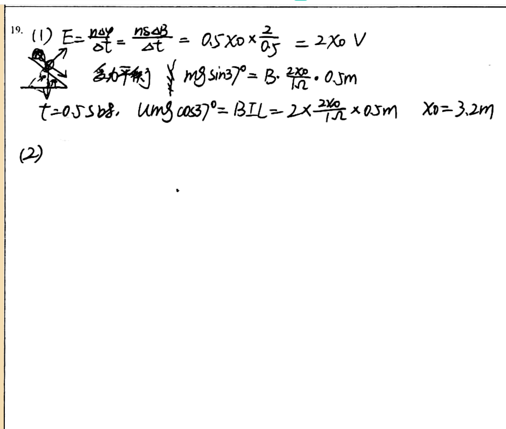

# 审查报告：stu_ans_02

## 1) 样本与任务元信息

- `db_id`: `2`
- `task_id`: `batch-question_19-2a4f3231`
- `question_id(DB)`: `question_19`
- `question_key(映射)`: `question_19`
- `created_at`: `2026-03-24 14:03:46`
- `is_pass`: **False**
- `total_deduction`: **15.0**

## 1.1 标准答案与学生作答图片

### 标准答案


### 学生作答



## 2) Qwen 感知层输出

- `readability_status`: **CLEAR**
- `global_confidence`: **0.96**

### 2.1 结构化元素明细

| element_id | content_type | confidence | raw_content |
|---|---|---:|---|
| `p0_1` | `plain_text` | 0.98 | 19. (1) |
| `p0_2` | `latex_formula` | 0.97 | E=\frac{n\Delta \phi}{\Delta t}=\frac{nS\Delta B}{\Delta t}=0.5\times 0\times \frac{2}{0.5}=2\times 0\ V |
| `p0_3` | `image_diagram` | 0.95 | A hand-drawn diagram showing a triangular setup with an arrow pointing upward from the top vertex, labeled 'B'. The base of the triangle has a horizontal line with a right-angle symbol at one end. A small circle is drawn near the top vertex, possibly representing a pivot or point of interest. |
| `p0_4` | `plain_text` | 0.96 | 受力平衡 |
| `p0_5` | `latex_formula` | 0.96 | mg\sin 37^\circ=B\cdot \frac{2x_0}{1.2}\cdot 0.5m |
| `p0_6` | `latex_formula` | 0.95 | t=0.5s\text{时},\ \mu mg\cos 37^\circ=BIl=2\times \frac{2x_0}{1.2}\times 0.5m |
| `p0_7` | `latex_formula` | 0.97 | x_0=3.2m |
| `p0_8` | `plain_text` | 0.98 | (2) |

### 2.2 image_diagram 转译高亮

#### image_diagram 高亮：`p0_3`

```text
A hand-drawn diagram showing a triangular setup with an arrow pointing upward from the top vertex, labeled 'B'. The base of the triangle has a horizontal line with a right-angle symbol at one end. A small circle is drawn near the top vertex, possibly representing a pivot or point of interest.
```

## 3) DeepSeek 认知层输出

- 最终判定 `is_fully_correct`: **False**
- 扣分 `total_score_deduction`: **15.0**
- 人工复核标记 `requires_human_review`: **False**
- 系统置信度 `system_confidence`: **0.95**

### 3.1 逻辑推导（可审查视图）

```text
模型未显式输出思维链字段，以下为基于 `step_evaluations` 的可审查推导摘要：
[1] 锚点 `p0_1` -> 正确（NONE）：无补充说明。
[2] 锚点 `p0_2` -> 错误（CALCULATION）：The induced emf should be ε = (dB1/dt) L x0 = 4Lx0, and current I = ε/(2R) = 2x0 A.
[3] 锚点 `p0_3` -> 正确（NONE）：无补充说明。
[4] 锚点 `p0_4` -> 正确（NONE）：无补充说明。
[5] 锚点 `p0_5` -> 错误（LOGIC）：For rod b, force balance should be B3 * I * L = mg sinα, with I = 2x0 A.
[6] 锚点 `p0_6` -> 错误（CONCEPTUAL）：For rod a at the moment it starts to move, the equation is BIL + mg sinα = μ mg cosα, not just μ mg cosα = BIL.
[7] 锚点 `p0_7` -> 错误（CALCULATION）：Correct x0 should be 3.00 m.
[8] 锚点 `p0_8` -> 正确（NONE）：无补充说明。
```

### 3.2 最终反馈

> The student attempted part (1) but set up incorrect equations and obtained x0=3.2m instead of 3.00m. Parts (2), (3), and (4) were not addressed, leading to a complete loss of points. Review the force balance and energy conservation principles.

### 3.3 错误步骤锚点

- 错误锚点数量：**4**
- 错误锚点列表：`p0_2`, `p0_5`, `p0_6`, `p0_7`

### 3.4 Step 级别明细

| 锚点(reference_element_id) | 正误 | error_type | correction_suggestion |
|---|---|---|---|
| `p0_1` | 正确 | `NONE` | None |
| `p0_2` | 错误 | `CALCULATION` | The induced emf should be ε = (dB1/dt) L x0 = 4Lx0, and current I = ε/(2R) = 2x0 A. |
| `p0_3` | 正确 | `NONE` | None |
| `p0_4` | 正确 | `NONE` | None |
| `p0_5` | 错误 | `LOGIC` | For rod b, force balance should be B3 * I * L = mg sinα, with I = 2x0 A. |
| `p0_6` | 错误 | `CONCEPTUAL` | For rod a at the moment it starts to move, the equation is BIL + mg sinα = μ mg cosα, not just μ mg cosα = BIL. |
| `p0_7` | 错误 | `CALCULATION` | Correct x0 should be 3.00 m. |
| `p0_8` | 正确 | `NONE` | None |

## 4) 原始 JSON（审计留痕）

```json
{
  "perception_output": {
    "readability_status": "CLEAR",
    "elements": [
      {
        "element_id": "p0_1",
        "content_type": "plain_text",
        "raw_content": "19. (1)",
        "confidence_score": 0.98,
        "bbox": {
          "x_min": 0.02,
          "y_min": 0.05,
          "x_max": 0.12,
          "y_max": 0.13
        }
      },
      {
        "element_id": "p0_2",
        "content_type": "latex_formula",
        "raw_content": "E=\\frac{n\\Delta \\phi}{\\Delta t}=\\frac{nS\\Delta B}{\\Delta t}=0.5\\times 0\\times \\frac{2}{0.5}=2\\times 0\\ V",
        "confidence_score": 0.97,
        "bbox": {
          "x_min": 0.14,
          "y_min": 0.05,
          "x_max": 0.68,
          "y_max": 0.13
        }
      },
      {
        "element_id": "p0_3",
        "content_type": "image_diagram",
        "raw_content": "A hand-drawn diagram showing a triangular setup with an arrow pointing upward from the top vertex, labeled 'B'. The base of the triangle has a horizontal line with a right-angle symbol at one end. A small circle is drawn near the top vertex, possibly representing a pivot or point of interest.",
        "confidence_score": 0.95,
        "bbox": {
          "x_min": 0.04,
          "y_min": 0.13,
          "x_max": 0.13,
          "y_max": 0.23
        }
      },
      {
        "element_id": "p0_4",
        "content_type": "plain_text",
        "raw_content": "受力平衡",
        "confidence_score": 0.96,
        "bbox": {
          "x_min": 0.18,
          "y_min": 0.13,
          "x_max": 0.28,
          "y_max": 0.18
        }
      },
      {
        "element_id": "p0_5",
        "content_type": "latex_formula",
        "raw_content": "mg\\sin 37^\\circ=B\\cdot \\frac{2x_0}{1.2}\\cdot 0.5m",
        "confidence_score": 0.96,
        "bbox": {
          "x_min": 0.31,
          "y_min": 0.13,
          "x_max": 0.55,
          "y_max": 0.18
        }
      },
      {
        "element_id": "p0_6",
        "content_type": "latex_formula",
        "raw_content": "t=0.5s\\text{时},\\ \\mu mg\\cos 37^\\circ=BIl=2\\times \\frac{2x_0}{1.2}\\times 0.5m",
        "confidence_score": 0.95,
        "bbox": {
          "x_min": 0.08,
          "y_min": 0.18,
          "x_max": 0.77,
          "y_max": 0.25
        }
      },
      {
        "element_id": "p0_7",
        "content_type": "latex_formula",
        "raw_content": "x_0=3.2m",
        "confidence_score": 0.97,
        "bbox": {
          "x_min": 0.79,
          "y_min": 0.18,
          "x_max": 0.93,
          "y_max": 0.25
        }
      },
      {
        "element_id": "p0_8",
        "content_type": "plain_text",
        "raw_content": "(2)",
        "confidence_score": 0.98,
        "bbox": {
          "x_min": 0.04,
          "y_min": 0.32,
          "x_max": 0.11,
          "y_max": 0.38
        }
      }
    ],
    "global_confidence": 0.96,
    "trigger_short_circuit": false
  },
  "evaluation_report": {
    "is_fully_correct": false,
    "total_score_deduction": 15.0,
    "step_evaluations": [
      {
        "reference_element_id": "p0_1",
        "is_correct": true,
        "error_type": "NONE",
        "correction_suggestion": null
      },
      {
        "reference_element_id": "p0_2",
        "is_correct": false,
        "error_type": "CALCULATION",
        "correction_suggestion": "The induced emf should be ε = (dB1/dt) L x0 = 4Lx0, and current I = ε/(2R) = 2x0 A."
      },
      {
        "reference_element_id": "p0_3",
        "is_correct": true,
        "error_type": "NONE",
        "correction_suggestion": null
      },
      {
        "reference_element_id": "p0_4",
        "is_correct": true,
        "error_type": "NONE",
        "correction_suggestion": null
      },
      {
        "reference_element_id": "p0_5",
        "is_correct": false,
        "error_type": "LOGIC",
        "correction_suggestion": "For rod b, force balance should be B3 * I * L = mg sinα, with I = 2x0 A."
      },
      {
        "reference_element_id": "p0_6",
        "is_correct": false,
        "error_type": "CONCEPTUAL",
        "correction_suggestion": "For rod a at the moment it starts to move, the equation is BIL + mg sinα = μ mg cosα, not just μ mg cosα = BIL."
      },
      {
        "reference_element_id": "p0_7",
        "is_correct": false,
        "error_type": "CALCULATION",
        "correction_suggestion": "Correct x0 should be 3.00 m."
      },
      {
        "reference_element_id": "p0_8",
        "is_correct": true,
        "error_type": "NONE",
        "correction_suggestion": null
      }
    ],
    "overall_feedback": "The student attempted part (1) but set up incorrect equations and obtained x0=3.2m instead of 3.00m. Parts (2), (3), and (4) were not addressed, leading to a complete loss of points. Review the force balance and energy conservation principles.",
    "system_confidence": 0.95,
    "requires_human_review": false
  }
}
```
