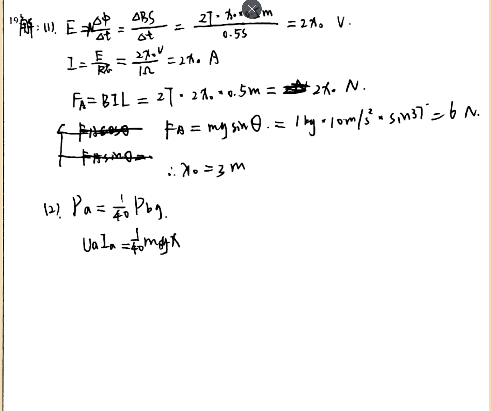

# 审查报告：stu_ans_03

## 1) 样本与任务元信息

- `db_id`: `3`
- `task_id`: `batch-question_19-2a4f3231`
- `question_id(DB)`: `question_19`
- `question_key(映射)`: `question_19`
- `created_at`: `2026-03-24 14:03:46`
- `is_pass`: **False**
- `total_deduction`: **13.0**

## 1.1 标准答案与学生作答图片

### 标准答案


### 学生作答



## 2) Qwen 感知层输出

- `readability_status`: **CLEAR**
- `global_confidence`: **0.96**

### 2.1 结构化元素明细

| element_id | content_type | confidence | raw_content |
|---|---|---:|---|
| `p0_e1` | `plain_text` | 0.98 | 19解：(1). E = \frac{\Delta \phi}{\Delta t} = \frac{\Delta BS}{\Delta t} = \frac{2T \cdot x_0 \cdot 0.5m}{0.5s} = 2x_0 V. |
| `p0_e2` | `latex_formula` | 0.97 | I = \frac{E}{R} = \frac{2x_0 V}{1\Omega} = 2x_0 A |
| `p0_e3` | `latex_formula` | 0.96 | F_A = BIL = 2T \cdot 2x_0 \cdot 0.5m = \boxed{2x_0} N. |
| `p0_e4` | `image_diagram` | 0.95 | A free-body diagram showing two forces: F_parallel = mg sinθ and F_perpendicular = mg cosθ, with θ labeled as 37°. |
| `p0_e5` | `latex_formula` | 0.97 | F_A = mg \sin \theta = 1kg \cdot 10m/s^2 \cdot \sin 37^\circ = 6N. |
| `p0_e6` | `latex_formula` | 0.96 | \therefore x_0 = 3m |
| `p0_e7` | `latex_formula` | 0.95 | (2). P_a = \frac{1}{40} P_b g. |
| `p0_e8` | `latex_formula` | 0.94 | U_a I_a = \frac{1}{40} m g x |

### 2.2 image_diagram 转译高亮

#### image_diagram 高亮：`p0_e4`

```text
A free-body diagram showing two forces: F_parallel = mg sinθ and F_perpendicular = mg cosθ, with θ labeled as 37°.
```

## 3) DeepSeek 认知层输出

- 最终判定 `is_fully_correct`: **False**
- 扣分 `total_score_deduction`: **13.0**
- 人工复核标记 `requires_human_review`: **False**
- 系统置信度 `system_confidence`: **0.95**

### 3.1 逻辑推导（可审查视图）

```text
模型未显式输出思维链字段，以下为基于 `step_evaluations` 的可审查推导摘要：
[1] 锚点 `p0_e1` -> 正确（NONE）：无补充说明。
[2] 锚点 `p0_e2` -> 正确（NONE）：无补充说明。
[3] 锚点 `p0_e3` -> 正确（NONE）：无补充说明。
[4] 锚点 `p0_e4` -> 正确（NONE）：无补充说明。
[5] 锚点 `p0_e5` -> 正确（NONE）：无补充说明。
[6] 锚点 `p0_e6` -> 正确（NONE）：无补充说明。
[7] 锚点 `p0_e7` -> 错误（CONCEPTUAL）：The equation setup for part (2) is unclear. It should be: P_a = I^2 R and P_G = mg sinα v, with P_a = (1/40) P_G. Define symbols clearly and proceed to solve for v.
[8] 锚点 `p0_e8` -> 错误（CONCEPTUAL）：This expression is not correctly formulated for part (2). You need to express the current I in terms of v (from motional emf), then compute P_a and P_G to set up the power balance equation.
```

### 3.2 最终反馈

> Part (1) is correctly solved, obtaining x0 = 3 m. However, part (2) is incomplete with unclear equations, and parts (3) and (4) are not attempted. Review the full problem to address the motion after 0.5 s, the energy conservation for rod a starting to move, and the steady-state velocity difference when both rods move.

### 3.3 错误步骤锚点

- 错误锚点数量：**2**
- 错误锚点列表：`p0_e7`, `p0_e8`

### 3.4 Step 级别明细

| 锚点(reference_element_id) | 正误 | error_type | correction_suggestion |
|---|---|---|---|
| `p0_e1` | 正确 | `NONE` | None |
| `p0_e2` | 正确 | `NONE` | None |
| `p0_e3` | 正确 | `NONE` | None |
| `p0_e4` | 正确 | `NONE` | None |
| `p0_e5` | 正确 | `NONE` | None |
| `p0_e6` | 正确 | `NONE` | None |
| `p0_e7` | 错误 | `CONCEPTUAL` | The equation setup for part (2) is unclear. It should be: P_a = I^2 R and P_G = mg sinα v, with P_a = (1/40) P_G. Define symbols clearly and proceed to solve for v. |
| `p0_e8` | 错误 | `CONCEPTUAL` | This expression is not correctly formulated for part (2). You need to express the current I in terms of v (from motional emf), then compute P_a and P_G to set up the power balance equation. |

## 4) 原始 JSON（审计留痕）

```json
{
  "perception_output": {
    "readability_status": "CLEAR",
    "elements": [
      {
        "element_id": "p0_e1",
        "content_type": "plain_text",
        "raw_content": "19解：(1). E = \\frac{\\Delta \\phi}{\\Delta t} = \\frac{\\Delta BS}{\\Delta t} = \\frac{2T \\cdot x_0 \\cdot 0.5m}{0.5s} = 2x_0 V.",
        "confidence_score": 0.98,
        "bbox": {
          "x_min": 0.02,
          "y_min": 0.03,
          "x_max": 0.76,
          "y_max": 0.14
        }
      },
      {
        "element_id": "p0_e2",
        "content_type": "latex_formula",
        "raw_content": "I = \\frac{E}{R} = \\frac{2x_0 V}{1\\Omega} = 2x_0 A",
        "confidence_score": 0.97,
        "bbox": {
          "x_min": 0.18,
          "y_min": 0.15,
          "x_max": 0.55,
          "y_max": 0.22
        }
      },
      {
        "element_id": "p0_e3",
        "content_type": "latex_formula",
        "raw_content": "F_A = BIL = 2T \\cdot 2x_0 \\cdot 0.5m = \\boxed{2x_0} N.",
        "confidence_score": 0.96,
        "bbox": {
          "x_min": 0.18,
          "y_min": 0.23,
          "x_max": 0.78,
          "y_max": 0.31
        }
      },
      {
        "element_id": "p0_e4",
        "content_type": "image_diagram",
        "raw_content": "A free-body diagram showing two forces: F_parallel = mg sinθ and F_perpendicular = mg cosθ, with θ labeled as 37°.",
        "confidence_score": 0.95,
        "bbox": {
          "x_min": 0.12,
          "y_min": 0.32,
          "x_max": 0.32,
          "y_max": 0.42
        }
      },
      {
        "element_id": "p0_e5",
        "content_type": "latex_formula",
        "raw_content": "F_A = mg \\sin \\theta = 1kg \\cdot 10m/s^2 \\cdot \\sin 37^\\circ = 6N.",
        "confidence_score": 0.97,
        "bbox": {
          "x_min": 0.38,
          "y_min": 0.32,
          "x_max": 0.88,
          "y_max": 0.39
        }
      },
      {
        "element_id": "p0_e6",
        "content_type": "latex_formula",
        "raw_content": "\\therefore x_0 = 3m",
        "confidence_score": 0.96,
        "bbox": {
          "x_min": 0.38,
          "y_min": 0.4,
          "x_max": 0.55,
          "y_max": 0.46
        }
      },
      {
        "element_id": "p0_e7",
        "content_type": "latex_formula",
        "raw_content": "(2). P_a = \\frac{1}{40} P_b g.",
        "confidence_score": 0.95,
        "bbox": {
          "x_min": 0.15,
          "y_min": 0.48,
          "x_max": 0.42,
          "y_max": 0.55
        }
      },
      {
        "element_id": "p0_e8",
        "content_type": "latex_formula",
        "raw_content": "U_a I_a = \\frac{1}{40} m g x",
        "confidence_score": 0.94,
        "bbox": {
          "x_min": 0.22,
          "y_min": 0.56,
          "x_max": 0.45,
          "y_max": 0.63
        }
      }
    ],
    "global_confidence": 0.96,
    "trigger_short_circuit": false
  },
  "evaluation_report": {
    "is_fully_correct": false,
    "total_score_deduction": 13.0,
    "step_evaluations": [
      {
        "reference_element_id": "p0_e1",
        "is_correct": true,
        "error_type": "NONE",
        "correction_suggestion": null
      },
      {
        "reference_element_id": "p0_e2",
        "is_correct": true,
        "error_type": "NONE",
        "correction_suggestion": null
      },
      {
        "reference_element_id": "p0_e3",
        "is_correct": true,
        "error_type": "NONE",
        "correction_suggestion": null
      },
      {
        "reference_element_id": "p0_e4",
        "is_correct": true,
        "error_type": "NONE",
        "correction_suggestion": null
      },
      {
        "reference_element_id": "p0_e5",
        "is_correct": true,
        "error_type": "NONE",
        "correction_suggestion": null
      },
      {
        "reference_element_id": "p0_e6",
        "is_correct": true,
        "error_type": "NONE",
        "correction_suggestion": null
      },
      {
        "reference_element_id": "p0_e7",
        "is_correct": false,
        "error_type": "CONCEPTUAL",
        "correction_suggestion": "The equation setup for part (2) is unclear. It should be: P_a = I^2 R and P_G = mg sinα v, with P_a = (1/40) P_G. Define symbols clearly and proceed to solve for v."
      },
      {
        "reference_element_id": "p0_e8",
        "is_correct": false,
        "error_type": "CONCEPTUAL",
        "correction_suggestion": "This expression is not correctly formulated for part (2). You need to express the current I in terms of v (from motional emf), then compute P_a and P_G to set up the power balance equation."
      }
    ],
    "overall_feedback": "Part (1) is correctly solved, obtaining x0 = 3 m. However, part (2) is incomplete with unclear equations, and parts (3) and (4) are not attempted. Review the full problem to address the motion after 0.5 s, the energy conservation for rod a starting to move, and the steady-state velocity difference when both rods move.",
    "system_confidence": 0.95,
    "requires_human_review": false
  }
}
```
