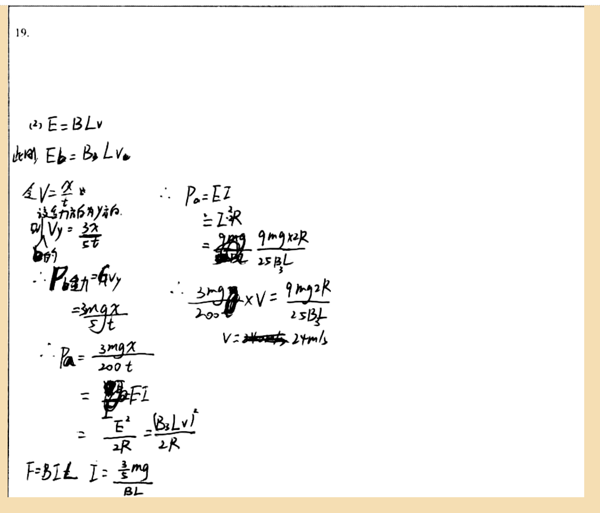

# 审查报告：stu_ans_04

## 1) 样本与任务元信息

- `db_id`: `4`
- `task_id`: `batch-question_19-2a4f3231`
- `question_id(DB)`: `question_19`
- `question_key(映射)`: `question_19`
- `created_at`: `2026-03-24 14:03:46`
- `is_pass`: **False**
- `total_deduction`: **0.0**

## 1.1 标准答案与学生作答图片

### 标准答案


### 学生作答



## 2) Qwen 感知层输出

- `readability_status`: **CLEAR**
- `global_confidence`: **0.95**

### 2.1 结构化元素明细

| element_id | content_type | confidence | raw_content |
|---|---|---:|---|
| `p0_1` | `plain_text` | 0.98 | 19. |
| `p0_2` | `latex_formula` | 0.97 | (3) E = BLv |
| `p0_3` | `plain_text` | 0.96 | 此时, Eb = B₂Lv₀ |
| `p0_4` | `latex_formula` | 0.95 | 设 V = \frac{\alpha}{t} \Rightarrow v_y = \frac{3\alpha}{5t} |
| `p0_5` | `plain_text` | 0.94 | 设运动方向为y方向 |
| `p0_6` | `latex_formula` | 0.93 | P_{\text{阻}} = Fv_y = \frac{3mg\alpha}{5t} |
| `p0_7` | `latex_formula` | 0.92 | P_a = \frac{3mg\alpha}{200t} |
| `p0_8` | `latex_formula` | 0.91 | F = BIL, I = \frac{3mg}{BL} |
| `p0_9` | `latex_formula` | 0.94 | P_o = EI = I^2R = \frac{9mg}{25B^2L^2} \times 2R |
| `p0_10` | `latex_formula` | 0.93 | \frac{3mg}{200} \times V = \frac{9mg \times 2R}{25B^2L^2} |
| `p0_11` | `latex_formula` | 0.92 | V = 24 \, \text{m/s} |
| `p0_12` | `latex_formula` | 0.9 | P_a = \frac{E^2}{2R} = \frac{(B_2Lv)^2}{2R} |

### 2.2 image_diagram 转译高亮

> 本样本无 `image_diagram` 节点。

## 3) DeepSeek 认知层输出

- 最终判定 `is_fully_correct`: **False**
- 扣分 `total_score_deduction`: **0.0**
- 人工复核标记 `requires_human_review`: **True**
- 系统置信度 `system_confidence`: **0.3**

### 3.1 逻辑推导（可审查视图）

```text
模型未显式输出思维链字段，以下为基于 `step_evaluations` 的可审查推导摘要：
[1] 锚点 `p0_1` -> 正确（NONE）：无补充说明。
[2] 锚点 `p0_2` -> 正确（NONE）：无补充说明。
[3] 锚点 `p0_3` -> 错误（CONCEPTUAL）：电动势表达式应与磁场和速度相关，但符号B₂和v₀未定义且与题目上下文不符，请检查磁场符号和速度变量。
[4] 锚点 `p0_4` -> 错误（LOGIC）：假设 V = α/t 和 v_y = 3α/5t 缺乏物理依据，未在问题中定义，请基于牛顿定律或能量守恒推导速度。
[5] 锚点 `p0_5` -> 正确（NONE）：无补充说明。
[6] 锚点 `p0_6` -> 错误（CALCULATION）：阻力功率表达式 P_阻 = Fv_y 中力 F 未定义，且公式 3mgα/(5t) 与正确物理关系不符，应使用重力分量或电磁力。
[7] 锚点 `p0_7` -> 错误（CALCULATION）：P_a 的表达式 3mgα/(200t) 与正确形式 P_a = I^2 R 或 P_a = 0.5v^2 不匹配，请检查功率计算。
[8] 锚点 `p0_8` -> 错误（CONCEPTUAL）：力公式 F = BIL 正确，但电流 I = 3mg/(BL) 错误，I 应依赖于速度 v，而非常数，请根据欧姆定律和电动势求 I。
[9] 锚点 `p0_9` -> 错误（CALCULATION）：功率表达式 P_o = EI = I^2R 形式正确，但具体计算 9mg/(25B^2L^2) × 2R 无合理推导，请重新基于电路参数计算。
[10] 锚点 `p0_10` -> 错误（LOGIC）：等式 3mg/200 × V = 9mg × 2R/(25B^2L^2) 设置错误，未正确建立功率平衡方程 P_a = (1/40)P_G。
[11] 锚点 `p0_11` -> 错误（CALCULATION）：解出的速度 V = 24 m/s 与正确值 v = 0.300 m/s 严重不符，表明计算或公式应用有根本错误。
[12] 锚点 `p0_12` -> 错误（CONCEPTUAL）：P_a = E^2/(2R) 假设电路为单电阻，但实际电路有两个电阻，正确功率应为 P_a = I^2 R，其中 I = E/(2R)。
```

### 3.2 最终反馈

> 学生尝试解决电磁感应问题，但作业呈现混乱的逻辑断层：引入了未定义的变量（如α、t），符号使用不一致，表达式与正确物理关系不符，且最终结果（V=24 m/s）与正确答案（v=0.300 m/s）差异巨大。整体推导缺乏连贯性，无法可靠映射到评分点。建议重新学习电磁感应中的力平衡、能量守恒和电路功率计算，并确保每一步基于给定物理定律。

### 3.3 错误步骤锚点

- 错误锚点数量：**9**
- 错误锚点列表：`p0_3`, `p0_4`, `p0_6`, `p0_7`, `p0_8`, `p0_9`, `p0_10`, `p0_11`, `p0_12`

### 3.4 Step 级别明细

| 锚点(reference_element_id) | 正误 | error_type | correction_suggestion |
|---|---|---|---|
| `p0_1` | 正确 | `NONE` | None |
| `p0_2` | 正确 | `NONE` | None |
| `p0_3` | 错误 | `CONCEPTUAL` | 电动势表达式应与磁场和速度相关，但符号B₂和v₀未定义且与题目上下文不符，请检查磁场符号和速度变量。 |
| `p0_4` | 错误 | `LOGIC` | 假设 V = α/t 和 v_y = 3α/5t 缺乏物理依据，未在问题中定义，请基于牛顿定律或能量守恒推导速度。 |
| `p0_5` | 正确 | `NONE` | None |
| `p0_6` | 错误 | `CALCULATION` | 阻力功率表达式 P_阻 = Fv_y 中力 F 未定义，且公式 3mgα/(5t) 与正确物理关系不符，应使用重力分量或电磁力。 |
| `p0_7` | 错误 | `CALCULATION` | P_a 的表达式 3mgα/(200t) 与正确形式 P_a = I^2 R 或 P_a = 0.5v^2 不匹配，请检查功率计算。 |
| `p0_8` | 错误 | `CONCEPTUAL` | 力公式 F = BIL 正确，但电流 I = 3mg/(BL) 错误，I 应依赖于速度 v，而非常数，请根据欧姆定律和电动势求 I。 |
| `p0_9` | 错误 | `CALCULATION` | 功率表达式 P_o = EI = I^2R 形式正确，但具体计算 9mg/(25B^2L^2) × 2R 无合理推导，请重新基于电路参数计算。 |
| `p0_10` | 错误 | `LOGIC` | 等式 3mg/200 × V = 9mg × 2R/(25B^2L^2) 设置错误，未正确建立功率平衡方程 P_a = (1/40)P_G。 |
| `p0_11` | 错误 | `CALCULATION` | 解出的速度 V = 24 m/s 与正确值 v = 0.300 m/s 严重不符，表明计算或公式应用有根本错误。 |
| `p0_12` | 错误 | `CONCEPTUAL` | P_a = E^2/(2R) 假设电路为单电阻，但实际电路有两个电阻，正确功率应为 P_a = I^2 R，其中 I = E/(2R)。 |

## 4) 原始 JSON（审计留痕）

```json
{
  "perception_output": {
    "readability_status": "CLEAR",
    "elements": [
      {
        "element_id": "p0_1",
        "content_type": "plain_text",
        "raw_content": "19.",
        "confidence_score": 0.98,
        "bbox": {
          "x_min": 0.02,
          "y_min": 0.04,
          "x_max": 0.06,
          "y_max": 0.07
        }
      },
      {
        "element_id": "p0_2",
        "content_type": "latex_formula",
        "raw_content": "(3) E = BLv",
        "confidence_score": 0.97,
        "bbox": {
          "x_min": 0.05,
          "y_min": 0.18,
          "x_max": 0.21,
          "y_max": 0.23
        }
      },
      {
        "element_id": "p0_3",
        "content_type": "plain_text",
        "raw_content": "此时, Eb = B₂Lv₀",
        "confidence_score": 0.96,
        "bbox": {
          "x_min": 0.03,
          "y_min": 0.24,
          "x_max": 0.24,
          "y_max": 0.29
        }
      },
      {
        "element_id": "p0_4",
        "content_type": "latex_formula",
        "raw_content": "设 V = \\frac{\\alpha}{t} \\Rightarrow v_y = \\frac{3\\alpha}{5t}",
        "confidence_score": 0.95,
        "bbox": {
          "x_min": 0.04,
          "y_min": 0.31,
          "x_max": 0.22,
          "y_max": 0.42
        }
      },
      {
        "element_id": "p0_5",
        "content_type": "plain_text",
        "raw_content": "设运动方向为y方向",
        "confidence_score": 0.94,
        "bbox": {
          "x_min": 0.07,
          "y_min": 0.37,
          "x_max": 0.21,
          "y_max": 0.41
        }
      },
      {
        "element_id": "p0_6",
        "content_type": "latex_formula",
        "raw_content": "P_{\\text{阻}} = Fv_y = \\frac{3mg\\alpha}{5t}",
        "confidence_score": 0.93,
        "bbox": {
          "x_min": 0.04,
          "y_min": 0.43,
          "x_max": 0.22,
          "y_max": 0.55
        }
      },
      {
        "element_id": "p0_7",
        "content_type": "latex_formula",
        "raw_content": "P_a = \\frac{3mg\\alpha}{200t}",
        "confidence_score": 0.92,
        "bbox": {
          "x_min": 0.05,
          "y_min": 0.57,
          "x_max": 0.24,
          "y_max": 0.63
        }
      },
      {
        "element_id": "p0_8",
        "content_type": "latex_formula",
        "raw_content": "F = BIL, I = \\frac{3mg}{BL}",
        "confidence_score": 0.91,
        "bbox": {
          "x_min": 0.04,
          "y_min": 0.82,
          "x_max": 0.25,
          "y_max": 0.88
        }
      },
      {
        "element_id": "p0_9",
        "content_type": "latex_formula",
        "raw_content": "P_o = EI = I^2R = \\frac{9mg}{25B^2L^2} \\times 2R",
        "confidence_score": 0.94,
        "bbox": {
          "x_min": 0.35,
          "y_min": 0.31,
          "x_max": 0.58,
          "y_max": 0.51
        }
      },
      {
        "element_id": "p0_10",
        "content_type": "latex_formula",
        "raw_content": "\\frac{3mg}{200} \\times V = \\frac{9mg \\times 2R}{25B^2L^2}",
        "confidence_score": 0.93,
        "bbox": {
          "x_min": 0.33,
          "y_min": 0.53,
          "x_max": 0.58,
          "y_max": 0.61
        }
      },
      {
        "element_id": "p0_11",
        "content_type": "latex_formula",
        "raw_content": "V = 24 \\, \\text{m/s}",
        "confidence_score": 0.92,
        "bbox": {
          "x_min": 0.44,
          "y_min": 0.62,
          "x_max": 0.55,
          "y_max": 0.67
        }
      },
      {
        "element_id": "p0_12",
        "content_type": "latex_formula",
        "raw_content": "P_a = \\frac{E^2}{2R} = \\frac{(B_2Lv)^2}{2R}",
        "confidence_score": 0.9,
        "bbox": {
          "x_min": 0.05,
          "y_min": 0.65,
          "x_max": 0.25,
          "y_max": 0.75
        }
      }
    ],
    "global_confidence": 0.95,
    "trigger_short_circuit": false
  },
  "evaluation_report": {
    "is_fully_correct": false,
    "total_score_deduction": 0.0,
    "step_evaluations": [
      {
        "reference_element_id": "p0_1",
        "is_correct": true,
        "error_type": "NONE",
        "correction_suggestion": null
      },
      {
        "reference_element_id": "p0_2",
        "is_correct": true,
        "error_type": "NONE",
        "correction_suggestion": null
      },
      {
        "reference_element_id": "p0_3",
        "is_correct": false,
        "error_type": "CONCEPTUAL",
        "correction_suggestion": "电动势表达式应与磁场和速度相关，但符号B₂和v₀未定义且与题目上下文不符，请检查磁场符号和速度变量。"
      },
      {
        "reference_element_id": "p0_4",
        "is_correct": false,
        "error_type": "LOGIC",
        "correction_suggestion": "假设 V = α/t 和 v_y = 3α/5t 缺乏物理依据，未在问题中定义，请基于牛顿定律或能量守恒推导速度。"
      },
      {
        "reference_element_id": "p0_5",
        "is_correct": true,
        "error_type": "NONE",
        "correction_suggestion": null
      },
      {
        "reference_element_id": "p0_6",
        "is_correct": false,
        "error_type": "CALCULATION",
        "correction_suggestion": "阻力功率表达式 P_阻 = Fv_y 中力 F 未定义，且公式 3mgα/(5t) 与正确物理关系不符，应使用重力分量或电磁力。"
      },
      {
        "reference_element_id": "p0_7",
        "is_correct": false,
        "error_type": "CALCULATION",
        "correction_suggestion": "P_a 的表达式 3mgα/(200t) 与正确形式 P_a = I^2 R 或 P_a = 0.5v^2 不匹配，请检查功率计算。"
      },
      {
        "reference_element_id": "p0_8",
        "is_correct": false,
        "error_type": "CONCEPTUAL",
        "correction_suggestion": "力公式 F = BIL 正确，但电流 I = 3mg/(BL) 错误，I 应依赖于速度 v，而非常数，请根据欧姆定律和电动势求 I。"
      },
      {
        "reference_element_id": "p0_9",
        "is_correct": false,
        "error_type": "CALCULATION",
        "correction_suggestion": "功率表达式 P_o = EI = I^2R 形式正确，但具体计算 9mg/(25B^2L^2) × 2R 无合理推导，请重新基于电路参数计算。"
      },
      {
        "reference_element_id": "p0_10",
        "is_correct": false,
        "error_type": "LOGIC",
        "correction_suggestion": "等式 3mg/200 × V = 9mg × 2R/(25B^2L^2) 设置错误，未正确建立功率平衡方程 P_a = (1/40)P_G。"
      },
      {
        "reference_element_id": "p0_11",
        "is_correct": false,
        "error_type": "CALCULATION",
        "correction_suggestion": "解出的速度 V = 24 m/s 与正确值 v = 0.300 m/s 严重不符，表明计算或公式应用有根本错误。"
      },
      {
        "reference_element_id": "p0_12",
        "is_correct": false,
        "error_type": "CONCEPTUAL",
        "correction_suggestion": "P_a = E^2/(2R) 假设电路为单电阻，但实际电路有两个电阻，正确功率应为 P_a = I^2 R，其中 I = E/(2R)。"
      }
    ],
    "overall_feedback": "学生尝试解决电磁感应问题，但作业呈现混乱的逻辑断层：引入了未定义的变量（如α、t），符号使用不一致，表达式与正确物理关系不符，且最终结果（V=24 m/s）与正确答案（v=0.300 m/s）差异巨大。整体推导缺乏连贯性，无法可靠映射到评分点。建议重新学习电磁感应中的力平衡、能量守恒和电路功率计算，并确保每一步基于给定物理定律。",
    "system_confidence": 0.3,
    "requires_human_review": true
  }
}
```
