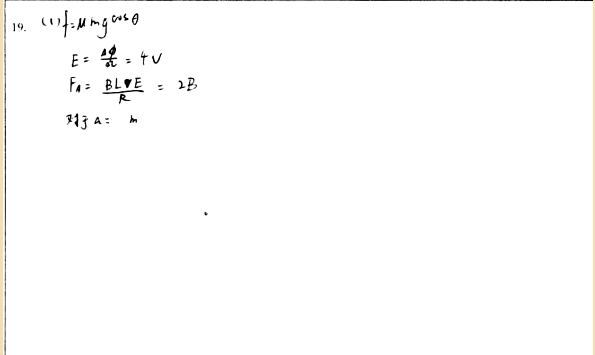

# 审查报告：stu_ans_05

## 1) 样本与任务元信息

- `db_id`: `5`
- `task_id`: `batch-question_19-2a4f3231`
- `question_id(DB)`: `question_19`
- `question_key(映射)`: `question_19`
- `created_at`: `2026-03-24 14:03:46`
- `is_pass`: **False**
- `total_deduction`: **15.0**

## 1.1 标准答案与学生作答图片

### 标准答案


### 学生作答



## 2) Qwen 感知层输出

- `readability_status`: **CLEAR**
- `global_confidence`: **0.96**

### 2.1 结构化元素明细

| element_id | content_type | confidence | raw_content |
|---|---|---:|---|
| `p0_1` | `plain_text` | 0.98 | 19. |
| `p0_2` | `latex_formula` | 0.97 | f=\mu mg\cos\theta |
| `p0_3` | `latex_formula` | 0.96 | E=\frac{\Delta\phi}{\Delta t}=4V |
| `p0_4` | `latex_formula` | 0.95 | F_{A}=\frac{BL\cdot E}{R}=2B |
| `p0_5` | `plain_text` | 0.94 | <student>对于 a: m</student> |

### 2.2 image_diagram 转译高亮

> 本样本无 `image_diagram` 节点。

## 3) DeepSeek 认知层输出

- 最终判定 `is_fully_correct`: **False**
- 扣分 `total_score_deduction`: **15.0**
- 人工复核标记 `requires_human_review`: **True**
- 系统置信度 `system_confidence`: **0.8**

### 3.1 逻辑推导（可审查视图）

```text
模型未显式输出思维链字段，以下为基于 `step_evaluations` 的可审查推导摘要：
[1] 锚点 `p0_1` -> 正确（NONE）：无补充说明。
[2] 锚点 `p0_2` -> 正确（NONE）：无补充说明。
[3] 锚点 `p0_3` -> 正确（NONE）：无补充说明。
[4] 锚点 `p0_4` -> 正确（NONE）：无补充说明。
[5] 锚点 `p0_5` -> 错误（TRANSCRIPTION_ERROR）：内容不清晰，可能为OCR识别错误或书写不规范，请重新检查并清晰表达。
```

### 3.2 最终反馈

> 您的答案不完整，仅包含零散公式（如摩擦力、感应电动势、安培力），缺乏针对问题各部分的具体计算步骤和最终数值结果。请根据问题要求，系统性地推导并求解x0、v、s和Δv等关键量。

### 3.3 错误步骤锚点

- 错误锚点数量：**1**
- 错误锚点列表：`p0_5`

### 3.4 Step 级别明细

| 锚点(reference_element_id) | 正误 | error_type | correction_suggestion |
|---|---|---|---|
| `p0_1` | 正确 | `None` | None |
| `p0_2` | 正确 | `None` | None |
| `p0_3` | 正确 | `None` | None |
| `p0_4` | 正确 | `None` | None |
| `p0_5` | 错误 | `TRANSCRIPTION_ERROR` | 内容不清晰，可能为OCR识别错误或书写不规范，请重新检查并清晰表达。 |

## 4) 原始 JSON（审计留痕）

```json
{
  "perception_output": {
    "readability_status": "CLEAR",
    "elements": [
      {
        "element_id": "p0_1",
        "content_type": "plain_text",
        "raw_content": "19.",
        "confidence_score": 0.98,
        "bbox": {
          "x_min": 0.02,
          "y_min": 0.15,
          "x_max": 0.06,
          "y_max": 0.2
        }
      },
      {
        "element_id": "p0_2",
        "content_type": "latex_formula",
        "raw_content": "f=\\mu mg\\cos\\theta",
        "confidence_score": 0.97,
        "bbox": {
          "x_min": 0.07,
          "y_min": 0.14,
          "x_max": 0.27,
          "y_max": 0.21
        }
      },
      {
        "element_id": "p0_3",
        "content_type": "latex_formula",
        "raw_content": "E=\\frac{\\Delta\\phi}{\\Delta t}=4V",
        "confidence_score": 0.96,
        "bbox": {
          "x_min": 0.12,
          "y_min": 0.23,
          "x_max": 0.29,
          "y_max": 0.29
        }
      },
      {
        "element_id": "p0_4",
        "content_type": "latex_formula",
        "raw_content": "F_{A}=\\frac{BL\\cdot E}{R}=2B",
        "confidence_score": 0.95,
        "bbox": {
          "x_min": 0.11,
          "y_min": 0.31,
          "x_max": 0.34,
          "y_max": 0.38
        }
      },
      {
        "element_id": "p0_5",
        "content_type": "plain_text",
        "raw_content": "<student>对于 a: m</student>",
        "confidence_score": 0.94,
        "bbox": {
          "x_min": 0.12,
          "y_min": 0.39,
          "x_max": 0.25,
          "y_max": 0.44
        }
      }
    ],
    "global_confidence": 0.96,
    "trigger_short_circuit": false
  },
  "evaluation_report": {
    "is_fully_correct": false,
    "total_score_deduction": 15.0,
    "step_evaluations": [
      {
        "reference_element_id": "p0_1",
        "is_correct": true,
        "error_type": null,
        "correction_suggestion": null
      },
      {
        "reference_element_id": "p0_2",
        "is_correct": true,
        "error_type": null,
        "correction_suggestion": null
      },
      {
        "reference_element_id": "p0_3",
        "is_correct": true,
        "error_type": null,
        "correction_suggestion": null
      },
      {
        "reference_element_id": "p0_4",
        "is_correct": true,
        "error_type": null,
        "correction_suggestion": null
      },
      {
        "reference_element_id": "p0_5",
        "is_correct": false,
        "error_type": "TRANSCRIPTION_ERROR",
        "correction_suggestion": "内容不清晰，可能为OCR识别错误或书写不规范，请重新检查并清晰表达。"
      }
    ],
    "overall_feedback": "您的答案不完整，仅包含零散公式（如摩擦力、感应电动势、安培力），缺乏针对问题各部分的具体计算步骤和最终数值结果。请根据问题要求，系统性地推导并求解x0、v、s和Δv等关键量。",
    "system_confidence": 0.8,
    "requires_human_review": true
  }
}
```
