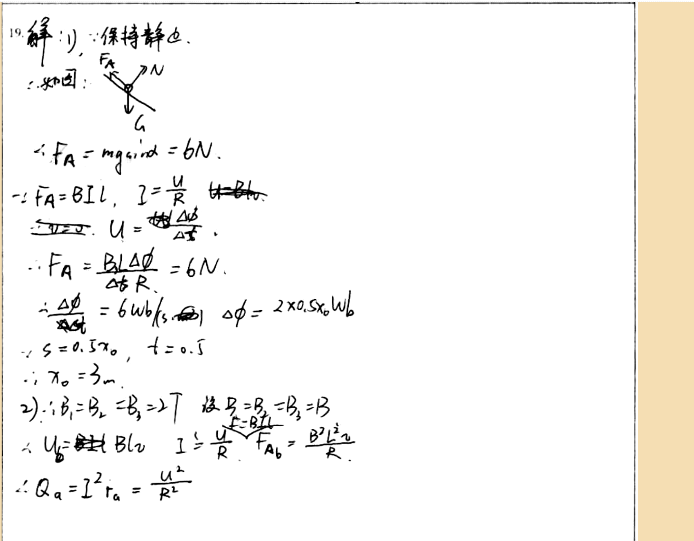

# 审查报告：stu_ans_06

## 1) 样本与任务元信息

- `db_id`: `6`
- `task_id`: `batch-question_19-2a4f3231`
- `question_id(DB)`: `question_19`
- `question_key(映射)`: `question_19`
- `created_at`: `2026-03-24 14:03:46`
- `is_pass`: **False**
- `total_deduction`: **13.0**

## 1.1 标准答案与学生作答图片

### 标准答案


### 学生作答



## 2) Qwen 感知层输出

- `readability_status`: **CLEAR**
- `global_confidence`: **0.97**

### 2.1 结构化元素明细

| element_id | content_type | confidence | raw_content |
|---|---|---:|---|
| `p0_e1` | `plain_text` | 0.98 | 19. 解: 1) ∵ 保持静止. |
| `p0_e2` | `plain_text` | 0.97 | ∴ 如图: |
| `p0_e3` | `image_diagram` | 0.96 | A force diagram showing a point with three vectors: F_A pointing upward-left, N pointing upward-right, and G pointing downward. The angle between F_A and the horizontal is labeled α. |
| `p0_e4` | `latex_formula` | 0.98 | F_A = mg\sin\alpha = 6N |
| `p0_e5` | `latex_formula` | 0.97 | F_A = BIL,\quad I = \frac{U}{R} |
| `p0_e6` | `latex_formula` | 0.96 | U = \frac{\Delta\phi}{\Delta t} |
| `p0_e7` | `latex_formula` | 0.98 | F_A = \frac{BL\Delta\phi}{\Delta t R} = 6N |
| `p0_e8` | `latex_formula` | 0.97 | \frac{\Delta\phi}{\Delta t} = 6Wb/s,\quad \Delta\phi = 2\times0.5x_0Wb |
| `p0_e9` | `latex_formula` | 0.96 | s = 0.5x_0,\quad t = 0.5 |
| `p0_e10` | `latex_formula` | 0.98 | x_0 = 3m |
| `p0_e11` | `plain_text` | 0.97 | 2) ∵ B₁=B₂=B₃=2T 设 B₁=B₂=B₃=B |
| `p0_e12` | `latex_formula` | 0.96 | U_b = BLv,\quad I = \frac{U}{R},\quad F_{Ab} = \frac{B^2l^2v}{R} |
| `p0_e13` | `latex_formula` | 0.98 | Q_a = I^2r_a = \frac{U^2}{R^2} |

### 2.2 image_diagram 转译高亮

#### image_diagram 高亮：`p0_e3`

```text
A force diagram showing a point with three vectors: F_A pointing upward-left, N pointing upward-right, and G pointing downward. The angle between F_A and the horizontal is labeled α.
```

## 3) DeepSeek 认知层输出

- 最终判定 `is_fully_correct`: **False**
- 扣分 `total_score_deduction`: **13.0**
- 人工复核标记 `requires_human_review`: **False**
- 系统置信度 `system_confidence`: **0.95**

### 3.1 逻辑推导（可审查视图）

```text
模型未显式输出思维链字段，以下为基于 `step_evaluations` 的可审查推导摘要：
[1] 锚点 `p0_e1` -> 正确（NONE）：无补充说明。
[2] 锚点 `p0_e2` -> 正确（NONE）：无补充说明。
[3] 锚点 `p0_e3` -> 正确（NONE）：无补充说明。
[4] 锚点 `p0_e4` -> 正确（NONE）：无补充说明。
[5] 锚点 `p0_e5` -> 正确（NONE）：无补充说明。
[6] 锚点 `p0_e6` -> 正确（NONE）：无补充说明。
[7] 锚点 `p0_e7` -> 正确（NONE）：无补充说明。
[8] 锚点 `p0_e8` -> 正确（NONE）：无补充说明。
[9] 锚点 `p0_e9` -> 正确（NONE）：无补充说明。
[10] 锚点 `p0_e10` -> 正确（NONE）：无补充说明。
[11] 锚点 `p0_e11` -> 正确（NONE）：无补充说明。
[12] 锚点 `p0_e12` -> 正确（NONE）：无补充说明。
[13] 锚点 `p0_e13` -> 错误（CALCULATION）：热功率的正确表达式是 P_a = I^2 R = U^2/R，而不是 U^2/R^2。注意电流 I = U/R，所以 I^2 R = (U^2/R^2) * R = U^2/R。
```

### 3.2 最终反馈

> 第一部分解答正确，得到了x0=3m。但第二部分没有完成，第三、四部分未涉及。请补全后续部分的解答。

### 3.3 错误步骤锚点

- 错误锚点数量：**1**
- 错误锚点列表：`p0_e13`

### 3.4 Step 级别明细

| 锚点(reference_element_id) | 正误 | error_type | correction_suggestion |
|---|---|---|---|
| `p0_e1` | 正确 | `NONE` | None |
| `p0_e2` | 正确 | `NONE` | None |
| `p0_e3` | 正确 | `NONE` | None |
| `p0_e4` | 正确 | `NONE` | None |
| `p0_e5` | 正确 | `NONE` | None |
| `p0_e6` | 正确 | `NONE` | None |
| `p0_e7` | 正确 | `NONE` | None |
| `p0_e8` | 正确 | `NONE` | None |
| `p0_e9` | 正确 | `NONE` | None |
| `p0_e10` | 正确 | `NONE` | None |
| `p0_e11` | 正确 | `NONE` | None |
| `p0_e12` | 正确 | `NONE` | None |
| `p0_e13` | 错误 | `CALCULATION` | 热功率的正确表达式是 P_a = I^2 R = U^2/R，而不是 U^2/R^2。注意电流 I = U/R，所以 I^2 R = (U^2/R^2) * R = U^2/R。 |

## 4) 原始 JSON（审计留痕）

```json
{
  "perception_output": {
    "readability_status": "CLEAR",
    "elements": [
      {
        "element_id": "p0_e1",
        "content_type": "plain_text",
        "raw_content": "19. 解: 1) ∵ 保持静止.",
        "confidence_score": 0.98,
        "bbox": {
          "x_min": 0.02,
          "y_min": 0.03,
          "x_max": 0.35,
          "y_max": 0.12
        }
      },
      {
        "element_id": "p0_e2",
        "content_type": "plain_text",
        "raw_content": "∴ 如图:",
        "confidence_score": 0.97,
        "bbox": {
          "x_min": 0.04,
          "y_min": 0.12,
          "x_max": 0.16,
          "y_max": 0.17
        }
      },
      {
        "element_id": "p0_e3",
        "content_type": "image_diagram",
        "raw_content": "A force diagram showing a point with three vectors: F_A pointing upward-left, N pointing upward-right, and G pointing downward. The angle between F_A and the horizontal is labeled α.",
        "confidence_score": 0.96,
        "bbox": {
          "x_min": 0.18,
          "y_min": 0.12,
          "x_max": 0.32,
          "y_max": 0.25
        }
      },
      {
        "element_id": "p0_e4",
        "content_type": "latex_formula",
        "raw_content": "F_A = mg\\sin\\alpha = 6N",
        "confidence_score": 0.98,
        "bbox": {
          "x_min": 0.05,
          "y_min": 0.25,
          "x_max": 0.42,
          "y_max": 0.32
        }
      },
      {
        "element_id": "p0_e5",
        "content_type": "latex_formula",
        "raw_content": "F_A = BIL,\\quad I = \\frac{U}{R}",
        "confidence_score": 0.97,
        "bbox": {
          "x_min": 0.04,
          "y_min": 0.32,
          "x_max": 0.45,
          "y_max": 0.39
        }
      },
      {
        "element_id": "p0_e6",
        "content_type": "latex_formula",
        "raw_content": "U = \\frac{\\Delta\\phi}{\\Delta t}",
        "confidence_score": 0.96,
        "bbox": {
          "x_min": 0.05,
          "y_min": 0.39,
          "x_max": 0.42,
          "y_max": 0.46
        }
      },
      {
        "element_id": "p0_e7",
        "content_type": "latex_formula",
        "raw_content": "F_A = \\frac{BL\\Delta\\phi}{\\Delta t R} = 6N",
        "confidence_score": 0.98,
        "bbox": {
          "x_min": 0.04,
          "y_min": 0.46,
          "x_max": 0.45,
          "y_max": 0.53
        }
      },
      {
        "element_id": "p0_e8",
        "content_type": "latex_formula",
        "raw_content": "\\frac{\\Delta\\phi}{\\Delta t} = 6Wb/s,\\quad \\Delta\\phi = 2\\times0.5x_0Wb",
        "confidence_score": 0.97,
        "bbox": {
          "x_min": 0.05,
          "y_min": 0.53,
          "x_max": 0.65,
          "y_max": 0.61
        }
      },
      {
        "element_id": "p0_e9",
        "content_type": "latex_formula",
        "raw_content": "s = 0.5x_0,\\quad t = 0.5",
        "confidence_score": 0.96,
        "bbox": {
          "x_min": 0.05,
          "y_min": 0.61,
          "x_max": 0.38,
          "y_max": 0.68
        }
      },
      {
        "element_id": "p0_e10",
        "content_type": "latex_formula",
        "raw_content": "x_0 = 3m",
        "confidence_score": 0.98,
        "bbox": {
          "x_min": 0.05,
          "y_min": 0.68,
          "x_max": 0.25,
          "y_max": 0.75
        }
      },
      {
        "element_id": "p0_e11",
        "content_type": "plain_text",
        "raw_content": "2) ∵ B₁=B₂=B₃=2T 设 B₁=B₂=B₃=B",
        "confidence_score": 0.97,
        "bbox": {
          "x_min": 0.05,
          "y_min": 0.75,
          "x_max": 0.58,
          "y_max": 0.82
        }
      },
      {
        "element_id": "p0_e12",
        "content_type": "latex_formula",
        "raw_content": "U_b = BLv,\\quad I = \\frac{U}{R},\\quad F_{Ab} = \\frac{B^2l^2v}{R}",
        "confidence_score": 0.96,
        "bbox": {
          "x_min": 0.05,
          "y_min": 0.82,
          "x_max": 0.65,
          "y_max": 0.9
        }
      },
      {
        "element_id": "p0_e13",
        "content_type": "latex_formula",
        "raw_content": "Q_a = I^2r_a = \\frac{U^2}{R^2}",
        "confidence_score": 0.98,
        "bbox": {
          "x_min": 0.05,
          "y_min": 0.9,
          "x_max": 0.42,
          "y_max": 0.97
        }
      }
    ],
    "global_confidence": 0.97,
    "trigger_short_circuit": false
  },
  "evaluation_report": {
    "is_fully_correct": false,
    "total_score_deduction": 13.0,
    "step_evaluations": [
      {
        "reference_element_id": "p0_e1",
        "is_correct": true,
        "error_type": "NONE",
        "correction_suggestion": null
      },
      {
        "reference_element_id": "p0_e2",
        "is_correct": true,
        "error_type": "NONE",
        "correction_suggestion": null
      },
      {
        "reference_element_id": "p0_e3",
        "is_correct": true,
        "error_type": "NONE",
        "correction_suggestion": null
      },
      {
        "reference_element_id": "p0_e4",
        "is_correct": true,
        "error_type": "NONE",
        "correction_suggestion": null
      },
      {
        "reference_element_id": "p0_e5",
        "is_correct": true,
        "error_type": "NONE",
        "correction_suggestion": null
      },
      {
        "reference_element_id": "p0_e6",
        "is_correct": true,
        "error_type": "NONE",
        "correction_suggestion": null
      },
      {
        "reference_element_id": "p0_e7",
        "is_correct": true,
        "error_type": "NONE",
        "correction_suggestion": null
      },
      {
        "reference_element_id": "p0_e8",
        "is_correct": true,
        "error_type": "NONE",
        "correction_suggestion": null
      },
      {
        "reference_element_id": "p0_e9",
        "is_correct": true,
        "error_type": "NONE",
        "correction_suggestion": null
      },
      {
        "reference_element_id": "p0_e10",
        "is_correct": true,
        "error_type": "NONE",
        "correction_suggestion": null
      },
      {
        "reference_element_id": "p0_e11",
        "is_correct": true,
        "error_type": "NONE",
        "correction_suggestion": null
      },
      {
        "reference_element_id": "p0_e12",
        "is_correct": true,
        "error_type": "NONE",
        "correction_suggestion": null
      },
      {
        "reference_element_id": "p0_e13",
        "is_correct": false,
        "error_type": "CALCULATION",
        "correction_suggestion": "热功率的正确表达式是 P_a = I^2 R = U^2/R，而不是 U^2/R^2。注意电流 I = U/R，所以 I^2 R = (U^2/R^2) * R = U^2/R。"
      }
    ],
    "overall_feedback": "第一部分解答正确，得到了x0=3m。但第二部分没有完成，第三、四部分未涉及。请补全后续部分的解答。",
    "system_confidence": 0.95,
    "requires_human_review": false
  }
}
```
