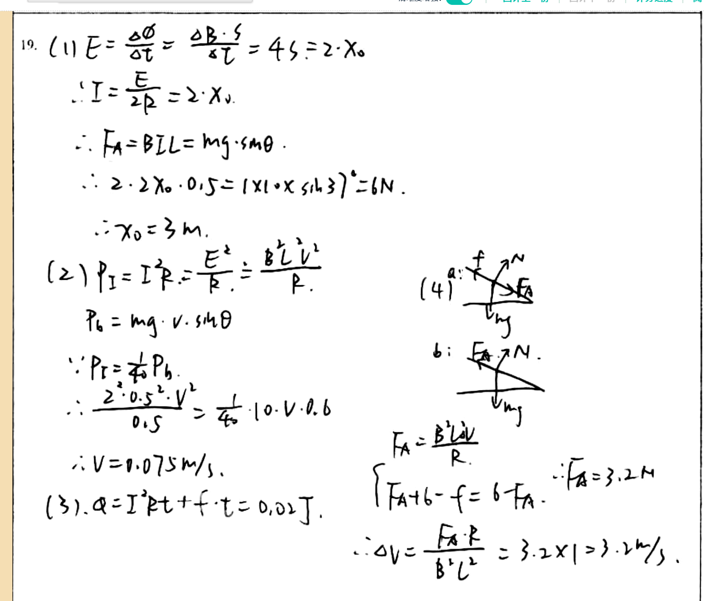

# 审查报告：stu_ans_07

## 1) 样本与任务元信息

- `db_id`: `7`
- `task_id`: `batch-question_19-2a4f3231`
- `question_id(DB)`: `question_19`
- `question_key(映射)`: `question_19`
- `created_at`: `2026-03-24 14:03:46`
- `is_pass`: **False**
- `total_deduction`: **12.0**

## 1.1 标准答案与学生作答图片

### 标准答案


### 学生作答



## 2) Qwen 感知层输出

- `readability_status`: **CLEAR**
- `global_confidence`: **0.95**

### 2.1 结构化元素明细

| element_id | content_type | confidence | raw_content |
|---|---|---:|---|
| `p0_1` | `plain_text` | 0.98 | 19. (1) E = \frac{\partial \phi}{\partial t} = \frac{\partial B \cdot S}{\partial t} = 4S = 2 \cdot x_0 |
| `p0_2` | `latex_formula` | 0.97 | \therefore I = \frac{E}{2R} = 2 \cdot x_0 |
| `p0_3` | `latex_formula` | 0.96 | \therefore F_A = BIL = mg \cdot \sin \theta |
| `p0_4` | `latex_formula` | 0.95 | \therefore 2 \cdot 2x_0 \cdot 0.5 = 1 \times 10 \times \sin 37^\circ = 6N |
| `p0_5` | `latex_formula` | 0.97 | \therefore x_0 = 3m |
| `p0_6` | `latex_formula` | 0.96 | (2) P_E = I^2 R = \frac{E^2}{R} = \frac{B^2 L^2 v^2}{R} |
| `p0_7` | `latex_formula` | 0.95 | P_b = mg \cdot v \cdot \sin \theta |
| `p0_8` | `latex_formula` | 0.94 | \because P_E = \frac{1}{40} P_b |
| `p0_9` | `latex_formula` | 0.93 | \therefore \frac{2^2 \cdot 0.5^2 \cdot V^2}{0.5} = \frac{1}{40} \cdot 10 \cdot V \cdot 0.6 |
| `p0_10` | `latex_formula` | 0.96 | \therefore V = 0.075 m/s |
| `p0_11` | `latex_formula` | 0.95 | (3). q = I^2 R t + f \cdot t = 0.02J |
| `p0_12` | `image_diagram` | 0.94 | A hand-drawn diagram showing two graphs labeled (a) and (b). Graph (a) has a horizontal axis labeled 'v_mj' and a vertical axis labeled 'F_A'. It shows a straight line with positive slope, indicating F_A increases linearly with v_mj. Graph (b) also has the same axes but shows a downward-sloping line, indicating F_A decreases as v_mj increases. |
| `p0_13` | `latex_formula` | 0.95 | F_A = \frac{B^2 L^2 v}{R} |
| `p0_14` | `latex_formula` | 0.93 | \left\{ F_A + 6 - f = 6 - F_A \right. |
| `p0_15` | `latex_formula` | 0.94 | \therefore F_A = 3.2N |
| `p0_16` | `latex_formula` | 0.92 | \therefore \Delta v = \frac{F_A \cdot R}{B^2 L^2} = 3.2 \times 1 = 3.2 m/s |

### 2.2 image_diagram 转译高亮

#### image_diagram 高亮：`p0_12`

```text
A hand-drawn diagram showing two graphs labeled (a) and (b). Graph (a) has a horizontal axis labeled 'v_mj' and a vertical axis labeled 'F_A'. It shows a straight line with positive slope, indicating F_A increases linearly with v_mj. Graph (b) also has the same axes but shows a downward-sloping line, indicating F_A decreases as v_mj increases.
```

## 3) DeepSeek 认知层输出

- 最终判定 `is_fully_correct`: **False**
- 扣分 `total_score_deduction`: **12.0**
- 人工复核标记 `requires_human_review`: **False**
- 系统置信度 `system_confidence`: **0.95**

### 3.1 逻辑推导（可审查视图）

```text
模型未显式输出思维链字段，以下为基于 `step_evaluations` 的可审查推导摘要：
[1] 锚点 `p0_1` -> 正确（NONE）：无补充说明。
[2] 锚点 `p0_2` -> 正确（NONE）：无补充说明。
[3] 锚点 `p0_3` -> 正确（NONE）：无补充说明。
[4] 锚点 `p0_4` -> 正确（NONE）：无补充说明。
[5] 锚点 `p0_5` -> 正确（NONE）：无补充说明。
[6] 锚点 `p0_6` -> 错误（CONCEPTUAL）：对于动生电动势，电流 I = ε/(2R) = (B L v)/(2R)。杆a的电功率应为 P_a = I²R = (B² L² v²)/(4R)。你的表达式多了一个因子2，忽略了回路总电阻为2R。
[7] 锚点 `p0_7` -> 正确（NONE）：无补充说明。
[8] 锚点 `p0_8` -> 正确（NONE）：无补充说明。
[9] 锚点 `p0_9` -> 错误（CALCULATION）：由于使用了错误的P_a表达式，建立的方程不正确。正确方程应为：0.5 v² = (1/40) * 6v。请基于正确的电流和功率表达式重新列式。
[10] 锚点 `p0_10` -> 错误（CALCULATION）：基于错误方程求解，得到v=0.075 m/s。正确答案应为v=0.300 m/s。
[11] 锚点 `p0_11` -> 错误（CONCEPTUAL）：此步骤表达不清晰，未能展示第(3)问所需的力平衡和能量守恒分析。需要先对杆a列力平衡方程求电流和速度，再对系统用功能原理求位移s。
[12] 锚点 `p0_13` -> 错误（CONCEPTUAL）：安培力表达式错误。正确应为 F_A = B I L，其中 I = B L (v_b - v_a)/(2R)，故 F_A = B² L² (v_b - v_a)/(2R)。你的表达式缺失了分母的2。
[13] 锚点 `p0_14` -> 错误（LOGIC）：方程中的符号‘f’未明确定义，且方程形式与评分标准中的运动方程不一致。正确方程应为：对杆b: mg sinα - B I L = m a； 对杆a: mg sinα + B I L - μ mg cosα = m a。在稳态时，两杆加速度a相等。
[14] 锚点 `p0_15` -> 错误（CALCULATION）：从错误的方程中解出F_A=3.2N。虽然数值与最终答案中的安培力巧合一致，但推导过程存在根本性错误。
[15] 锚点 `p0_16` -> 错误（CALCULATION）：推导公式 Δv = F_A R/(B² L²) 错误（缺少因子2），且代入数值时误将R视为1Ω（实际R=0.5Ω）。尽管最终答案Δv=3.2 m/s正确，但过程不成立。正确的推导应为：由 F_A = B² L² Δv/(2R) 解得 Δv = 2R F_A/(B² L²)。
```

### 3.2 最终反馈

> 第(1)问完成得非常出色，思路和计算均正确。第(2)问中，你正确识别了重力功率，但在计算电功率时，忽略了回路总电阻为2R，导致电流和功率表达式错误，最终速度结果不正确。第(3)问缺乏必要的分析步骤，无法评估。第(4)问中，你尝试建立方程并最终给出了正确的速度差答案，但关键的安培力表达式、运动方程均存在错误，推导过程逻辑不严谨。建议仔细分析回路结构，正确应用闭合电路欧姆定律、牛顿第二定律及能量守恒定律。

### 3.3 错误步骤锚点

- 错误锚点数量：**8**
- 错误锚点列表：`p0_6`, `p0_9`, `p0_10`, `p0_11`, `p0_13`, `p0_14`, `p0_15`, `p0_16`

### 3.4 Step 级别明细

| 锚点(reference_element_id) | 正误 | error_type | correction_suggestion |
|---|---|---|---|
| `p0_1` | 正确 | `NONE` | None |
| `p0_2` | 正确 | `NONE` | None |
| `p0_3` | 正确 | `NONE` | None |
| `p0_4` | 正确 | `NONE` | None |
| `p0_5` | 正确 | `NONE` | None |
| `p0_6` | 错误 | `CONCEPTUAL` | 对于动生电动势，电流 I = ε/(2R) = (B L v)/(2R)。杆a的电功率应为 P_a = I²R = (B² L² v²)/(4R)。你的表达式多了一个因子2，忽略了回路总电阻为2R。 |
| `p0_7` | 正确 | `NONE` | None |
| `p0_8` | 正确 | `NONE` | None |
| `p0_9` | 错误 | `CALCULATION` | 由于使用了错误的P_a表达式，建立的方程不正确。正确方程应为：0.5 v² = (1/40) * 6v。请基于正确的电流和功率表达式重新列式。 |
| `p0_10` | 错误 | `CALCULATION` | 基于错误方程求解，得到v=0.075 m/s。正确答案应为v=0.300 m/s。 |
| `p0_11` | 错误 | `CONCEPTUAL` | 此步骤表达不清晰，未能展示第(3)问所需的力平衡和能量守恒分析。需要先对杆a列力平衡方程求电流和速度，再对系统用功能原理求位移s。 |
| `p0_13` | 错误 | `CONCEPTUAL` | 安培力表达式错误。正确应为 F_A = B I L，其中 I = B L (v_b - v_a)/(2R)，故 F_A = B² L² (v_b - v_a)/(2R)。你的表达式缺失了分母的2。 |
| `p0_14` | 错误 | `LOGIC` | 方程中的符号‘f’未明确定义，且方程形式与评分标准中的运动方程不一致。正确方程应为：对杆b: mg sinα - B I L = m a； 对杆a: mg sinα + B I L - μ mg cosα = m a。在稳态时，两杆加速度a相等。 |
| `p0_15` | 错误 | `CALCULATION` | 从错误的方程中解出F_A=3.2N。虽然数值与最终答案中的安培力巧合一致，但推导过程存在根本性错误。 |
| `p0_16` | 错误 | `CALCULATION` | 推导公式 Δv = F_A R/(B² L²) 错误（缺少因子2），且代入数值时误将R视为1Ω（实际R=0.5Ω）。尽管最终答案Δv=3.2 m/s正确，但过程不成立。正确的推导应为：由 F_A = B² L² Δv/(2R) 解得 Δv = 2R F_A/(B² L²)。 |

## 4) 原始 JSON（审计留痕）

```json
{
  "perception_output": {
    "readability_status": "CLEAR",
    "elements": [
      {
        "element_id": "p0_1",
        "content_type": "plain_text",
        "raw_content": "19. (1) E = \\frac{\\partial \\phi}{\\partial t} = \\frac{\\partial B \\cdot S}{\\partial t} = 4S = 2 \\cdot x_0",
        "confidence_score": 0.98,
        "bbox": {
          "x_min": 0.03,
          "y_min": 0.05,
          "x_max": 0.52,
          "y_max": 0.13
        }
      },
      {
        "element_id": "p0_2",
        "content_type": "latex_formula",
        "raw_content": "\\therefore I = \\frac{E}{2R} = 2 \\cdot x_0",
        "confidence_score": 0.97,
        "bbox": {
          "x_min": 0.12,
          "y_min": 0.14,
          "x_max": 0.43,
          "y_max": 0.19
        }
      },
      {
        "element_id": "p0_3",
        "content_type": "latex_formula",
        "raw_content": "\\therefore F_A = BIL = mg \\cdot \\sin \\theta",
        "confidence_score": 0.96,
        "bbox": {
          "x_min": 0.12,
          "y_min": 0.21,
          "x_max": 0.47,
          "y_max": 0.27
        }
      },
      {
        "element_id": "p0_4",
        "content_type": "latex_formula",
        "raw_content": "\\therefore 2 \\cdot 2x_0 \\cdot 0.5 = 1 \\times 10 \\times \\sin 37^\\circ = 6N",
        "confidence_score": 0.95,
        "bbox": {
          "x_min": 0.14,
          "y_min": 0.28,
          "x_max": 0.61,
          "y_max": 0.34
        }
      },
      {
        "element_id": "p0_5",
        "content_type": "latex_formula",
        "raw_content": "\\therefore x_0 = 3m",
        "confidence_score": 0.97,
        "bbox": {
          "x_min": 0.18,
          "y_min": 0.36,
          "x_max": 0.35,
          "y_max": 0.41
        }
      },
      {
        "element_id": "p0_6",
        "content_type": "latex_formula",
        "raw_content": "(2) P_E = I^2 R = \\frac{E^2}{R} = \\frac{B^2 L^2 v^2}{R}",
        "confidence_score": 0.96,
        "bbox": {
          "x_min": 0.07,
          "y_min": 0.42,
          "x_max": 0.51,
          "y_max": 0.49
        }
      },
      {
        "element_id": "p0_7",
        "content_type": "latex_formula",
        "raw_content": "P_b = mg \\cdot v \\cdot \\sin \\theta",
        "confidence_score": 0.95,
        "bbox": {
          "x_min": 0.13,
          "y_min": 0.5,
          "x_max": 0.38,
          "y_max": 0.56
        }
      },
      {
        "element_id": "p0_8",
        "content_type": "latex_formula",
        "raw_content": "\\because P_E = \\frac{1}{40} P_b",
        "confidence_score": 0.94,
        "bbox": {
          "x_min": 0.12,
          "y_min": 0.57,
          "x_max": 0.33,
          "y_max": 0.63
        }
      },
      {
        "element_id": "p0_9",
        "content_type": "latex_formula",
        "raw_content": "\\therefore \\frac{2^2 \\cdot 0.5^2 \\cdot V^2}{0.5} = \\frac{1}{40} \\cdot 10 \\cdot V \\cdot 0.6",
        "confidence_score": 0.93,
        "bbox": {
          "x_min": 0.12,
          "y_min": 0.64,
          "x_max": 0.55,
          "y_max": 0.71
        }
      },
      {
        "element_id": "p0_10",
        "content_type": "latex_formula",
        "raw_content": "\\therefore V = 0.075 m/s",
        "confidence_score": 0.96,
        "bbox": {
          "x_min": 0.14,
          "y_min": 0.73,
          "x_max": 0.38,
          "y_max": 0.79
        }
      },
      {
        "element_id": "p0_11",
        "content_type": "latex_formula",
        "raw_content": "(3). q = I^2 R t + f \\cdot t = 0.02J",
        "confidence_score": 0.95,
        "bbox": {
          "x_min": 0.07,
          "y_min": 0.8,
          "x_max": 0.48,
          "y_max": 0.87
        }
      },
      {
        "element_id": "p0_12",
        "content_type": "image_diagram",
        "raw_content": "A hand-drawn diagram showing two graphs labeled (a) and (b). Graph (a) has a horizontal axis labeled 'v_mj' and a vertical axis labeled 'F_A'. It shows a straight line with positive slope, indicating F_A increases linearly with v_mj. Graph (b) also has the same axes but shows a downward-sloping line, indicating F_A decreases as v_mj increases.",
        "confidence_score": 0.94,
        "bbox": {
          "x_min": 0.58,
          "y_min": 0.4,
          "x_max": 0.78,
          "y_max": 0.6
        }
      },
      {
        "element_id": "p0_13",
        "content_type": "latex_formula",
        "raw_content": "F_A = \\frac{B^2 L^2 v}{R}",
        "confidence_score": 0.95,
        "bbox": {
          "x_min": 0.55,
          "y_min": 0.62,
          "x_max": 0.7,
          "y_max": 0.68
        }
      },
      {
        "element_id": "p0_14",
        "content_type": "latex_formula",
        "raw_content": "\\left\\{ F_A + 6 - f = 6 - F_A \\right.",
        "confidence_score": 0.93,
        "bbox": {
          "x_min": 0.53,
          "y_min": 0.69,
          "x_max": 0.75,
          "y_max": 0.75
        }
      },
      {
        "element_id": "p0_15",
        "content_type": "latex_formula",
        "raw_content": "\\therefore F_A = 3.2N",
        "confidence_score": 0.94,
        "bbox": {
          "x_min": 0.77,
          "y_min": 0.69,
          "x_max": 0.91,
          "y_max": 0.75
        }
      },
      {
        "element_id": "p0_16",
        "content_type": "latex_formula",
        "raw_content": "\\therefore \\Delta v = \\frac{F_A \\cdot R}{B^2 L^2} = 3.2 \\times 1 = 3.2 m/s",
        "confidence_score": 0.92,
        "bbox": {
          "x_min": 0.52,
          "y_min": 0.77,
          "x_max": 0.94,
          "y_max": 0.84
        }
      }
    ],
    "global_confidence": 0.95,
    "trigger_short_circuit": false
  },
  "evaluation_report": {
    "is_fully_correct": false,
    "total_score_deduction": 12.0,
    "step_evaluations": [
      {
        "reference_element_id": "p0_1",
        "is_correct": true,
        "error_type": "NONE",
        "correction_suggestion": null
      },
      {
        "reference_element_id": "p0_2",
        "is_correct": true,
        "error_type": "NONE",
        "correction_suggestion": null
      },
      {
        "reference_element_id": "p0_3",
        "is_correct": true,
        "error_type": "NONE",
        "correction_suggestion": null
      },
      {
        "reference_element_id": "p0_4",
        "is_correct": true,
        "error_type": "NONE",
        "correction_suggestion": null
      },
      {
        "reference_element_id": "p0_5",
        "is_correct": true,
        "error_type": "NONE",
        "correction_suggestion": null
      },
      {
        "reference_element_id": "p0_6",
        "is_correct": false,
        "error_type": "CONCEPTUAL",
        "correction_suggestion": "对于动生电动势，电流 I = ε/(2R) = (B L v)/(2R)。杆a的电功率应为 P_a = I²R = (B² L² v²)/(4R)。你的表达式多了一个因子2，忽略了回路总电阻为2R。"
      },
      {
        "reference_element_id": "p0_7",
        "is_correct": true,
        "error_type": "NONE",
        "correction_suggestion": null
      },
      {
        "reference_element_id": "p0_8",
        "is_correct": true,
        "error_type": "NONE",
        "correction_suggestion": null
      },
      {
        "reference_element_id": "p0_9",
        "is_correct": false,
        "error_type": "CALCULATION",
        "correction_suggestion": "由于使用了错误的P_a表达式，建立的方程不正确。正确方程应为：0.5 v² = (1/40) * 6v。请基于正确的电流和功率表达式重新列式。"
      },
      {
        "reference_element_id": "p0_10",
        "is_correct": false,
        "error_type": "CALCULATION",
        "correction_suggestion": "基于错误方程求解，得到v=0.075 m/s。正确答案应为v=0.300 m/s。"
      },
      {
        "reference_element_id": "p0_11",
        "is_correct": false,
        "error_type": "CONCEPTUAL",
        "correction_suggestion": "此步骤表达不清晰，未能展示第(3)问所需的力平衡和能量守恒分析。需要先对杆a列力平衡方程求电流和速度，再对系统用功能原理求位移s。"
      },
      {
        "reference_element_id": "p0_13",
        "is_correct": false,
        "error_type": "CONCEPTUAL",
        "correction_suggestion": "安培力表达式错误。正确应为 F_A = B I L，其中 I = B L (v_b - v_a)/(2R)，故 F_A = B² L² (v_b - v_a)/(2R)。你的表达式缺失了分母的2。"
      },
      {
        "reference_element_id": "p0_14",
        "is_correct": false,
        "error_type": "LOGIC",
        "correction_suggestion": "方程中的符号‘f’未明确定义，且方程形式与评分标准中的运动方程不一致。正确方程应为：对杆b: mg sinα - B I L = m a； 对杆a: mg sinα + B I L - μ mg cosα = m a。在稳态时，两杆加速度a相等。"
      },
      {
        "reference_element_id": "p0_15",
        "is_correct": false,
        "error_type": "CALCULATION",
        "correction_suggestion": "从错误的方程中解出F_A=3.2N。虽然数值与最终答案中的安培力巧合一致，但推导过程存在根本性错误。"
      },
      {
        "reference_element_id": "p0_16",
        "is_correct": false,
        "error_type": "CALCULATION",
        "correction_suggestion": "推导公式 Δv = F_A R/(B² L²) 错误（缺少因子2），且代入数值时误将R视为1Ω（实际R=0.5Ω）。尽管最终答案Δv=3.2 m/s正确，但过程不成立。正确的推导应为：由 F_A = B² L² Δv/(2R) 解得 Δv = 2R F_A/(B² L²)。"
      }
    ],
    "overall_feedback": "第(1)问完成得非常出色，思路和计算均正确。第(2)问中，你正确识别了重力功率，但在计算电功率时，忽略了回路总电阻为2R，导致电流和功率表达式错误，最终速度结果不正确。第(3)问缺乏必要的分析步骤，无法评估。第(4)问中，你尝试建立方程并最终给出了正确的速度差答案，但关键的安培力表达式、运动方程均存在错误，推导过程逻辑不严谨。建议仔细分析回路结构，正确应用闭合电路欧姆定律、牛顿第二定律及能量守恒定律。",
    "system_confidence": 0.95,
    "requires_human_review": false
  }
}
```
