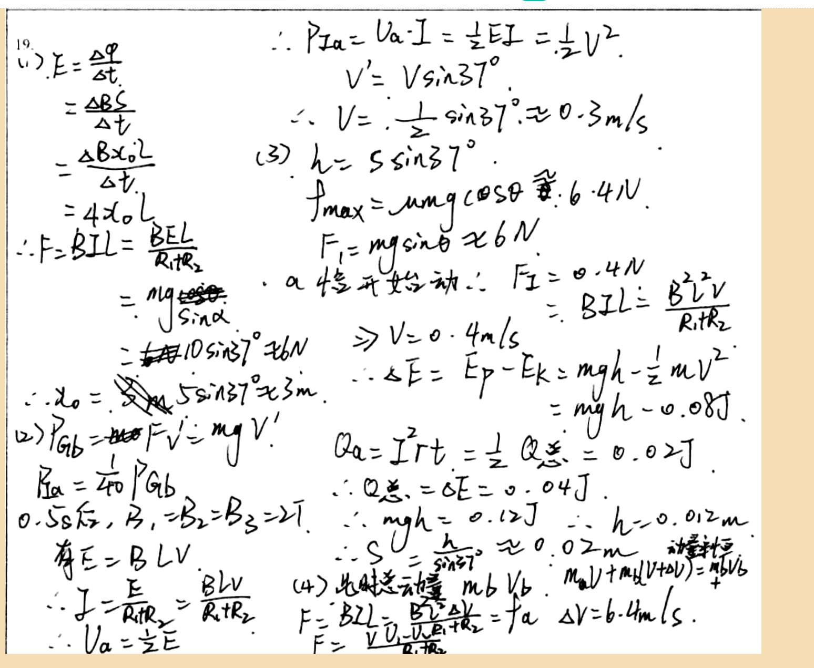

# 审查报告：stu_ans_08

## 1) 样本与任务元信息

- `db_id`: `8`
- `task_id`: `batch-question_19-2a4f3231`
- `question_id(DB)`: `question_19`
- `question_key(映射)`: `question_19`
- `created_at`: `2026-03-24 14:03:46`
- `is_pass`: **False**
- `total_deduction`: **5.0**

## 1.1 标准答案与学生作答图片

### 标准答案


### 学生作答



## 2) Qwen 感知层输出

- `readability_status`: **CLEAR**
- `global_confidence`: **0.96**

### 2.1 结构化元素明细

| element_id | content_type | confidence | raw_content |
|---|---|---:|---|
| `p0_1` | `plain_text` | 0.98 | 19. |
| `p0_2` | `latex_formula` | 0.97 | E = \frac{\Delta \varphi}{\Delta t} |
| `p0_3` | `latex_formula` | 0.96 | = \frac{\Delta B S}{\Delta t} |
| `p0_4` | `latex_formula` | 0.95 | = \frac{\Delta B \times 0.2}{\Delta t} |
| `p0_5` | `latex_formula` | 0.96 | = 4 \times 0.2 |
| `p0_6` | `latex_formula` | 0.97 | \therefore F = B I L = \frac{B E L}{R_1 + R_2} |
| `p0_7` | `latex_formula` | 0.95 | = \frac{m g}{\sin \alpha} |
| `p0_8` | `latex_formula` | 0.96 | = 10 \sin 37^\circ \approx 6 N |
| `p0_9` | `latex_formula` | 0.95 | \therefore x_0 = 5 \sin 37^\circ \approx 3 m |
| `p0_10` | `latex_formula` | 0.97 | (2) P_{ab} = F \cdot V' = m g V' |
| `p0_11` | `latex_formula` | 0.96 | P_a = \frac{1}{40} P_{ab} |
| `p0_12` | `plain_text` | 0.95 | 0.5s后，B₁=B₂=B₃=2T |
| `p0_13` | `plain_text` | 0.96 | 有E = B L V |
| `p0_14` | `latex_formula` | 0.97 | \therefore I = \frac{E}{R_1 + R_2} = \frac{B L V}{R_1 + R_2} |
| `p0_15` | `latex_formula` | 0.96 | \therefore V_a = \frac{1}{2} E |
| `p0_16` | `latex_formula` | 0.97 | \therefore P_{ta} = U_a \cdot I = \frac{1}{2} E I = \frac{1}{2} V^2 |
| `p0_17` | `latex_formula` | 0.96 | V' = V \sin 37^\circ |
| `p0_18` | `latex_formula` | 0.95 | \therefore V = \frac{1}{2} \sin 37^\circ \approx 0.3 m/s |
| `p0_19` | `latex_formula` | 0.97 | (3) h = s \sin 37^\circ |
| `p0_20` | `latex_formula` | 0.96 | f_{max} = \mu m g \cos \theta \approx 6.4 N |
| `p0_21` | `latex_formula` | 0.96 | F_1 = m g \sin \theta \approx 6 N |
| `p0_22` | `plain_text` | 0.95 | a恰开始动 ∴ F_Σ = 0.4N |
| `p0_23` | `latex_formula` | 0.96 | \Rightarrow V = 0.4 m/s |
| `p0_24` | `latex_formula` | 0.97 | \therefore \Delta E = E_p - E_k = m g h - \frac{1}{2} m V^2 |
| `p0_25` | `latex_formula` | 0.96 | = m g h - 0.08 J |
| `p0_26` | `latex_formula` | 0.97 | Q_a = I^2 r t = \frac{1}{2} Q_{总} = 0.02 J |
| `p0_27` | `latex_formula` | 0.96 | \therefore Q_{总} = \Delta E = 0.04 J |
| `p0_28` | `latex_formula` | 0.95 | \therefore m g h = 0.12 J |
| `p0_29` | `latex_formula` | 0.96 | \therefore h = 0.012 m |
| `p0_30` | `latex_formula` | 0.97 | \therefore S = \frac{h}{\sin 37^\circ} \approx 0.02 m |
| `p0_31` | `plain_text` | 0.95 | 动量守恒 |
| `p0_32` | `latex_formula` | 0.96 | (4) 先射运动量 m_b v_b |
| `p0_33` | `latex_formula` | 0.97 | F = B I L = \frac{B L (U_a)}{R_1 + R_2} = f_a |
| `p0_34` | `latex_formula` | 0.95 | F = \frac{V (U_a - U_a)}{R_1 + R_2} |
| `p0_35` | `latex_formula` | 0.96 | \Delta V = 6.4 m/s |

### 2.2 image_diagram 转译高亮

> 本样本无 `image_diagram` 节点。

## 3) DeepSeek 认知层输出

- 最终判定 `is_fully_correct`: **False**
- 扣分 `total_score_deduction`: **5.0**
- 人工复核标记 `requires_human_review`: **False**
- 系统置信度 `system_confidence`: **0.9**

### 3.1 逻辑推导（可审查视图）

```text
模型未显式输出思维链字段，以下为基于 `step_evaluations` 的可审查推导摘要：
[1] 锚点 `p0_6` -> 正确（NONE）：无补充说明。
[2] 锚点 `p0_9` -> 正确（NONE）：无补充说明。
[3] 锚点 `p0_16` -> 正确（NONE）：无补充说明。
[4] 锚点 `p0_10` -> 正确（NONE）：无补充说明。
[5] 锚点 `p0_18` -> 正确（NONE）：无补充说明。
[6] 锚点 `p0_22` -> 正确（NONE）：无补充说明。
[7] 锚点 `p0_23` -> 正确（NONE）：无补充说明。
[8] 锚点 `p0_24` -> 正确（NONE）：无补充说明。
[9] 锚点 `p0_30` -> 正确（NONE）：无补充说明。
[10] 锚点 `p0_34` -> 错误（CONCEPTUAL）：感应电动势应为 ε = B L (v_b - v_a)，其中 v_b 和 v_a 分别为两杆速度。请检查表达式。
[11] 锚点 `p0_33` -> 错误（CONCEPTUAL）：杆 b 的运动方程应为 mg sinα - B I L = m a_b。请正确列出受力分析。
[12] 锚点 `p0_33` -> 错误（CONCEPTUAL）：杆 a 的运动方程应为 mg sinα + B I L - μ mg cosα = m a_a。请正确列出受力分析。
[13] 锚点 `p0_32` -> 错误（CONCEPTUAL）：稳态时两杆加速度相同，需利用此条件联立方程求解速度差。
[14] 锚点 `p0_35` -> 错误（CALCULATION）：稳态速度差应为 Δv = v_b - v_a = 3.2 m/s。请重新求解方程。
```

### 3.2 最终反馈

> 前三问解答正确，思路清晰，计算准确。第四问未能正确建立感应电动势和运动方程，导致最终结果错误。建议复习电磁感应中动生电动势的表达式以及连接体在磁场中的动力学分析方法。

### 3.3 错误步骤锚点

- 错误锚点数量：**5**
- 错误锚点列表：`p0_34`, `p0_33`, `p0_33`, `p0_32`, `p0_35`

### 3.4 Step 级别明细

| 锚点(reference_element_id) | 正误 | error_type | correction_suggestion |
|---|---|---|---|
| `p0_6` | 正确 | `NONE` | None |
| `p0_9` | 正确 | `NONE` | None |
| `p0_16` | 正确 | `NONE` | None |
| `p0_10` | 正确 | `NONE` | None |
| `p0_18` | 正确 | `NONE` | None |
| `p0_22` | 正确 | `NONE` | None |
| `p0_23` | 正确 | `NONE` | None |
| `p0_24` | 正确 | `NONE` | None |
| `p0_30` | 正确 | `NONE` | None |
| `p0_34` | 错误 | `CONCEPTUAL` | 感应电动势应为 ε = B L (v_b - v_a)，其中 v_b 和 v_a 分别为两杆速度。请检查表达式。 |
| `p0_33` | 错误 | `CONCEPTUAL` | 杆 b 的运动方程应为 mg sinα - B I L = m a_b。请正确列出受力分析。 |
| `p0_33` | 错误 | `CONCEPTUAL` | 杆 a 的运动方程应为 mg sinα + B I L - μ mg cosα = m a_a。请正确列出受力分析。 |
| `p0_32` | 错误 | `CONCEPTUAL` | 稳态时两杆加速度相同，需利用此条件联立方程求解速度差。 |
| `p0_35` | 错误 | `CALCULATION` | 稳态速度差应为 Δv = v_b - v_a = 3.2 m/s。请重新求解方程。 |

## 4) 原始 JSON（审计留痕）

```json
{
  "perception_output": {
    "readability_status": "CLEAR",
    "elements": [
      {
        "element_id": "p0_1",
        "content_type": "plain_text",
        "raw_content": "19.",
        "confidence_score": 0.98,
        "bbox": {
          "x_min": 0.02,
          "y_min": 0.04,
          "x_max": 0.06,
          "y_max": 0.07
        }
      },
      {
        "element_id": "p0_2",
        "content_type": "latex_formula",
        "raw_content": "E = \\frac{\\Delta \\varphi}{\\Delta t}",
        "confidence_score": 0.97,
        "bbox": {
          "x_min": 0.03,
          "y_min": 0.07,
          "x_max": 0.15,
          "y_max": 0.12
        }
      },
      {
        "element_id": "p0_3",
        "content_type": "latex_formula",
        "raw_content": "= \\frac{\\Delta B S}{\\Delta t}",
        "confidence_score": 0.96,
        "bbox": {
          "x_min": 0.03,
          "y_min": 0.12,
          "x_max": 0.15,
          "y_max": 0.17
        }
      },
      {
        "element_id": "p0_4",
        "content_type": "latex_formula",
        "raw_content": "= \\frac{\\Delta B \\times 0.2}{\\Delta t}",
        "confidence_score": 0.95,
        "bbox": {
          "x_min": 0.03,
          "y_min": 0.17,
          "x_max": 0.15,
          "y_max": 0.22
        }
      },
      {
        "element_id": "p0_5",
        "content_type": "latex_formula",
        "raw_content": "= 4 \\times 0.2",
        "confidence_score": 0.96,
        "bbox": {
          "x_min": 0.03,
          "y_min": 0.22,
          "x_max": 0.15,
          "y_max": 0.27
        }
      },
      {
        "element_id": "p0_6",
        "content_type": "latex_formula",
        "raw_content": "\\therefore F = B I L = \\frac{B E L}{R_1 + R_2}",
        "confidence_score": 0.97,
        "bbox": {
          "x_min": 0.03,
          "y_min": 0.27,
          "x_max": 0.25,
          "y_max": 0.32
        }
      },
      {
        "element_id": "p0_7",
        "content_type": "latex_formula",
        "raw_content": "= \\frac{m g}{\\sin \\alpha}",
        "confidence_score": 0.95,
        "bbox": {
          "x_min": 0.03,
          "y_min": 0.32,
          "x_max": 0.15,
          "y_max": 0.37
        }
      },
      {
        "element_id": "p0_8",
        "content_type": "latex_formula",
        "raw_content": "= 10 \\sin 37^\\circ \\approx 6 N",
        "confidence_score": 0.96,
        "bbox": {
          "x_min": 0.03,
          "y_min": 0.37,
          "x_max": 0.25,
          "y_max": 0.42
        }
      },
      {
        "element_id": "p0_9",
        "content_type": "latex_formula",
        "raw_content": "\\therefore x_0 = 5 \\sin 37^\\circ \\approx 3 m",
        "confidence_score": 0.95,
        "bbox": {
          "x_min": 0.03,
          "y_min": 0.42,
          "x_max": 0.25,
          "y_max": 0.47
        }
      },
      {
        "element_id": "p0_10",
        "content_type": "latex_formula",
        "raw_content": "(2) P_{ab} = F \\cdot V' = m g V'",
        "confidence_score": 0.97,
        "bbox": {
          "x_min": 0.03,
          "y_min": 0.47,
          "x_max": 0.25,
          "y_max": 0.52
        }
      },
      {
        "element_id": "p0_11",
        "content_type": "latex_formula",
        "raw_content": "P_a = \\frac{1}{40} P_{ab}",
        "confidence_score": 0.96,
        "bbox": {
          "x_min": 0.03,
          "y_min": 0.52,
          "x_max": 0.15,
          "y_max": 0.57
        }
      },
      {
        "element_id": "p0_12",
        "content_type": "plain_text",
        "raw_content": "0.5s后，B₁=B₂=B₃=2T",
        "confidence_score": 0.95,
        "bbox": {
          "x_min": 0.03,
          "y_min": 0.57,
          "x_max": 0.25,
          "y_max": 0.62
        }
      },
      {
        "element_id": "p0_13",
        "content_type": "plain_text",
        "raw_content": "有E = B L V",
        "confidence_score": 0.96,
        "bbox": {
          "x_min": 0.03,
          "y_min": 0.62,
          "x_max": 0.15,
          "y_max": 0.67
        }
      },
      {
        "element_id": "p0_14",
        "content_type": "latex_formula",
        "raw_content": "\\therefore I = \\frac{E}{R_1 + R_2} = \\frac{B L V}{R_1 + R_2}",
        "confidence_score": 0.97,
        "bbox": {
          "x_min": 0.03,
          "y_min": 0.67,
          "x_max": 0.25,
          "y_max": 0.72
        }
      },
      {
        "element_id": "p0_15",
        "content_type": "latex_formula",
        "raw_content": "\\therefore V_a = \\frac{1}{2} E",
        "confidence_score": 0.96,
        "bbox": {
          "x_min": 0.03,
          "y_min": 0.72,
          "x_max": 0.15,
          "y_max": 0.77
        }
      },
      {
        "element_id": "p0_16",
        "content_type": "latex_formula",
        "raw_content": "\\therefore P_{ta} = U_a \\cdot I = \\frac{1}{2} E I = \\frac{1}{2} V^2",
        "confidence_score": 0.97,
        "bbox": {
          "x_min": 0.45,
          "y_min": 0.04,
          "x_max": 0.75,
          "y_max": 0.09
        }
      },
      {
        "element_id": "p0_17",
        "content_type": "latex_formula",
        "raw_content": "V' = V \\sin 37^\\circ",
        "confidence_score": 0.96,
        "bbox": {
          "x_min": 0.45,
          "y_min": 0.09,
          "x_max": 0.65,
          "y_max": 0.14
        }
      },
      {
        "element_id": "p0_18",
        "content_type": "latex_formula",
        "raw_content": "\\therefore V = \\frac{1}{2} \\sin 37^\\circ \\approx 0.3 m/s",
        "confidence_score": 0.95,
        "bbox": {
          "x_min": 0.45,
          "y_min": 0.14,
          "x_max": 0.75,
          "y_max": 0.19
        }
      },
      {
        "element_id": "p0_19",
        "content_type": "latex_formula",
        "raw_content": "(3) h = s \\sin 37^\\circ",
        "confidence_score": 0.97,
        "bbox": {
          "x_min": 0.45,
          "y_min": 0.19,
          "x_max": 0.65,
          "y_max": 0.24
        }
      },
      {
        "element_id": "p0_20",
        "content_type": "latex_formula",
        "raw_content": "f_{max} = \\mu m g \\cos \\theta \\approx 6.4 N",
        "confidence_score": 0.96,
        "bbox": {
          "x_min": 0.45,
          "y_min": 0.24,
          "x_max": 0.75,
          "y_max": 0.29
        }
      },
      {
        "element_id": "p0_21",
        "content_type": "latex_formula",
        "raw_content": "F_1 = m g \\sin \\theta \\approx 6 N",
        "confidence_score": 0.96,
        "bbox": {
          "x_min": 0.45,
          "y_min": 0.29,
          "x_max": 0.75,
          "y_max": 0.34
        }
      },
      {
        "element_id": "p0_22",
        "content_type": "plain_text",
        "raw_content": "a恰开始动 ∴ F_Σ = 0.4N",
        "confidence_score": 0.95,
        "bbox": {
          "x_min": 0.45,
          "y_min": 0.34,
          "x_max": 0.75,
          "y_max": 0.39
        }
      },
      {
        "element_id": "p0_23",
        "content_type": "latex_formula",
        "raw_content": "\\Rightarrow V = 0.4 m/s",
        "confidence_score": 0.96,
        "bbox": {
          "x_min": 0.45,
          "y_min": 0.39,
          "x_max": 0.65,
          "y_max": 0.44
        }
      },
      {
        "element_id": "p0_24",
        "content_type": "latex_formula",
        "raw_content": "\\therefore \\Delta E = E_p - E_k = m g h - \\frac{1}{2} m V^2",
        "confidence_score": 0.97,
        "bbox": {
          "x_min": 0.45,
          "y_min": 0.44,
          "x_max": 0.85,
          "y_max": 0.49
        }
      },
      {
        "element_id": "p0_25",
        "content_type": "latex_formula",
        "raw_content": "= m g h - 0.08 J",
        "confidence_score": 0.96,
        "bbox": {
          "x_min": 0.75,
          "y_min": 0.49,
          "x_max": 0.85,
          "y_max": 0.54
        }
      },
      {
        "element_id": "p0_26",
        "content_type": "latex_formula",
        "raw_content": "Q_a = I^2 r t = \\frac{1}{2} Q_{总} = 0.02 J",
        "confidence_score": 0.97,
        "bbox": {
          "x_min": 0.45,
          "y_min": 0.54,
          "x_max": 0.85,
          "y_max": 0.59
        }
      },
      {
        "element_id": "p0_27",
        "content_type": "latex_formula",
        "raw_content": "\\therefore Q_{总} = \\Delta E = 0.04 J",
        "confidence_score": 0.96,
        "bbox": {
          "x_min": 0.45,
          "y_min": 0.59,
          "x_max": 0.75,
          "y_max": 0.64
        }
      },
      {
        "element_id": "p0_28",
        "content_type": "latex_formula",
        "raw_content": "\\therefore m g h = 0.12 J",
        "confidence_score": 0.95,
        "bbox": {
          "x_min": 0.45,
          "y_min": 0.64,
          "x_max": 0.75,
          "y_max": 0.69
        }
      },
      {
        "element_id": "p0_29",
        "content_type": "latex_formula",
        "raw_content": "\\therefore h = 0.012 m",
        "confidence_score": 0.96,
        "bbox": {
          "x_min": 0.75,
          "y_min": 0.64,
          "x_max": 0.85,
          "y_max": 0.69
        }
      },
      {
        "element_id": "p0_30",
        "content_type": "latex_formula",
        "raw_content": "\\therefore S = \\frac{h}{\\sin 37^\\circ} \\approx 0.02 m",
        "confidence_score": 0.97,
        "bbox": {
          "x_min": 0.45,
          "y_min": 0.69,
          "x_max": 0.75,
          "y_max": 0.74
        }
      },
      {
        "element_id": "p0_31",
        "content_type": "plain_text",
        "raw_content": "动量守恒",
        "confidence_score": 0.95,
        "bbox": {
          "x_min": 0.75,
          "y_min": 0.69,
          "x_max": 0.85,
          "y_max": 0.74
        }
      },
      {
        "element_id": "p0_32",
        "content_type": "latex_formula",
        "raw_content": "(4) 先射运动量 m_b v_b",
        "confidence_score": 0.96,
        "bbox": {
          "x_min": 0.45,
          "y_min": 0.74,
          "x_max": 0.75,
          "y_max": 0.79
        }
      },
      {
        "element_id": "p0_33",
        "content_type": "latex_formula",
        "raw_content": "F = B I L = \\frac{B L (U_a)}{R_1 + R_2} = f_a",
        "confidence_score": 0.97,
        "bbox": {
          "x_min": 0.45,
          "y_min": 0.79,
          "x_max": 0.85,
          "y_max": 0.84
        }
      },
      {
        "element_id": "p0_34",
        "content_type": "latex_formula",
        "raw_content": "F = \\frac{V (U_a - U_a)}{R_1 + R_2}",
        "confidence_score": 0.95,
        "bbox": {
          "x_min": 0.45,
          "y_min": 0.84,
          "x_max": 0.75,
          "y_max": 0.89
        }
      },
      {
        "element_id": "p0_35",
        "content_type": "latex_formula",
        "raw_content": "\\Delta V = 6.4 m/s",
        "confidence_score": 0.96,
        "bbox": {
          "x_min": 0.75,
          "y_min": 0.79,
          "x_max": 0.85,
          "y_max": 0.84
        }
      }
    ],
    "global_confidence": 0.96,
    "trigger_short_circuit": false
  },
  "evaluation_report": {
    "is_fully_correct": false,
    "total_score_deduction": 5.0,
    "step_evaluations": [
      {
        "reference_element_id": "p0_6",
        "is_correct": true,
        "error_type": "NONE",
        "correction_suggestion": null
      },
      {
        "reference_element_id": "p0_9",
        "is_correct": true,
        "error_type": "NONE",
        "correction_suggestion": null
      },
      {
        "reference_element_id": "p0_16",
        "is_correct": true,
        "error_type": "NONE",
        "correction_suggestion": null
      },
      {
        "reference_element_id": "p0_10",
        "is_correct": true,
        "error_type": "NONE",
        "correction_suggestion": null
      },
      {
        "reference_element_id": "p0_18",
        "is_correct": true,
        "error_type": "NONE",
        "correction_suggestion": null
      },
      {
        "reference_element_id": "p0_22",
        "is_correct": true,
        "error_type": "NONE",
        "correction_suggestion": null
      },
      {
        "reference_element_id": "p0_23",
        "is_correct": true,
        "error_type": "NONE",
        "correction_suggestion": null
      },
      {
        "reference_element_id": "p0_24",
        "is_correct": true,
        "error_type": "NONE",
        "correction_suggestion": null
      },
      {
        "reference_element_id": "p0_30",
        "is_correct": true,
        "error_type": "NONE",
        "correction_suggestion": null
      },
      {
        "reference_element_id": "p0_34",
        "is_correct": false,
        "error_type": "CONCEPTUAL",
        "correction_suggestion": "感应电动势应为 ε = B L (v_b - v_a)，其中 v_b 和 v_a 分别为两杆速度。请检查表达式。"
      },
      {
        "reference_element_id": "p0_33",
        "is_correct": false,
        "error_type": "CONCEPTUAL",
        "correction_suggestion": "杆 b 的运动方程应为 mg sinα - B I L = m a_b。请正确列出受力分析。"
      },
      {
        "reference_element_id": "p0_33",
        "is_correct": false,
        "error_type": "CONCEPTUAL",
        "correction_suggestion": "杆 a 的运动方程应为 mg sinα + B I L - μ mg cosα = m a_a。请正确列出受力分析。"
      },
      {
        "reference_element_id": "p0_32",
        "is_correct": false,
        "error_type": "CONCEPTUAL",
        "correction_suggestion": "稳态时两杆加速度相同，需利用此条件联立方程求解速度差。"
      },
      {
        "reference_element_id": "p0_35",
        "is_correct": false,
        "error_type": "CALCULATION",
        "correction_suggestion": "稳态速度差应为 Δv = v_b - v_a = 3.2 m/s。请重新求解方程。"
      }
    ],
    "overall_feedback": "前三问解答正确，思路清晰，计算准确。第四问未能正确建立感应电动势和运动方程，导致最终结果错误。建议复习电磁感应中动生电动势的表达式以及连接体在磁场中的动力学分析方法。",
    "system_confidence": 0.9,
    "requires_human_review": false
  }
}
```
