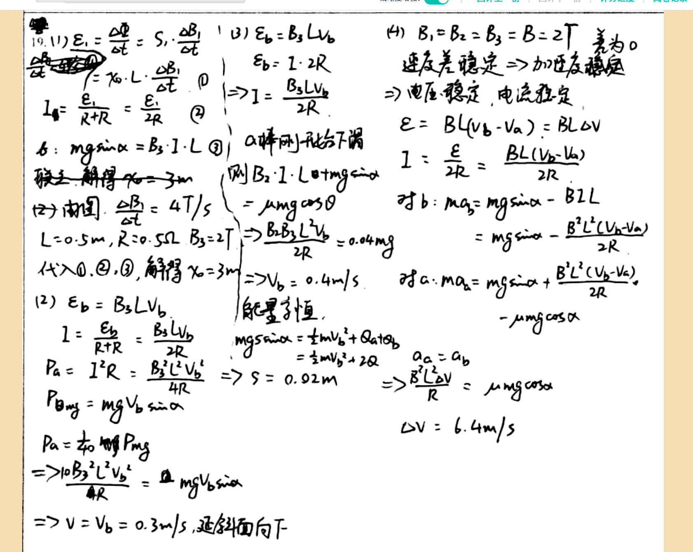

# 审查报告：stu_ans_09

## 1) 样本与任务元信息

- `db_id`: `9`
- `task_id`: `batch-question_19-2a4f3231`
- `question_id(DB)`: `question_19`
- `question_key(映射)`: `question_19`
- `created_at`: `2026-03-24 14:03:46`
- `is_pass`: **False**
- `total_deduction`: **2.0**

## 1.1 标准答案与学生作答图片

### 标准答案


### 学生作答



## 2) Qwen 感知层输出

- `readability_status`: **CLEAR**
- `global_confidence`: **0.93**

### 2.1 结构化元素明细

| element_id | content_type | confidence | raw_content |
|---|---|---:|---|
| `p0_1` | `plain_text` | 0.98 | 19.(1) \varepsilon_{1}=\frac{\Delta \Phi}{\Delta t}=S_{1} \cdot \frac{\Delta B_{1}}{\Delta t} |
| `p0_2` | `latex_formula` | 0.97 | \frac{\Delta \Phi}{\Delta t}=\gamma_{0} \cdot L \cdot \frac{\Delta B_{1}}{\Delta t} \quad (1) |
| `p0_3` | `latex_formula` | 0.96 | I_{a}=\frac{\varepsilon_{1}}{R+r}=\frac{\varepsilon_{1}}{2 R} \quad (2) |
| `p0_4` | `latex_formula` | 0.95 | b: m g \sin \alpha=B_{3} \cdot I \cdot L \quad (3) |
| `p0_5` | `plain_text` | 0.94 | 联立，解得 $\gamma_0 = 3m$ |
| `p0_6` | `latex_formula` | 0.96 | (2) 南图, \frac{\Delta B}{\Delta t}=4 T / s |
| `p0_7` | `latex_formula` | 0.95 | L=0.5 m, R=0.5 \Omega, B_{3}=2 T |
| `p0_8` | `plain_text` | 0.94 | 代入①、②、③，解得 $\gamma_0 = 3m$ |
| `p0_9` | `latex_formula` | 0.97 | (2) \varepsilon_{b}=B_{3} L v_{b} |
| `p0_10` | `latex_formula` | 0.96 | I=\frac{\varepsilon_{b}}{R+r}=\frac{B_{3} L v_{b}}{2 R} |
| `p0_11` | `latex_formula` | 0.95 | P_{a}=I^{2} R=\frac{B_{3}^{2} L^{2} v_{b}^{2}}{4 R} |
| `p0_12` | `latex_formula` | 0.94 | P_{\mathrm{mg}}=m g v_{b} \sin \alpha |
| `p0_13` | `latex_formula` | 0.93 | P_{a}=\frac{1}{40} P_{\mathrm{mg}} |
| `p0_14` | `latex_formula` | 0.92 | \Rightarrow \frac{10 B_{3}^{2} L^{2} v_{b}^{2}}{4 R}=m g v_{b} \sin \alpha |
| `p0_15` | `plain_text` | 0.91 | $\Rightarrow v = v_b = 0.3 m/s$, 延斜面向下 |
| `p0_16` | `latex_formula` | 0.97 | (3) \varepsilon_{b}=B_{3} L v_{b} |
| `p0_17` | `latex_formula` | 0.96 | \varepsilon_{b}=I \cdot 2 R |
| `p0_18` | `latex_formula` | 0.95 | \Rightarrow I=\frac{B_{3} L v_{b}}{2 R} |
| `p0_19` | `plain_text` | 0.94 | a棒刚开始下滑 |
| `p0_20` | `latex_formula` | 0.93 | 则 B_{3} \cdot I \cdot L+\mu m g \cos \theta |
| `p0_21` | `latex_formula` | 0.92 | =\mu m g \cos \theta |
| `p0_22` | `latex_formula` | 0.91 | \Rightarrow \frac{B_{3} B_{3} L^{2} v_{b}}{2 R}=0.04 m g |
| `p0_23` | `latex_formula` | 0.9 | \Rightarrow v_{b}=0.4 m / s |
| `p0_24` | `plain_text` | 0.95 | 能量守恒 |
| `p0_25` | `latex_formula` | 0.94 | m g s \sin \alpha=\frac{1}{2} m v_{b}^{2}+Q_{\text {at }}+q_{b} |
| `p0_26` | `latex_formula` | 0.93 | =\frac{1}{2} m v_{b}^{2}+2 Q |
| `p0_27` | `latex_formula` | 0.92 | \Rightarrow S=0.02 m |
| `p0_28` | `latex_formula` | 0.97 | (4) B_{1}=B_{2}=B_{3}=B=2 T \quad \text { 差为 } 0 |
| `p0_29` | `plain_text` | 0.96 | 速度差稳定 => 加速度稳定 |
| `p0_30` | `plain_text` | 0.95 | => 电压稳定，电流稳定 |
| `p0_31` | `latex_formula` | 0.94 | \varepsilon=B L\left(v_{b}-v_{a}\right)=B L \Delta v |
| `p0_32` | `latex_formula` | 0.93 | I=\frac{\varepsilon}{2 R}=\frac{B L\left(v_{b}-v_{a}\right)}{2 R} |
| `p0_33` | `latex_formula` | 0.92 | 对 b: m a_{b}=m g \sin \alpha-B^{2} L |
| `p0_34` | `latex_formula` | 0.91 | =m g \sin \alpha-\frac{B^{2} L^{2}\left(v_{b}-v_{a}\right)}{2 R} |
| `p0_35` | `latex_formula` | 0.9 | 对 a: m a_{a}=m g \sin \alpha+\frac{B^{2} L^{2}\left(v_{b}-v_{a}\right)}{2 R} |
| `p0_36` | `latex_formula` | 0.89 | -\mu m g \cos \alpha |
| `p0_37` | `latex_formula` | 0.88 | a_{a}=a_{b} |
| `p0_38` | `latex_formula` | 0.87 | \Rightarrow \frac{B^{2} L^{2} \Delta V}{R}=\mu m g \cos \alpha |
| `p0_39` | `latex_formula` | 0.86 | \Delta V=6.4 m / s |

### 2.2 image_diagram 转译高亮

> 本样本无 `image_diagram` 节点。

## 3) DeepSeek 认知层输出

- 最终判定 `is_fully_correct`: **False**
- 扣分 `total_score_deduction`: **2.0**
- 人工复核标记 `requires_human_review`: **False**
- 系统置信度 `system_confidence`: **0.95**

### 3.1 逻辑推导（可审查视图）

```text
模型未显式输出思维链字段，以下为基于 `step_evaluations` 的可审查推导摘要：
[1] 锚点 `p0_4` -> 正确（NONE）：无补充说明。
[2] 锚点 `p0_5` -> 正确（NONE）：无补充说明。
[3] 锚点 `p0_11` -> 正确（NONE）：无补充说明。
[4] 锚点 `p0_12` -> 正确（NONE）：无补充说明。
[5] 锚点 `p0_15` -> 正确（NONE）：无补充说明。
[6] 锚点 `p0_22` -> 正确（NONE）：无补充说明。
[7] 锚点 `p0_23` -> 错误（LOGIC）：应明确解出电流 I=0.4 A，而不仅仅是速度 v_b=0.4 m/s。
[8] 锚点 `p0_25` -> 正确（NONE）：无补充说明。
[9] 锚点 `p0_27` -> 正确（NONE）：无补充说明。
[10] 锚点 `p0_31` -> 正确（NONE）：无补充说明。
[11] 锚点 `p0_34` -> 正确（NONE）：无补充说明。
[12] 锚点 `p0_35` -> 正确（NONE）：无补充说明。
[13] 锚点 `p0_37` -> 正确（NONE）：无补充说明。
[14] 锚点 `p0_39` -> 错误（CALCULATION）：稳态速度差应为 Δv = 3.2 m/s，请检查方程推导或数值计算。
```

### 3.2 最终反馈

> 学生解题思路基本正确，部分(1)和(2)完成良好。在部分(3)中，力平衡方程设置正确但未显式给出电流值；部分(4)中速度差计算错误。总扣分2分。

### 3.3 错误步骤锚点

- 错误锚点数量：**2**
- 错误锚点列表：`p0_23`, `p0_39`

### 3.4 Step 级别明细

| 锚点(reference_element_id) | 正误 | error_type | correction_suggestion |
|---|---|---|---|
| `p0_4` | 正确 | `NONE` | None |
| `p0_5` | 正确 | `NONE` | None |
| `p0_11` | 正确 | `NONE` | None |
| `p0_12` | 正确 | `NONE` | None |
| `p0_15` | 正确 | `NONE` | None |
| `p0_22` | 正确 | `NONE` | None |
| `p0_23` | 错误 | `LOGIC` | 应明确解出电流 I=0.4 A，而不仅仅是速度 v_b=0.4 m/s。 |
| `p0_25` | 正确 | `NONE` | None |
| `p0_27` | 正确 | `NONE` | None |
| `p0_31` | 正确 | `NONE` | None |
| `p0_34` | 正确 | `NONE` | None |
| `p0_35` | 正确 | `NONE` | None |
| `p0_37` | 正确 | `NONE` | None |
| `p0_39` | 错误 | `CALCULATION` | 稳态速度差应为 Δv = 3.2 m/s，请检查方程推导或数值计算。 |

## 4) 原始 JSON（审计留痕）

```json
{
  "perception_output": {
    "readability_status": "CLEAR",
    "elements": [
      {
        "element_id": "p0_1",
        "content_type": "plain_text",
        "raw_content": "19.(1) \\varepsilon_{1}=\\frac{\\Delta \\Phi}{\\Delta t}=S_{1} \\cdot \\frac{\\Delta B_{1}}{\\Delta t}",
        "confidence_score": 0.98,
        "bbox": {
          "x_min": 0.03,
          "y_min": 0.04,
          "x_max": 0.27,
          "y_max": 0.11
        }
      },
      {
        "element_id": "p0_2",
        "content_type": "latex_formula",
        "raw_content": "\\frac{\\Delta \\Phi}{\\Delta t}=\\gamma_{0} \\cdot L \\cdot \\frac{\\Delta B_{1}}{\\Delta t} \\quad (1)",
        "confidence_score": 0.97,
        "bbox": {
          "x_min": 0.03,
          "y_min": 0.11,
          "x_max": 0.25,
          "y_max": 0.16
        }
      },
      {
        "element_id": "p0_3",
        "content_type": "latex_formula",
        "raw_content": "I_{a}=\\frac{\\varepsilon_{1}}{R+r}=\\frac{\\varepsilon_{1}}{2 R} \\quad (2)",
        "confidence_score": 0.96,
        "bbox": {
          "x_min": 0.03,
          "y_min": 0.16,
          "x_max": 0.25,
          "y_max": 0.22
        }
      },
      {
        "element_id": "p0_4",
        "content_type": "latex_formula",
        "raw_content": "b: m g \\sin \\alpha=B_{3} \\cdot I \\cdot L \\quad (3)",
        "confidence_score": 0.95,
        "bbox": {
          "x_min": 0.03,
          "y_min": 0.22,
          "x_max": 0.25,
          "y_max": 0.28
        }
      },
      {
        "element_id": "p0_5",
        "content_type": "plain_text",
        "raw_content": "联立，解得 $\\gamma_0 = 3m$",
        "confidence_score": 0.94,
        "bbox": {
          "x_min": 0.03,
          "y_min": 0.28,
          "x_max": 0.25,
          "y_max": 0.33
        }
      },
      {
        "element_id": "p0_6",
        "content_type": "latex_formula",
        "raw_content": "(2) 南图, \\frac{\\Delta B}{\\Delta t}=4 T / s",
        "confidence_score": 0.96,
        "bbox": {
          "x_min": 0.03,
          "y_min": 0.33,
          "x_max": 0.25,
          "y_max": 0.38
        }
      },
      {
        "element_id": "p0_7",
        "content_type": "latex_formula",
        "raw_content": "L=0.5 m, R=0.5 \\Omega, B_{3}=2 T",
        "confidence_score": 0.95,
        "bbox": {
          "x_min": 0.03,
          "y_min": 0.38,
          "x_max": 0.25,
          "y_max": 0.43
        }
      },
      {
        "element_id": "p0_8",
        "content_type": "plain_text",
        "raw_content": "代入①、②、③，解得 $\\gamma_0 = 3m$",
        "confidence_score": 0.94,
        "bbox": {
          "x_min": 0.03,
          "y_min": 0.43,
          "x_max": 0.25,
          "y_max": 0.48
        }
      },
      {
        "element_id": "p0_9",
        "content_type": "latex_formula",
        "raw_content": "(2) \\varepsilon_{b}=B_{3} L v_{b}",
        "confidence_score": 0.97,
        "bbox": {
          "x_min": 0.03,
          "y_min": 0.48,
          "x_max": 0.25,
          "y_max": 0.53
        }
      },
      {
        "element_id": "p0_10",
        "content_type": "latex_formula",
        "raw_content": "I=\\frac{\\varepsilon_{b}}{R+r}=\\frac{B_{3} L v_{b}}{2 R}",
        "confidence_score": 0.96,
        "bbox": {
          "x_min": 0.03,
          "y_min": 0.53,
          "x_max": 0.25,
          "y_max": 0.58
        }
      },
      {
        "element_id": "p0_11",
        "content_type": "latex_formula",
        "raw_content": "P_{a}=I^{2} R=\\frac{B_{3}^{2} L^{2} v_{b}^{2}}{4 R}",
        "confidence_score": 0.95,
        "bbox": {
          "x_min": 0.03,
          "y_min": 0.58,
          "x_max": 0.25,
          "y_max": 0.63
        }
      },
      {
        "element_id": "p0_12",
        "content_type": "latex_formula",
        "raw_content": "P_{\\mathrm{mg}}=m g v_{b} \\sin \\alpha",
        "confidence_score": 0.94,
        "bbox": {
          "x_min": 0.03,
          "y_min": 0.63,
          "x_max": 0.25,
          "y_max": 0.68
        }
      },
      {
        "element_id": "p0_13",
        "content_type": "latex_formula",
        "raw_content": "P_{a}=\\frac{1}{40} P_{\\mathrm{mg}}",
        "confidence_score": 0.93,
        "bbox": {
          "x_min": 0.03,
          "y_min": 0.68,
          "x_max": 0.25,
          "y_max": 0.73
        }
      },
      {
        "element_id": "p0_14",
        "content_type": "latex_formula",
        "raw_content": "\\Rightarrow \\frac{10 B_{3}^{2} L^{2} v_{b}^{2}}{4 R}=m g v_{b} \\sin \\alpha",
        "confidence_score": 0.92,
        "bbox": {
          "x_min": 0.03,
          "y_min": 0.73,
          "x_max": 0.25,
          "y_max": 0.78
        }
      },
      {
        "element_id": "p0_15",
        "content_type": "plain_text",
        "raw_content": "$\\Rightarrow v = v_b = 0.3 m/s$, 延斜面向下",
        "confidence_score": 0.91,
        "bbox": {
          "x_min": 0.03,
          "y_min": 0.78,
          "x_max": 0.25,
          "y_max": 0.83
        }
      },
      {
        "element_id": "p0_16",
        "content_type": "latex_formula",
        "raw_content": "(3) \\varepsilon_{b}=B_{3} L v_{b}",
        "confidence_score": 0.97,
        "bbox": {
          "x_min": 0.28,
          "y_min": 0.04,
          "x_max": 0.45,
          "y_max": 0.11
        }
      },
      {
        "element_id": "p0_17",
        "content_type": "latex_formula",
        "raw_content": "\\varepsilon_{b}=I \\cdot 2 R",
        "confidence_score": 0.96,
        "bbox": {
          "x_min": 0.28,
          "y_min": 0.11,
          "x_max": 0.45,
          "y_max": 0.16
        }
      },
      {
        "element_id": "p0_18",
        "content_type": "latex_formula",
        "raw_content": "\\Rightarrow I=\\frac{B_{3} L v_{b}}{2 R}",
        "confidence_score": 0.95,
        "bbox": {
          "x_min": 0.28,
          "y_min": 0.16,
          "x_max": 0.45,
          "y_max": 0.22
        }
      },
      {
        "element_id": "p0_19",
        "content_type": "plain_text",
        "raw_content": "a棒刚开始下滑",
        "confidence_score": 0.94,
        "bbox": {
          "x_min": 0.28,
          "y_min": 0.22,
          "x_max": 0.45,
          "y_max": 0.28
        }
      },
      {
        "element_id": "p0_20",
        "content_type": "latex_formula",
        "raw_content": "则 B_{3} \\cdot I \\cdot L+\\mu m g \\cos \\theta",
        "confidence_score": 0.93,
        "bbox": {
          "x_min": 0.28,
          "y_min": 0.28,
          "x_max": 0.45,
          "y_max": 0.33
        }
      },
      {
        "element_id": "p0_21",
        "content_type": "latex_formula",
        "raw_content": "=\\mu m g \\cos \\theta",
        "confidence_score": 0.92,
        "bbox": {
          "x_min": 0.28,
          "y_min": 0.33,
          "x_max": 0.45,
          "y_max": 0.38
        }
      },
      {
        "element_id": "p0_22",
        "content_type": "latex_formula",
        "raw_content": "\\Rightarrow \\frac{B_{3} B_{3} L^{2} v_{b}}{2 R}=0.04 m g",
        "confidence_score": 0.91,
        "bbox": {
          "x_min": 0.28,
          "y_min": 0.38,
          "x_max": 0.45,
          "y_max": 0.43
        }
      },
      {
        "element_id": "p0_23",
        "content_type": "latex_formula",
        "raw_content": "\\Rightarrow v_{b}=0.4 m / s",
        "confidence_score": 0.9,
        "bbox": {
          "x_min": 0.28,
          "y_min": 0.43,
          "x_max": 0.45,
          "y_max": 0.48
        }
      },
      {
        "element_id": "p0_24",
        "content_type": "plain_text",
        "raw_content": "能量守恒",
        "confidence_score": 0.95,
        "bbox": {
          "x_min": 0.28,
          "y_min": 0.48,
          "x_max": 0.45,
          "y_max": 0.53
        }
      },
      {
        "element_id": "p0_25",
        "content_type": "latex_formula",
        "raw_content": "m g s \\sin \\alpha=\\frac{1}{2} m v_{b}^{2}+Q_{\\text {at }}+q_{b}",
        "confidence_score": 0.94,
        "bbox": {
          "x_min": 0.28,
          "y_min": 0.53,
          "x_max": 0.45,
          "y_max": 0.58
        }
      },
      {
        "element_id": "p0_26",
        "content_type": "latex_formula",
        "raw_content": "=\\frac{1}{2} m v_{b}^{2}+2 Q",
        "confidence_score": 0.93,
        "bbox": {
          "x_min": 0.28,
          "y_min": 0.58,
          "x_max": 0.45,
          "y_max": 0.63
        }
      },
      {
        "element_id": "p0_27",
        "content_type": "latex_formula",
        "raw_content": "\\Rightarrow S=0.02 m",
        "confidence_score": 0.92,
        "bbox": {
          "x_min": 0.28,
          "y_min": 0.63,
          "x_max": 0.45,
          "y_max": 0.68
        }
      },
      {
        "element_id": "p0_28",
        "content_type": "latex_formula",
        "raw_content": "(4) B_{1}=B_{2}=B_{3}=B=2 T \\quad \\text { 差为 } 0",
        "confidence_score": 0.97,
        "bbox": {
          "x_min": 0.52,
          "y_min": 0.04,
          "x_max": 0.85,
          "y_max": 0.11
        }
      },
      {
        "element_id": "p0_29",
        "content_type": "plain_text",
        "raw_content": "速度差稳定 => 加速度稳定",
        "confidence_score": 0.96,
        "bbox": {
          "x_min": 0.52,
          "y_min": 0.11,
          "x_max": 0.85,
          "y_max": 0.16
        }
      },
      {
        "element_id": "p0_30",
        "content_type": "plain_text",
        "raw_content": "=> 电压稳定，电流稳定",
        "confidence_score": 0.95,
        "bbox": {
          "x_min": 0.52,
          "y_min": 0.16,
          "x_max": 0.85,
          "y_max": 0.22
        }
      },
      {
        "element_id": "p0_31",
        "content_type": "latex_formula",
        "raw_content": "\\varepsilon=B L\\left(v_{b}-v_{a}\\right)=B L \\Delta v",
        "confidence_score": 0.94,
        "bbox": {
          "x_min": 0.52,
          "y_min": 0.22,
          "x_max": 0.85,
          "y_max": 0.28
        }
      },
      {
        "element_id": "p0_32",
        "content_type": "latex_formula",
        "raw_content": "I=\\frac{\\varepsilon}{2 R}=\\frac{B L\\left(v_{b}-v_{a}\\right)}{2 R}",
        "confidence_score": 0.93,
        "bbox": {
          "x_min": 0.52,
          "y_min": 0.28,
          "x_max": 0.85,
          "y_max": 0.33
        }
      },
      {
        "element_id": "p0_33",
        "content_type": "latex_formula",
        "raw_content": "对 b: m a_{b}=m g \\sin \\alpha-B^{2} L",
        "confidence_score": 0.92,
        "bbox": {
          "x_min": 0.52,
          "y_min": 0.33,
          "x_max": 0.85,
          "y_max": 0.38
        }
      },
      {
        "element_id": "p0_34",
        "content_type": "latex_formula",
        "raw_content": "=m g \\sin \\alpha-\\frac{B^{2} L^{2}\\left(v_{b}-v_{a}\\right)}{2 R}",
        "confidence_score": 0.91,
        "bbox": {
          "x_min": 0.52,
          "y_min": 0.38,
          "x_max": 0.85,
          "y_max": 0.43
        }
      },
      {
        "element_id": "p0_35",
        "content_type": "latex_formula",
        "raw_content": "对 a: m a_{a}=m g \\sin \\alpha+\\frac{B^{2} L^{2}\\left(v_{b}-v_{a}\\right)}{2 R}",
        "confidence_score": 0.9,
        "bbox": {
          "x_min": 0.52,
          "y_min": 0.43,
          "x_max": 0.85,
          "y_max": 0.48
        }
      },
      {
        "element_id": "p0_36",
        "content_type": "latex_formula",
        "raw_content": "-\\mu m g \\cos \\alpha",
        "confidence_score": 0.89,
        "bbox": {
          "x_min": 0.52,
          "y_min": 0.48,
          "x_max": 0.85,
          "y_max": 0.53
        }
      },
      {
        "element_id": "p0_37",
        "content_type": "latex_formula",
        "raw_content": "a_{a}=a_{b}",
        "confidence_score": 0.88,
        "bbox": {
          "x_min": 0.52,
          "y_min": 0.53,
          "x_max": 0.85,
          "y_max": 0.58
        }
      },
      {
        "element_id": "p0_38",
        "content_type": "latex_formula",
        "raw_content": "\\Rightarrow \\frac{B^{2} L^{2} \\Delta V}{R}=\\mu m g \\cos \\alpha",
        "confidence_score": 0.87,
        "bbox": {
          "x_min": 0.52,
          "y_min": 0.58,
          "x_max": 0.85,
          "y_max": 0.63
        }
      },
      {
        "element_id": "p0_39",
        "content_type": "latex_formula",
        "raw_content": "\\Delta V=6.4 m / s",
        "confidence_score": 0.86,
        "bbox": {
          "x_min": 0.52,
          "y_min": 0.63,
          "x_max": 0.85,
          "y_max": 0.68
        }
      }
    ],
    "global_confidence": 0.93,
    "trigger_short_circuit": false
  },
  "evaluation_report": {
    "is_fully_correct": false,
    "total_score_deduction": 2.0,
    "step_evaluations": [
      {
        "reference_element_id": "p0_4",
        "is_correct": true,
        "error_type": "NONE",
        "correction_suggestion": null
      },
      {
        "reference_element_id": "p0_5",
        "is_correct": true,
        "error_type": "NONE",
        "correction_suggestion": null
      },
      {
        "reference_element_id": "p0_11",
        "is_correct": true,
        "error_type": "NONE",
        "correction_suggestion": null
      },
      {
        "reference_element_id": "p0_12",
        "is_correct": true,
        "error_type": "NONE",
        "correction_suggestion": null
      },
      {
        "reference_element_id": "p0_15",
        "is_correct": true,
        "error_type": "NONE",
        "correction_suggestion": null
      },
      {
        "reference_element_id": "p0_22",
        "is_correct": true,
        "error_type": "NONE",
        "correction_suggestion": null
      },
      {
        "reference_element_id": "p0_23",
        "is_correct": false,
        "error_type": "LOGIC",
        "correction_suggestion": "应明确解出电流 I=0.4 A，而不仅仅是速度 v_b=0.4 m/s。"
      },
      {
        "reference_element_id": "p0_25",
        "is_correct": true,
        "error_type": "NONE",
        "correction_suggestion": null
      },
      {
        "reference_element_id": "p0_27",
        "is_correct": true,
        "error_type": "NONE",
        "correction_suggestion": null
      },
      {
        "reference_element_id": "p0_31",
        "is_correct": true,
        "error_type": "NONE",
        "correction_suggestion": null
      },
      {
        "reference_element_id": "p0_34",
        "is_correct": true,
        "error_type": "NONE",
        "correction_suggestion": null
      },
      {
        "reference_element_id": "p0_35",
        "is_correct": true,
        "error_type": "NONE",
        "correction_suggestion": null
      },
      {
        "reference_element_id": "p0_37",
        "is_correct": true,
        "error_type": "NONE",
        "correction_suggestion": null
      },
      {
        "reference_element_id": "p0_39",
        "is_correct": false,
        "error_type": "CALCULATION",
        "correction_suggestion": "稳态速度差应为 Δv = 3.2 m/s，请检查方程推导或数值计算。"
      }
    ],
    "overall_feedback": "学生解题思路基本正确，部分(1)和(2)完成良好。在部分(3)中，力平衡方程设置正确但未显式给出电流值；部分(4)中速度差计算错误。总扣分2分。",
    "system_confidence": 0.95,
    "requires_human_review": false
  }
}
```
