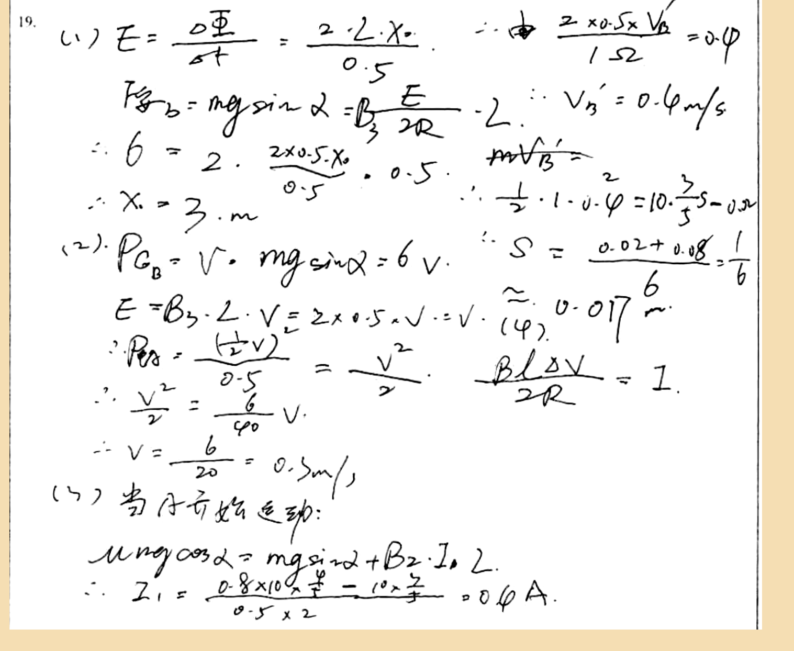

# 审查报告：stu_ans_10

## 1) 样本与任务元信息

- `db_id`: `10`
- `task_id`: `batch-question_19-2a4f3231`
- `question_id(DB)`: `question_19`
- `question_key(映射)`: `question_19`
- `created_at`: `2026-03-24 14:03:46`
- `is_pass`: **False**
- `total_deduction`: **7.0**

## 1.1 标准答案与学生作答图片

### 标准答案


### 学生作答



## 2) Qwen 感知层输出

- `readability_status`: **CLEAR**
- `global_confidence`: **0.96**

### 2.1 结构化元素明细

| element_id | content_type | confidence | raw_content |
|---|---|---:|---|
| `p0_1` | `plain_text` | 0.98 | 19. |
| `p0_2` | `latex_formula` | 0.97 | E = \frac{\Delta \Phi}{\Delta t} = \frac{2 \cdot l \cdot x_0}{0.5} |
| `p0_3` | `latex_formula` | 0.96 | \Rightarrow \frac{2 \times 0.5 \times V_B}{1.52} = 0.4 |
| `p0_4` | `latex_formula` | 0.95 | F_{\text{安}} = mg\sin\alpha = B_3 \frac{E}{2R} \cdot l |
| `p0_5` | `latex_formula` | 0.94 | \therefore V_B' = 0.4 \, \text{m/s} |
| `p0_6` | `latex_formula` | 0.96 | 6 = 2 \cdot \frac{2 \times 0.5 \cdot x_0}{0.5} \cdot 0.5 |
| `p0_7` | `latex_formula` | 0.93 | mV_B'^2 |
| `p0_8` | `latex_formula` | 0.95 | \therefore x_0 = 3 \, \text{m} |
| `p0_9` | `latex_formula` | 0.94 | \frac{1}{2} \cdot 1 \cdot 0.4 = 10 \cdot \frac{3}{5}s - 0.2 |
| `p0_10` | `latex_formula` | 0.96 | P_{G_B} = V \cdot mg\sin\alpha = 6 \, \text{V} |
| `p0_11` | `latex_formula` | 0.95 | S = \frac{0.02 + 0.08}{6} = \frac{1}{6} |
| `p0_12` | `latex_formula` | 0.94 | E = B_3 \cdot l \cdot V = 2 \times 0.5 \cdot V = V |
| `p0_13` | `latex_formula` | 0.93 | \approx 0.017 \, \text{m} |
| `p0_14` | `latex_formula` | 0.95 | P_{\text{电}} = \frac{(\frac{1}{2}V)^2}{0.5} = \frac{V^2}{2} |
| `p0_15` | `latex_formula` | 0.94 | \frac{Bl \Delta V}{2R} = I |
| `p0_16` | `latex_formula` | 0.95 | \therefore \frac{V^2}{2} = \frac{6}{40} V |
| `p0_17` | `latex_formula` | 0.96 | \therefore V = \frac{6}{20} = 0.3 \, \text{m/s} |
| `p0_18` | `plain_text` | 0.97 | (3) 当杆开始运动: |
| `p0_19` | `latex_formula` | 0.95 | mg\cos\alpha = mg\sin\alpha + B_2 \cdot I_1 \cdot l |
| `p0_20` | `latex_formula` | 0.94 | \therefore I_1 = \frac{0.8 \times 10 \times \frac{4}{5} - 10 \times \frac{3}{5}}{0.5 \times 2} = 0.4 \, \text{A} |

### 2.2 image_diagram 转译高亮

> 本样本无 `image_diagram` 节点。

## 3) DeepSeek 认知层输出

- 最终判定 `is_fully_correct`: **False**
- 扣分 `total_score_deduction`: **7.0**
- 人工复核标记 `requires_human_review`: **False**
- 系统置信度 `system_confidence`: **0.9**

### 3.1 逻辑推导（可审查视图）

```text
模型未显式输出思维链字段，以下为基于 `step_evaluations` 的可审查推导摘要：
[1] 锚点 `p0_4` -> 正确（NONE）：无补充说明。
[2] 锚点 `p0_8` -> 正确（NONE）：无补充说明。
[3] 锚点 `p0_14` -> 正确（NONE）：无补充说明。
[4] 锚点 `p0_10` -> 正确（NONE）：无补充说明。
[5] 锚点 `p0_17` -> 正确（NONE）：无补充说明。
[6] 锚点 `p0_19` -> 正确（TRANSCRIPTION_ERROR）：方程应写为 BIL + mg sinα = μ mg cosα，但计算正确，视为笔误。
[7] 锚点 `p0_20` -> 正确（NONE）：无补充说明。
[8] 锚点 `p0_9` -> 错误（CONCEPTUAL）：能量守恒方程应为 mg sinα s = (1/2) m v^2 + Q_total，其中 v=0.4 m/s, Q_total=0.04 J。
[9] 锚点 `p0_13` -> 错误（CONCEPTUAL）：距离 s 应通过正确能量守恒方程求解，得 s=0.02 m。
[10] 锚点 `p0_1` -> 错误（CONCEPTUAL）：部分4未解答：需给出感应电动势 ε = B L (v_b - v_a) 和运动方程。
[11] 锚点 `p0_1` -> 错误（CONCEPTUAL）：部分4未解答：需给出杆b的运动方程 mg sinα - B I L = m a。
[12] 锚点 `p0_1` -> 错误（CONCEPTUAL）：部分4未解答：需给出杆a的运动方程 mg sinα + B I L - μ mg cosα = m a。
[13] 锚点 `p0_1` -> 错误（CONCEPTUAL）：部分4未解答：需应用稳态条件，两杆加速度相同。
[14] 锚点 `p0_1` -> 错误（CONCEPTUAL）：部分4未解答：需求解稳态速度差 Δv = v_b - v_a = 3.2 m/s。
```

### 3.2 最终反馈

> 学生正确解决了部分1（x0=3m）和部分2（v=0.3m/s）。部分3中力平衡方程有笔误但计算正确，能量守恒方程设置错误导致距离s计算不正确。部分4完全未涉及，因此稳态速度差未求解。总扣分7分。

### 3.3 错误步骤锚点

- 错误锚点数量：**7**
- 错误锚点列表：`p0_9`, `p0_13`, `p0_1`, `p0_1`, `p0_1`, `p0_1`, `p0_1`

### 3.4 Step 级别明细

| 锚点(reference_element_id) | 正误 | error_type | correction_suggestion |
|---|---|---|---|
| `p0_4` | 正确 | `NONE` | None |
| `p0_8` | 正确 | `NONE` | None |
| `p0_14` | 正确 | `NONE` | None |
| `p0_10` | 正确 | `NONE` | None |
| `p0_17` | 正确 | `NONE` | None |
| `p0_19` | 正确 | `TRANSCRIPTION_ERROR` | 方程应写为 BIL + mg sinα = μ mg cosα，但计算正确，视为笔误。 |
| `p0_20` | 正确 | `NONE` | None |
| `p0_9` | 错误 | `CONCEPTUAL` | 能量守恒方程应为 mg sinα s = (1/2) m v^2 + Q_total，其中 v=0.4 m/s, Q_total=0.04 J。 |
| `p0_13` | 错误 | `CONCEPTUAL` | 距离 s 应通过正确能量守恒方程求解，得 s=0.02 m。 |
| `p0_1` | 错误 | `CONCEPTUAL` | 部分4未解答：需给出感应电动势 ε = B L (v_b - v_a) 和运动方程。 |
| `p0_1` | 错误 | `CONCEPTUAL` | 部分4未解答：需给出杆b的运动方程 mg sinα - B I L = m a。 |
| `p0_1` | 错误 | `CONCEPTUAL` | 部分4未解答：需给出杆a的运动方程 mg sinα + B I L - μ mg cosα = m a。 |
| `p0_1` | 错误 | `CONCEPTUAL` | 部分4未解答：需应用稳态条件，两杆加速度相同。 |
| `p0_1` | 错误 | `CONCEPTUAL` | 部分4未解答：需求解稳态速度差 Δv = v_b - v_a = 3.2 m/s。 |

## 4) 原始 JSON（审计留痕）

```json
{
  "perception_output": {
    "readability_status": "CLEAR",
    "elements": [
      {
        "element_id": "p0_1",
        "content_type": "plain_text",
        "raw_content": "19.",
        "confidence_score": 0.98,
        "bbox": {
          "x_min": 0.02,
          "y_min": 0.03,
          "x_max": 0.06,
          "y_max": 0.07
        }
      },
      {
        "element_id": "p0_2",
        "content_type": "latex_formula",
        "raw_content": "E = \\frac{\\Delta \\Phi}{\\Delta t} = \\frac{2 \\cdot l \\cdot x_0}{0.5}",
        "confidence_score": 0.97,
        "bbox": {
          "x_min": 0.07,
          "y_min": 0.04,
          "x_max": 0.52,
          "y_max": 0.13
        }
      },
      {
        "element_id": "p0_3",
        "content_type": "latex_formula",
        "raw_content": "\\Rightarrow \\frac{2 \\times 0.5 \\times V_B}{1.52} = 0.4",
        "confidence_score": 0.96,
        "bbox": {
          "x_min": 0.55,
          "y_min": 0.04,
          "x_max": 0.94,
          "y_max": 0.13
        }
      },
      {
        "element_id": "p0_4",
        "content_type": "latex_formula",
        "raw_content": "F_{\\text{安}} = mg\\sin\\alpha = B_3 \\frac{E}{2R} \\cdot l",
        "confidence_score": 0.95,
        "bbox": {
          "x_min": 0.15,
          "y_min": 0.13,
          "x_max": 0.62,
          "y_max": 0.22
        }
      },
      {
        "element_id": "p0_5",
        "content_type": "latex_formula",
        "raw_content": "\\therefore V_B' = 0.4 \\, \\text{m/s}",
        "confidence_score": 0.94,
        "bbox": {
          "x_min": 0.72,
          "y_min": 0.13,
          "x_max": 0.95,
          "y_max": 0.22
        }
      },
      {
        "element_id": "p0_6",
        "content_type": "latex_formula",
        "raw_content": "6 = 2 \\cdot \\frac{2 \\times 0.5 \\cdot x_0}{0.5} \\cdot 0.5",
        "confidence_score": 0.96,
        "bbox": {
          "x_min": 0.15,
          "y_min": 0.22,
          "x_max": 0.55,
          "y_max": 0.31
        }
      },
      {
        "element_id": "p0_7",
        "content_type": "latex_formula",
        "raw_content": "mV_B'^2",
        "confidence_score": 0.93,
        "bbox": {
          "x_min": 0.65,
          "y_min": 0.22,
          "x_max": 0.78,
          "y_max": 0.31
        }
      },
      {
        "element_id": "p0_8",
        "content_type": "latex_formula",
        "raw_content": "\\therefore x_0 = 3 \\, \\text{m}",
        "confidence_score": 0.95,
        "bbox": {
          "x_min": 0.15,
          "y_min": 0.31,
          "x_max": 0.38,
          "y_max": 0.4
        }
      },
      {
        "element_id": "p0_9",
        "content_type": "latex_formula",
        "raw_content": "\\frac{1}{2} \\cdot 1 \\cdot 0.4 = 10 \\cdot \\frac{3}{5}s - 0.2",
        "confidence_score": 0.94,
        "bbox": {
          "x_min": 0.65,
          "y_min": 0.31,
          "x_max": 0.95,
          "y_max": 0.4
        }
      },
      {
        "element_id": "p0_10",
        "content_type": "latex_formula",
        "raw_content": "P_{G_B} = V \\cdot mg\\sin\\alpha = 6 \\, \\text{V}",
        "confidence_score": 0.96,
        "bbox": {
          "x_min": 0.08,
          "y_min": 0.4,
          "x_max": 0.62,
          "y_max": 0.5
        }
      },
      {
        "element_id": "p0_11",
        "content_type": "latex_formula",
        "raw_content": "S = \\frac{0.02 + 0.08}{6} = \\frac{1}{6}",
        "confidence_score": 0.95,
        "bbox": {
          "x_min": 0.72,
          "y_min": 0.4,
          "x_max": 0.95,
          "y_max": 0.5
        }
      },
      {
        "element_id": "p0_12",
        "content_type": "latex_formula",
        "raw_content": "E = B_3 \\cdot l \\cdot V = 2 \\times 0.5 \\cdot V = V",
        "confidence_score": 0.94,
        "bbox": {
          "x_min": 0.15,
          "y_min": 0.5,
          "x_max": 0.62,
          "y_max": 0.59
        }
      },
      {
        "element_id": "p0_13",
        "content_type": "latex_formula",
        "raw_content": "\\approx 0.017 \\, \\text{m}",
        "confidence_score": 0.93,
        "bbox": {
          "x_min": 0.72,
          "y_min": 0.5,
          "x_max": 0.95,
          "y_max": 0.59
        }
      },
      {
        "element_id": "p0_14",
        "content_type": "latex_formula",
        "raw_content": "P_{\\text{电}} = \\frac{(\\frac{1}{2}V)^2}{0.5} = \\frac{V^2}{2}",
        "confidence_score": 0.95,
        "bbox": {
          "x_min": 0.15,
          "y_min": 0.59,
          "x_max": 0.55,
          "y_max": 0.68
        }
      },
      {
        "element_id": "p0_15",
        "content_type": "latex_formula",
        "raw_content": "\\frac{Bl \\Delta V}{2R} = I",
        "confidence_score": 0.94,
        "bbox": {
          "x_min": 0.65,
          "y_min": 0.59,
          "x_max": 0.95,
          "y_max": 0.68
        }
      },
      {
        "element_id": "p0_16",
        "content_type": "latex_formula",
        "raw_content": "\\therefore \\frac{V^2}{2} = \\frac{6}{40} V",
        "confidence_score": 0.95,
        "bbox": {
          "x_min": 0.15,
          "y_min": 0.68,
          "x_max": 0.55,
          "y_max": 0.77
        }
      },
      {
        "element_id": "p0_17",
        "content_type": "latex_formula",
        "raw_content": "\\therefore V = \\frac{6}{20} = 0.3 \\, \\text{m/s}",
        "confidence_score": 0.96,
        "bbox": {
          "x_min": 0.15,
          "y_min": 0.77,
          "x_max": 0.55,
          "y_max": 0.86
        }
      },
      {
        "element_id": "p0_18",
        "content_type": "plain_text",
        "raw_content": "(3) 当杆开始运动:",
        "confidence_score": 0.97,
        "bbox": {
          "x_min": 0.07,
          "y_min": 0.86,
          "x_max": 0.45,
          "y_max": 0.95
        }
      },
      {
        "element_id": "p0_19",
        "content_type": "latex_formula",
        "raw_content": "mg\\cos\\alpha = mg\\sin\\alpha + B_2 \\cdot I_1 \\cdot l",
        "confidence_score": 0.95,
        "bbox": {
          "x_min": 0.15,
          "y_min": 0.95,
          "x_max": 0.75,
          "y_max": 1.0
        }
      },
      {
        "element_id": "p0_20",
        "content_type": "latex_formula",
        "raw_content": "\\therefore I_1 = \\frac{0.8 \\times 10 \\times \\frac{4}{5} - 10 \\times \\frac{3}{5}}{0.5 \\times 2} = 0.4 \\, \\text{A}",
        "confidence_score": 0.94,
        "bbox": {
          "x_min": 0.15,
          "y_min": 1.0,
          "x_max": 0.85,
          "y_max": 1.0
        }
      }
    ],
    "global_confidence": 0.96,
    "trigger_short_circuit": false
  },
  "evaluation_report": {
    "is_fully_correct": false,
    "total_score_deduction": 7.0,
    "step_evaluations": [
      {
        "reference_element_id": "p0_4",
        "is_correct": true,
        "error_type": "NONE",
        "correction_suggestion": null
      },
      {
        "reference_element_id": "p0_8",
        "is_correct": true,
        "error_type": "NONE",
        "correction_suggestion": null
      },
      {
        "reference_element_id": "p0_14",
        "is_correct": true,
        "error_type": "NONE",
        "correction_suggestion": null
      },
      {
        "reference_element_id": "p0_10",
        "is_correct": true,
        "error_type": "NONE",
        "correction_suggestion": null
      },
      {
        "reference_element_id": "p0_17",
        "is_correct": true,
        "error_type": "NONE",
        "correction_suggestion": null
      },
      {
        "reference_element_id": "p0_19",
        "is_correct": true,
        "error_type": "TRANSCRIPTION_ERROR",
        "correction_suggestion": "方程应写为 BIL + mg sinα = μ mg cosα，但计算正确，视为笔误。"
      },
      {
        "reference_element_id": "p0_20",
        "is_correct": true,
        "error_type": "NONE",
        "correction_suggestion": null
      },
      {
        "reference_element_id": "p0_9",
        "is_correct": false,
        "error_type": "CONCEPTUAL",
        "correction_suggestion": "能量守恒方程应为 mg sinα s = (1/2) m v^2 + Q_total，其中 v=0.4 m/s, Q_total=0.04 J。"
      },
      {
        "reference_element_id": "p0_13",
        "is_correct": false,
        "error_type": "CONCEPTUAL",
        "correction_suggestion": "距离 s 应通过正确能量守恒方程求解，得 s=0.02 m。"
      },
      {
        "reference_element_id": "p0_1",
        "is_correct": false,
        "error_type": "CONCEPTUAL",
        "correction_suggestion": "部分4未解答：需给出感应电动势 ε = B L (v_b - v_a) 和运动方程。"
      },
      {
        "reference_element_id": "p0_1",
        "is_correct": false,
        "error_type": "CONCEPTUAL",
        "correction_suggestion": "部分4未解答：需给出杆b的运动方程 mg sinα - B I L = m a。"
      },
      {
        "reference_element_id": "p0_1",
        "is_correct": false,
        "error_type": "CONCEPTUAL",
        "correction_suggestion": "部分4未解答：需给出杆a的运动方程 mg sinα + B I L - μ mg cosα = m a。"
      },
      {
        "reference_element_id": "p0_1",
        "is_correct": false,
        "error_type": "CONCEPTUAL",
        "correction_suggestion": "部分4未解答：需应用稳态条件，两杆加速度相同。"
      },
      {
        "reference_element_id": "p0_1",
        "is_correct": false,
        "error_type": "CONCEPTUAL",
        "correction_suggestion": "部分4未解答：需求解稳态速度差 Δv = v_b - v_a = 3.2 m/s。"
      }
    ],
    "overall_feedback": "学生正确解决了部分1（x0=3m）和部分2（v=0.3m/s）。部分3中力平衡方程有笔误但计算正确，能量守恒方程设置错误导致距离s计算不正确。部分4完全未涉及，因此稳态速度差未求解。总扣分7分。",
    "system_confidence": 0.9,
    "requires_human_review": false
  }
}
```
