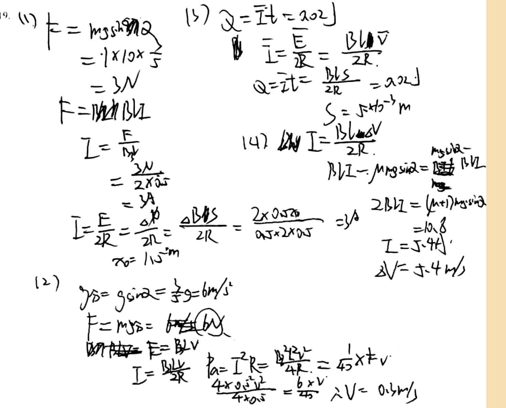

# 审查报告：stu_ans_11

## 1) 样本与任务元信息

- `db_id`: `11`
- `task_id`: `batch-question_19-2a4f3231`
- `question_id(DB)`: `question_19`
- `question_key(映射)`: `question_19`
- `created_at`: `2026-03-24 14:03:46`
- `is_pass`: **False**
- `total_deduction`: **13.0**

## 1.1 标准答案与学生作答图片

### 标准答案


### 学生作答



## 2) Qwen 感知层输出

- `readability_status`: **CLEAR**
- `global_confidence`: **0.95**

### 2.1 结构化元素明细

| element_id | content_type | confidence | raw_content |
|---|---|---:|---|
| `p0_1` | `plain_text` | 0.98 | 9. (1) F = mgsinα |
| `p0_2` | `latex_formula` | 0.97 | F = 1 \times 10 \times \frac{3}{5} = 3N |
| `p0_3` | `latex_formula` | 0.96 | F = BIL |
| `p0_4` | `latex_formula` | 0.95 | I = \frac{F}{BL} |
| `p0_5` | `latex_formula` | 0.96 | I = \frac{3N}{2 \times 0.5} = 3A |
| `p0_6` | `latex_formula` | 0.95 | I = \frac{E}{2R} = \frac{\Delta \phi}{2R} = \frac{\Delta B \Delta S}{2R} = \frac{2 \times 0.5 \times 0.1}{0.5 \times 2 \times 0.5} = 3A |
| `p0_7` | `latex_formula` | 0.94 | \Delta x = 1.5m |
| `p0_8` | `plain_text` | 0.98 | (2) |
| `p0_9` | `latex_formula` | 0.96 | g_{\parallel} = g \sin \alpha = \frac{3}{5}g = 6m/s^2 |
| `p0_10` | `latex_formula` | 0.95 | F = mg_{\parallel} = 6N |
| `p0_11` | `latex_formula` | 0.94 | F = BIL |
| `p0_12` | `latex_formula` | 0.95 | I = \frac{BIL}{2R} |
| `p0_13` | `latex_formula` | 0.94 | P_a = I^2 R = \frac{B^2 L^2 v^2}{4R} = \frac{1}{45} \times 6v |
| `p0_14` | `latex_formula` | 0.93 | \frac{4 \times 0.5^2 v^2}{4 \times 0.5} = \frac{6 \times v}{45} \Rightarrow V = 0.3m/s |
| `p0_15` | `plain_text` | 0.98 | (3) |
| `p0_16` | `latex_formula` | 0.96 | Q = \bar{I} t = 0.02J |
| `p0_17` | `latex_formula` | 0.95 | \bar{I} = \frac{E}{2R} = \frac{BL\Delta V}{2R} |
| `p0_18` | `latex_formula` | 0.94 | Q = \bar{I} t = \frac{BL\Delta V}{2R} = 0.02J |
| `p0_19` | `latex_formula` | 0.95 | S = 5 \times 10^{-3} m |
| `p0_20` | `plain_text` | 0.98 | (4) |
| `p0_21` | `latex_formula` | 0.95 | \Delta V = \frac{BL \Delta V}{2R} |
| `p0_22` | `latex_formula` | 0.94 | BLI - mg\sin\alpha = \mu mg\cos\alpha |
| `p0_23` | `latex_formula` | 0.93 | 2BLI = (\mu + 1)mg\sin\alpha |
| `p0_24` | `latex_formula` | 0.92 | = 10.8 |
| `p0_25` | `latex_formula` | 0.94 | I = 5.4A |
| `p0_26` | `latex_formula` | 0.93 | \Delta V = 5.4m/s |

### 2.2 image_diagram 转译高亮

> 本样本无 `image_diagram` 节点。

## 3) DeepSeek 认知层输出

- 最终判定 `is_fully_correct`: **False**
- 扣分 `total_score_deduction`: **13.0**
- 人工复核标记 `requires_human_review`: **False**
- 系统置信度 `system_confidence`: **0.9**

### 3.1 逻辑推导（可审查视图）

```text
模型未显式输出思维链字段，以下为基于 `step_evaluations` 的可审查推导摘要：
[1] 锚点 `p0_1` -> 错误（CALCULATION）：在力平衡方程中，mg sinα 应计算为 1kg * 10m/s² * (3/5) = 6N，而不是3N。
[2] 锚点 `p0_7` -> 错误（CALCULATION）：正确x0应为3.00m，检查感应电动势和电流计算。
[3] 锚点 `p0_13` -> 正确（NONE）：无补充说明。
[4] 锚点 `p0_10` -> 正确（NONE）：无补充说明。
[5] 锚点 `p0_14` -> 错误（LOGIC）：应设置 P_a = (1/40) P_G，即 0.5 v^2 = (1/40)*6v，然后解v=0.3m/s。
[6] 锚点 `p0_15` -> 错误（CONCEPTUAL）：需要设置杆a开始运动时的力平衡：BIL + mg sinα = μ mg cosα。
[7] 锚点 `p0_16` -> 错误（CONCEPTUAL）：从力平衡解出I=0.4A，然后v=I since ε=B L v等。
[8] 锚点 `p0_18` -> 错误（CONCEPTUAL）：应应用能量守恒：mg sinα * s = (1/2) m v^2 + Q_total，其中Q_total=2Q。
[9] 锚点 `p0_19` -> 错误（CALCULATION）：正确s应为0.02m，从能量守恒方程解出。
[10] 锚点 `p0_21` -> 错误（LOGIC）：感应电动势应为 ε = B L (v_b - v_a)，其中v_b和v_a是各自速度。
[11] 锚点 `p0_22` -> 错误（CONCEPTUAL）：杆b的运动方程：mg sinα - B I L = m a_b。
[12] 锚点 `p0_22` -> 错误（LOGIC）：杆a的运动方程应为：mg sinα + B I L - μ mg cosα = m a_a。
[13] 锚点 `p0_23` -> 错误（CONCEPTUAL）：在稳态，两杆加速度相同，即a_a = a_b。
[14] 锚点 `p0_26` -> 错误（CALCULATION）：正确稳态速度差应为Δv = v_b - v_a = 3.2 m/s。
```

### 3.2 最终反馈

> 学生的问题(1)和(3)基本错误，(2)中功率表达式正确但方程设置错误，(4)完全错误。需要复习电磁感应中的力平衡、能量守恒和运动方程。

### 3.3 错误步骤锚点

- 错误锚点数量：**12**
- 错误锚点列表：`p0_1`, `p0_7`, `p0_14`, `p0_15`, `p0_16`, `p0_18`, `p0_19`, `p0_21`, `p0_22`, `p0_22`, `p0_23`, `p0_26`

### 3.4 Step 级别明细

| 锚点(reference_element_id) | 正误 | error_type | correction_suggestion |
|---|---|---|---|
| `p0_1` | 错误 | `CALCULATION` | 在力平衡方程中，mg sinα 应计算为 1kg * 10m/s² * (3/5) = 6N，而不是3N。 |
| `p0_7` | 错误 | `CALCULATION` | 正确x0应为3.00m，检查感应电动势和电流计算。 |
| `p0_13` | 正确 | `NONE` | None |
| `p0_10` | 正确 | `NONE` | None |
| `p0_14` | 错误 | `LOGIC` | 应设置 P_a = (1/40) P_G，即 0.5 v^2 = (1/40)*6v，然后解v=0.3m/s。 |
| `p0_15` | 错误 | `CONCEPTUAL` | 需要设置杆a开始运动时的力平衡：BIL + mg sinα = μ mg cosα。 |
| `p0_16` | 错误 | `CONCEPTUAL` | 从力平衡解出I=0.4A，然后v=I since ε=B L v等。 |
| `p0_18` | 错误 | `CONCEPTUAL` | 应应用能量守恒：mg sinα * s = (1/2) m v^2 + Q_total，其中Q_total=2Q。 |
| `p0_19` | 错误 | `CALCULATION` | 正确s应为0.02m，从能量守恒方程解出。 |
| `p0_21` | 错误 | `LOGIC` | 感应电动势应为 ε = B L (v_b - v_a)，其中v_b和v_a是各自速度。 |
| `p0_22` | 错误 | `CONCEPTUAL` | 杆b的运动方程：mg sinα - B I L = m a_b。 |
| `p0_22` | 错误 | `LOGIC` | 杆a的运动方程应为：mg sinα + B I L - μ mg cosα = m a_a。 |
| `p0_23` | 错误 | `CONCEPTUAL` | 在稳态，两杆加速度相同，即a_a = a_b。 |
| `p0_26` | 错误 | `CALCULATION` | 正确稳态速度差应为Δv = v_b - v_a = 3.2 m/s。 |

## 4) 原始 JSON（审计留痕）

```json
{
  "perception_output": {
    "readability_status": "CLEAR",
    "elements": [
      {
        "element_id": "p0_1",
        "content_type": "plain_text",
        "raw_content": "9. (1) F = mgsinα",
        "confidence_score": 0.98,
        "bbox": {
          "x_min": 0.01,
          "y_min": 0.02,
          "x_max": 0.35,
          "y_max": 0.12
        }
      },
      {
        "element_id": "p0_2",
        "content_type": "latex_formula",
        "raw_content": "F = 1 \\times 10 \\times \\frac{3}{5} = 3N",
        "confidence_score": 0.97,
        "bbox": {
          "x_min": 0.04,
          "y_min": 0.12,
          "x_max": 0.32,
          "y_max": 0.26
        }
      },
      {
        "element_id": "p0_3",
        "content_type": "latex_formula",
        "raw_content": "F = BIL",
        "confidence_score": 0.96,
        "bbox": {
          "x_min": 0.12,
          "y_min": 0.26,
          "x_max": 0.32,
          "y_max": 0.34
        }
      },
      {
        "element_id": "p0_4",
        "content_type": "latex_formula",
        "raw_content": "I = \\frac{F}{BL}",
        "confidence_score": 0.95,
        "bbox": {
          "x_min": 0.15,
          "y_min": 0.34,
          "x_max": 0.32,
          "y_max": 0.44
        }
      },
      {
        "element_id": "p0_5",
        "content_type": "latex_formula",
        "raw_content": "I = \\frac{3N}{2 \\times 0.5} = 3A",
        "confidence_score": 0.96,
        "bbox": {
          "x_min": 0.15,
          "y_min": 0.44,
          "x_max": 0.35,
          "y_max": 0.58
        }
      },
      {
        "element_id": "p0_6",
        "content_type": "latex_formula",
        "raw_content": "I = \\frac{E}{2R} = \\frac{\\Delta \\phi}{2R} = \\frac{\\Delta B \\Delta S}{2R} = \\frac{2 \\times 0.5 \\times 0.1}{0.5 \\times 2 \\times 0.5} = 3A",
        "confidence_score": 0.95,
        "bbox": {
          "x_min": 0.15,
          "y_min": 0.58,
          "x_max": 0.72,
          "y_max": 0.72
        }
      },
      {
        "element_id": "p0_7",
        "content_type": "latex_formula",
        "raw_content": "\\Delta x = 1.5m",
        "confidence_score": 0.94,
        "bbox": {
          "x_min": 0.22,
          "y_min": 0.72,
          "x_max": 0.35,
          "y_max": 0.8
        }
      },
      {
        "element_id": "p0_8",
        "content_type": "plain_text",
        "raw_content": "(2)",
        "confidence_score": 0.98,
        "bbox": {
          "x_min": 0.07,
          "y_min": 0.7,
          "x_max": 0.12,
          "y_max": 0.76
        }
      },
      {
        "element_id": "p0_9",
        "content_type": "latex_formula",
        "raw_content": "g_{\\parallel} = g \\sin \\alpha = \\frac{3}{5}g = 6m/s^2",
        "confidence_score": 0.96,
        "bbox": {
          "x_min": 0.15,
          "y_min": 0.7,
          "x_max": 0.45,
          "y_max": 0.8
        }
      },
      {
        "element_id": "p0_10",
        "content_type": "latex_formula",
        "raw_content": "F = mg_{\\parallel} = 6N",
        "confidence_score": 0.95,
        "bbox": {
          "x_min": 0.15,
          "y_min": 0.8,
          "x_max": 0.45,
          "y_max": 0.9
        }
      },
      {
        "element_id": "p0_11",
        "content_type": "latex_formula",
        "raw_content": "F = BIL",
        "confidence_score": 0.94,
        "bbox": {
          "x_min": 0.15,
          "y_min": 0.9,
          "x_max": 0.35,
          "y_max": 0.98
        }
      },
      {
        "element_id": "p0_12",
        "content_type": "latex_formula",
        "raw_content": "I = \\frac{BIL}{2R}",
        "confidence_score": 0.95,
        "bbox": {
          "x_min": 0.15,
          "y_min": 0.98,
          "x_max": 0.35,
          "y_max": 1.0
        }
      },
      {
        "element_id": "p0_13",
        "content_type": "latex_formula",
        "raw_content": "P_a = I^2 R = \\frac{B^2 L^2 v^2}{4R} = \\frac{1}{45} \\times 6v",
        "confidence_score": 0.94,
        "bbox": {
          "x_min": 0.38,
          "y_min": 0.85,
          "x_max": 0.75,
          "y_max": 0.95
        }
      },
      {
        "element_id": "p0_14",
        "content_type": "latex_formula",
        "raw_content": "\\frac{4 \\times 0.5^2 v^2}{4 \\times 0.5} = \\frac{6 \\times v}{45} \\Rightarrow V = 0.3m/s",
        "confidence_score": 0.93,
        "bbox": {
          "x_min": 0.38,
          "y_min": 0.95,
          "x_max": 0.85,
          "y_max": 1.0
        }
      },
      {
        "element_id": "p0_15",
        "content_type": "plain_text",
        "raw_content": "(3)",
        "confidence_score": 0.98,
        "bbox": {
          "x_min": 0.4,
          "y_min": 0.02,
          "x_max": 0.45,
          "y_max": 0.08
        }
      },
      {
        "element_id": "p0_16",
        "content_type": "latex_formula",
        "raw_content": "Q = \\bar{I} t = 0.02J",
        "confidence_score": 0.96,
        "bbox": {
          "x_min": 0.45,
          "y_min": 0.02,
          "x_max": 0.75,
          "y_max": 0.12
        }
      },
      {
        "element_id": "p0_17",
        "content_type": "latex_formula",
        "raw_content": "\\bar{I} = \\frac{E}{2R} = \\frac{BL\\Delta V}{2R}",
        "confidence_score": 0.95,
        "bbox": {
          "x_min": 0.5,
          "y_min": 0.12,
          "x_max": 0.78,
          "y_max": 0.22
        }
      },
      {
        "element_id": "p0_18",
        "content_type": "latex_formula",
        "raw_content": "Q = \\bar{I} t = \\frac{BL\\Delta V}{2R} = 0.02J",
        "confidence_score": 0.94,
        "bbox": {
          "x_min": 0.5,
          "y_min": 0.22,
          "x_max": 0.8,
          "y_max": 0.32
        }
      },
      {
        "element_id": "p0_19",
        "content_type": "latex_formula",
        "raw_content": "S = 5 \\times 10^{-3} m",
        "confidence_score": 0.95,
        "bbox": {
          "x_min": 0.65,
          "y_min": 0.32,
          "x_max": 0.85,
          "y_max": 0.42
        }
      },
      {
        "element_id": "p0_20",
        "content_type": "plain_text",
        "raw_content": "(4)",
        "confidence_score": 0.98,
        "bbox": {
          "x_min": 0.5,
          "y_min": 0.42,
          "x_max": 0.55,
          "y_max": 0.48
        }
      },
      {
        "element_id": "p0_21",
        "content_type": "latex_formula",
        "raw_content": "\\Delta V = \\frac{BL \\Delta V}{2R}",
        "confidence_score": 0.95,
        "bbox": {
          "x_min": 0.55,
          "y_min": 0.42,
          "x_max": 0.8,
          "y_max": 0.52
        }
      },
      {
        "element_id": "p0_22",
        "content_type": "latex_formula",
        "raw_content": "BLI - mg\\sin\\alpha = \\mu mg\\cos\\alpha",
        "confidence_score": 0.94,
        "bbox": {
          "x_min": 0.7,
          "y_min": 0.52,
          "x_max": 0.95,
          "y_max": 0.62
        }
      },
      {
        "element_id": "p0_23",
        "content_type": "latex_formula",
        "raw_content": "2BLI = (\\mu + 1)mg\\sin\\alpha",
        "confidence_score": 0.93,
        "bbox": {
          "x_min": 0.75,
          "y_min": 0.62,
          "x_max": 0.95,
          "y_max": 0.72
        }
      },
      {
        "element_id": "p0_24",
        "content_type": "latex_formula",
        "raw_content": "= 10.8",
        "confidence_score": 0.92,
        "bbox": {
          "x_min": 0.8,
          "y_min": 0.72,
          "x_max": 0.9,
          "y_max": 0.8
        }
      },
      {
        "element_id": "p0_25",
        "content_type": "latex_formula",
        "raw_content": "I = 5.4A",
        "confidence_score": 0.94,
        "bbox": {
          "x_min": 0.8,
          "y_min": 0.8,
          "x_max": 0.9,
          "y_max": 0.88
        }
      },
      {
        "element_id": "p0_26",
        "content_type": "latex_formula",
        "raw_content": "\\Delta V = 5.4m/s",
        "confidence_score": 0.93,
        "bbox": {
          "x_min": 0.75,
          "y_min": 0.88,
          "x_max": 0.92,
          "y_max": 0.96
        }
      }
    ],
    "global_confidence": 0.95,
    "trigger_short_circuit": false
  },
  "evaluation_report": {
    "is_fully_correct": false,
    "total_score_deduction": 13.0,
    "step_evaluations": [
      {
        "reference_element_id": "p0_1",
        "is_correct": false,
        "error_type": "CALCULATION",
        "correction_suggestion": "在力平衡方程中，mg sinα 应计算为 1kg * 10m/s² * (3/5) = 6N，而不是3N。"
      },
      {
        "reference_element_id": "p0_7",
        "is_correct": false,
        "error_type": "CALCULATION",
        "correction_suggestion": "正确x0应为3.00m，检查感应电动势和电流计算。"
      },
      {
        "reference_element_id": "p0_13",
        "is_correct": true,
        "error_type": "NONE",
        "correction_suggestion": null
      },
      {
        "reference_element_id": "p0_10",
        "is_correct": true,
        "error_type": "NONE",
        "correction_suggestion": null
      },
      {
        "reference_element_id": "p0_14",
        "is_correct": false,
        "error_type": "LOGIC",
        "correction_suggestion": "应设置 P_a = (1/40) P_G，即 0.5 v^2 = (1/40)*6v，然后解v=0.3m/s。"
      },
      {
        "reference_element_id": "p0_15",
        "is_correct": false,
        "error_type": "CONCEPTUAL",
        "correction_suggestion": "需要设置杆a开始运动时的力平衡：BIL + mg sinα = μ mg cosα。"
      },
      {
        "reference_element_id": "p0_16",
        "is_correct": false,
        "error_type": "CONCEPTUAL",
        "correction_suggestion": "从力平衡解出I=0.4A，然后v=I since ε=B L v等。"
      },
      {
        "reference_element_id": "p0_18",
        "is_correct": false,
        "error_type": "CONCEPTUAL",
        "correction_suggestion": "应应用能量守恒：mg sinα * s = (1/2) m v^2 + Q_total，其中Q_total=2Q。"
      },
      {
        "reference_element_id": "p0_19",
        "is_correct": false,
        "error_type": "CALCULATION",
        "correction_suggestion": "正确s应为0.02m，从能量守恒方程解出。"
      },
      {
        "reference_element_id": "p0_21",
        "is_correct": false,
        "error_type": "LOGIC",
        "correction_suggestion": "感应电动势应为 ε = B L (v_b - v_a)，其中v_b和v_a是各自速度。"
      },
      {
        "reference_element_id": "p0_22",
        "is_correct": false,
        "error_type": "CONCEPTUAL",
        "correction_suggestion": "杆b的运动方程：mg sinα - B I L = m a_b。"
      },
      {
        "reference_element_id": "p0_22",
        "is_correct": false,
        "error_type": "LOGIC",
        "correction_suggestion": "杆a的运动方程应为：mg sinα + B I L - μ mg cosα = m a_a。"
      },
      {
        "reference_element_id": "p0_23",
        "is_correct": false,
        "error_type": "CONCEPTUAL",
        "correction_suggestion": "在稳态，两杆加速度相同，即a_a = a_b。"
      },
      {
        "reference_element_id": "p0_26",
        "is_correct": false,
        "error_type": "CALCULATION",
        "correction_suggestion": "正确稳态速度差应为Δv = v_b - v_a = 3.2 m/s。"
      }
    ],
    "overall_feedback": "学生的问题(1)和(3)基本错误，(2)中功率表达式正确但方程设置错误，(4)完全错误。需要复习电磁感应中的力平衡、能量守恒和运动方程。",
    "system_confidence": 0.9,
    "requires_human_review": false
  }
}
```
