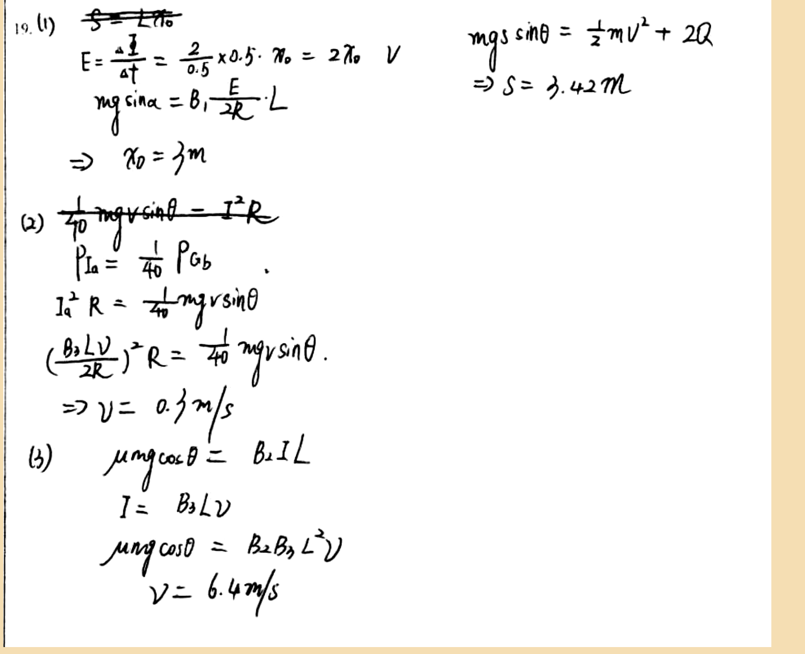

# 审查报告：stu_ans_12

## 1) 样本与任务元信息

- `db_id`: `12`
- `task_id`: `batch-question_19-2a4f3231`
- `question_id(DB)`: `question_19`
- `question_key(映射)`: `question_19`
- `created_at`: `2026-03-24 14:03:46`
- `is_pass`: **False**
- `total_deduction`: **10.0**

## 1.1 标准答案与学生作答图片

### 标准答案


### 学生作答



## 2) Qwen 感知层输出

- `readability_status`: **CLEAR**
- `global_confidence`: **0.96**

### 2.1 结构化元素明细

| element_id | content_type | confidence | raw_content |
|---|---|---:|---|
| `p0_1` | `plain_text` | 0.98 | 19. (1) |
| `p0_2` | `latex_formula` | 0.97 | \frac{\Delta \phi}{\Delta t} = \frac{2}{0.5} \times 0.5 \cdot x_0 = 2x_0 \quad V |
| `p0_3` | `latex_formula` | 0.96 | mg\sin\alpha = B_1\frac{E}{2R}\cdot L |
| `p0_4` | `latex_formula` | 0.95 | \Rightarrow x_0 = 3m |
| `p0_5` | `latex_formula` | 0.97 | mg\sin\theta = \frac{1}{2}mv^2 + 2Q |
| `p0_6` | `latex_formula` | 0.96 | \Rightarrow S = 3.42m |
| `p0_7` | `plain_text` | 0.98 | (2) |
| `p0_8` | `latex_formula` | 0.96 | \frac{1}{40}mgv\sin\theta = I^2R |
| `p0_9` | `latex_formula` | 0.95 | P_{Ia} = \frac{1}{40}P_{Gb} |
| `p0_10` | `latex_formula` | 0.95 | I_a^2R = \frac{1}{40}mgv\sin\theta |
| `p0_11` | `latex_formula` | 0.94 | \left(\frac{B_3Lv}{2R}\right)^2R = \frac{1}{40}mgv\sin\theta |
| `p0_12` | `latex_formula` | 0.95 | \Rightarrow v = 0.3m/s |
| `p0_13` | `plain_text` | 0.98 | (3) |
| `p0_14` | `latex_formula` | 0.96 | \mu mg\cos\theta = B_2IL |
| `p0_15` | `latex_formula` | 0.95 | I = B_3Lv |
| `p0_16` | `latex_formula` | 0.95 | \mu mg\cos\theta = B_2B_3L^2v |
| `p0_17` | `latex_formula` | 0.96 | v = 6.4m/s |

### 2.2 image_diagram 转译高亮

> 本样本无 `image_diagram` 节点。

## 3) DeepSeek 认知层输出

- 最终判定 `is_fully_correct`: **False**
- 扣分 `total_score_deduction`: **10.0**
- 人工复核标记 `requires_human_review`: **False**
- 系统置信度 `system_confidence`: **0.95**

### 3.1 逻辑推导（可审查视图）

```text
模型未显式输出思维链字段，以下为基于 `step_evaluations` 的可审查推导摘要：
[1] 锚点 `p0_1` -> 正确（NONE）：无补充说明。
[2] 锚点 `p0_2` -> 正确（NONE）：无补充说明。
[3] 锚点 `p0_3` -> 错误（CONCEPTUAL）：The force balance on rod b should involve the magnetic field B3, not B1. Correct equation: B3 * I * L = mg sinα.
[4] 锚点 `p0_4` -> 正确（NONE）：无补充说明。
[5] 锚点 `p0_5` -> 错误（CONCEPTUAL）：Energy conservation should include the displacement s. Correct equation: mg sinα * s = (1/2) m v^2 + Q_total, where Q_total = 2Q.
[6] 锚点 `p0_6` -> 错误（CALCULATION）：The calculated distance s is incorrect. Re-solve using correct energy conservation equation.
[7] 锚点 `p0_7` -> 正确（NONE）：无补充说明。
[8] 锚点 `p0_8` -> 正确（NONE）：无补充说明。
[9] 锚点 `p0_9` -> 正确（NONE）：无补充说明。
[10] 锚点 `p0_10` -> 正确（NONE）：无补充说明。
[11] 锚点 `p0_11` -> 正确（NONE）：无补充说明。
[12] 锚点 `p0_12` -> 正确（NONE）：无补充说明。
[13] 锚点 `p0_13` -> 正确（NONE）：无补充说明。
[14] 锚点 `p0_14` -> 错误（CONCEPTUAL）：The force balance on rod a when it starts to move should include both magnetic force and gravitational component. Correct equation: B I L + mg sinα = μ mg cosα.
[15] 锚点 `p0_15` -> 错误（CONCEPTUAL）：Current expression should account for total resistance. Correct: I = (B3 L v) / (2R).
[16] 锚点 `p0_16` -> 错误（LOGIC）：Derived equation is incorrect due to earlier errors. Re-derive from correct force balance and current expression.
[17] 锚点 `p0_17` -> 错误（CALCULATION）：The speed v should be 0.4 m/s, not 6.4 m/s. Re-solve with correct equations.
```

### 3.2 最终反馈

> Good work on parts (1) and (2), with correct results for x0 and v. However, part (3) has conceptual errors in force balance and energy conservation, leading to incorrect answers. Part (4) is completely missing. Review the magnetic forces involved in each rod and the energy conservation principle with heat dissipation.

### 3.3 错误步骤锚点

- 错误锚点数量：**7**
- 错误锚点列表：`p0_3`, `p0_5`, `p0_6`, `p0_14`, `p0_15`, `p0_16`, `p0_17`

### 3.4 Step 级别明细

| 锚点(reference_element_id) | 正误 | error_type | correction_suggestion |
|---|---|---|---|
| `p0_1` | 正确 | `None` | None |
| `p0_2` | 正确 | `None` | None |
| `p0_3` | 错误 | `CONCEPTUAL` | The force balance on rod b should involve the magnetic field B3, not B1. Correct equation: B3 * I * L = mg sinα. |
| `p0_4` | 正确 | `None` | None |
| `p0_5` | 错误 | `CONCEPTUAL` | Energy conservation should include the displacement s. Correct equation: mg sinα * s = (1/2) m v^2 + Q_total, where Q_total = 2Q. |
| `p0_6` | 错误 | `CALCULATION` | The calculated distance s is incorrect. Re-solve using correct energy conservation equation. |
| `p0_7` | 正确 | `None` | None |
| `p0_8` | 正确 | `None` | None |
| `p0_9` | 正确 | `None` | None |
| `p0_10` | 正确 | `None` | None |
| `p0_11` | 正确 | `None` | None |
| `p0_12` | 正确 | `None` | None |
| `p0_13` | 正确 | `None` | None |
| `p0_14` | 错误 | `CONCEPTUAL` | The force balance on rod a when it starts to move should include both magnetic force and gravitational component. Correct equation: B I L + mg sinα = μ mg cosα. |
| `p0_15` | 错误 | `CONCEPTUAL` | Current expression should account for total resistance. Correct: I = (B3 L v) / (2R). |
| `p0_16` | 错误 | `LOGIC` | Derived equation is incorrect due to earlier errors. Re-derive from correct force balance and current expression. |
| `p0_17` | 错误 | `CALCULATION` | The speed v should be 0.4 m/s, not 6.4 m/s. Re-solve with correct equations. |

## 4) 原始 JSON（审计留痕）

```json
{
  "perception_output": {
    "readability_status": "CLEAR",
    "elements": [
      {
        "element_id": "p0_1",
        "content_type": "plain_text",
        "raw_content": "19. (1)",
        "confidence_score": 0.98,
        "bbox": {
          "x_min": 0.02,
          "y_min": 0.03,
          "x_max": 0.07,
          "y_max": 0.06
        }
      },
      {
        "element_id": "p0_2",
        "content_type": "latex_formula",
        "raw_content": "\\frac{\\Delta \\phi}{\\Delta t} = \\frac{2}{0.5} \\times 0.5 \\cdot x_0 = 2x_0 \\quad V",
        "confidence_score": 0.97,
        "bbox": {
          "x_min": 0.08,
          "y_min": 0.06,
          "x_max": 0.45,
          "y_max": 0.12
        }
      },
      {
        "element_id": "p0_3",
        "content_type": "latex_formula",
        "raw_content": "mg\\sin\\alpha = B_1\\frac{E}{2R}\\cdot L",
        "confidence_score": 0.96,
        "bbox": {
          "x_min": 0.08,
          "y_min": 0.12,
          "x_max": 0.38,
          "y_max": 0.18
        }
      },
      {
        "element_id": "p0_4",
        "content_type": "latex_formula",
        "raw_content": "\\Rightarrow x_0 = 3m",
        "confidence_score": 0.95,
        "bbox": {
          "x_min": 0.08,
          "y_min": 0.18,
          "x_max": 0.32,
          "y_max": 0.24
        }
      },
      {
        "element_id": "p0_5",
        "content_type": "latex_formula",
        "raw_content": "mg\\sin\\theta = \\frac{1}{2}mv^2 + 2Q",
        "confidence_score": 0.97,
        "bbox": {
          "x_min": 0.62,
          "y_min": 0.03,
          "x_max": 0.92,
          "y_max": 0.09
        }
      },
      {
        "element_id": "p0_6",
        "content_type": "latex_formula",
        "raw_content": "\\Rightarrow S = 3.42m",
        "confidence_score": 0.96,
        "bbox": {
          "x_min": 0.62,
          "y_min": 0.09,
          "x_max": 0.85,
          "y_max": 0.15
        }
      },
      {
        "element_id": "p0_7",
        "content_type": "plain_text",
        "raw_content": "(2)",
        "confidence_score": 0.98,
        "bbox": {
          "x_min": 0.02,
          "y_min": 0.25,
          "x_max": 0.06,
          "y_max": 0.28
        }
      },
      {
        "element_id": "p0_8",
        "content_type": "latex_formula",
        "raw_content": "\\frac{1}{40}mgv\\sin\\theta = I^2R",
        "confidence_score": 0.96,
        "bbox": {
          "x_min": 0.08,
          "y_min": 0.25,
          "x_max": 0.42,
          "y_max": 0.31
        }
      },
      {
        "element_id": "p0_9",
        "content_type": "latex_formula",
        "raw_content": "P_{Ia} = \\frac{1}{40}P_{Gb}",
        "confidence_score": 0.95,
        "bbox": {
          "x_min": 0.08,
          "y_min": 0.31,
          "x_max": 0.35,
          "y_max": 0.37
        }
      },
      {
        "element_id": "p0_10",
        "content_type": "latex_formula",
        "raw_content": "I_a^2R = \\frac{1}{40}mgv\\sin\\theta",
        "confidence_score": 0.95,
        "bbox": {
          "x_min": 0.08,
          "y_min": 0.37,
          "x_max": 0.42,
          "y_max": 0.43
        }
      },
      {
        "element_id": "p0_11",
        "content_type": "latex_formula",
        "raw_content": "\\left(\\frac{B_3Lv}{2R}\\right)^2R = \\frac{1}{40}mgv\\sin\\theta",
        "confidence_score": 0.94,
        "bbox": {
          "x_min": 0.08,
          "y_min": 0.43,
          "x_max": 0.48,
          "y_max": 0.5
        }
      },
      {
        "element_id": "p0_12",
        "content_type": "latex_formula",
        "raw_content": "\\Rightarrow v = 0.3m/s",
        "confidence_score": 0.95,
        "bbox": {
          "x_min": 0.08,
          "y_min": 0.5,
          "x_max": 0.35,
          "y_max": 0.56
        }
      },
      {
        "element_id": "p0_13",
        "content_type": "plain_text",
        "raw_content": "(3)",
        "confidence_score": 0.98,
        "bbox": {
          "x_min": 0.02,
          "y_min": 0.57,
          "x_max": 0.06,
          "y_max": 0.6
        }
      },
      {
        "element_id": "p0_14",
        "content_type": "latex_formula",
        "raw_content": "\\mu mg\\cos\\theta = B_2IL",
        "confidence_score": 0.96,
        "bbox": {
          "x_min": 0.08,
          "y_min": 0.57,
          "x_max": 0.42,
          "y_max": 0.63
        }
      },
      {
        "element_id": "p0_15",
        "content_type": "latex_formula",
        "raw_content": "I = B_3Lv",
        "confidence_score": 0.95,
        "bbox": {
          "x_min": 0.08,
          "y_min": 0.63,
          "x_max": 0.32,
          "y_max": 0.69
        }
      },
      {
        "element_id": "p0_16",
        "content_type": "latex_formula",
        "raw_content": "\\mu mg\\cos\\theta = B_2B_3L^2v",
        "confidence_score": 0.95,
        "bbox": {
          "x_min": 0.08,
          "y_min": 0.69,
          "x_max": 0.48,
          "y_max": 0.75
        }
      },
      {
        "element_id": "p0_17",
        "content_type": "latex_formula",
        "raw_content": "v = 6.4m/s",
        "confidence_score": 0.96,
        "bbox": {
          "x_min": 0.08,
          "y_min": 0.75,
          "x_max": 0.35,
          "y_max": 0.81
        }
      }
    ],
    "global_confidence": 0.96,
    "trigger_short_circuit": false
  },
  "evaluation_report": {
    "is_fully_correct": false,
    "total_score_deduction": 10.0,
    "step_evaluations": [
      {
        "reference_element_id": "p0_1",
        "is_correct": true,
        "error_type": null,
        "correction_suggestion": null
      },
      {
        "reference_element_id": "p0_2",
        "is_correct": true,
        "error_type": null,
        "correction_suggestion": null
      },
      {
        "reference_element_id": "p0_3",
        "is_correct": false,
        "error_type": "CONCEPTUAL",
        "correction_suggestion": "The force balance on rod b should involve the magnetic field B3, not B1. Correct equation: B3 * I * L = mg sinα."
      },
      {
        "reference_element_id": "p0_4",
        "is_correct": true,
        "error_type": null,
        "correction_suggestion": null
      },
      {
        "reference_element_id": "p0_5",
        "is_correct": false,
        "error_type": "CONCEPTUAL",
        "correction_suggestion": "Energy conservation should include the displacement s. Correct equation: mg sinα * s = (1/2) m v^2 + Q_total, where Q_total = 2Q."
      },
      {
        "reference_element_id": "p0_6",
        "is_correct": false,
        "error_type": "CALCULATION",
        "correction_suggestion": "The calculated distance s is incorrect. Re-solve using correct energy conservation equation."
      },
      {
        "reference_element_id": "p0_7",
        "is_correct": true,
        "error_type": null,
        "correction_suggestion": null
      },
      {
        "reference_element_id": "p0_8",
        "is_correct": true,
        "error_type": null,
        "correction_suggestion": null
      },
      {
        "reference_element_id": "p0_9",
        "is_correct": true,
        "error_type": null,
        "correction_suggestion": null
      },
      {
        "reference_element_id": "p0_10",
        "is_correct": true,
        "error_type": null,
        "correction_suggestion": null
      },
      {
        "reference_element_id": "p0_11",
        "is_correct": true,
        "error_type": null,
        "correction_suggestion": null
      },
      {
        "reference_element_id": "p0_12",
        "is_correct": true,
        "error_type": null,
        "correction_suggestion": null
      },
      {
        "reference_element_id": "p0_13",
        "is_correct": true,
        "error_type": null,
        "correction_suggestion": null
      },
      {
        "reference_element_id": "p0_14",
        "is_correct": false,
        "error_type": "CONCEPTUAL",
        "correction_suggestion": "The force balance on rod a when it starts to move should include both magnetic force and gravitational component. Correct equation: B I L + mg sinα = μ mg cosα."
      },
      {
        "reference_element_id": "p0_15",
        "is_correct": false,
        "error_type": "CONCEPTUAL",
        "correction_suggestion": "Current expression should account for total resistance. Correct: I = (B3 L v) / (2R)."
      },
      {
        "reference_element_id": "p0_16",
        "is_correct": false,
        "error_type": "LOGIC",
        "correction_suggestion": "Derived equation is incorrect due to earlier errors. Re-derive from correct force balance and current expression."
      },
      {
        "reference_element_id": "p0_17",
        "is_correct": false,
        "error_type": "CALCULATION",
        "correction_suggestion": "The speed v should be 0.4 m/s, not 6.4 m/s. Re-solve with correct equations."
      }
    ],
    "overall_feedback": "Good work on parts (1) and (2), with correct results for x0 and v. However, part (3) has conceptual errors in force balance and energy conservation, leading to incorrect answers. Part (4) is completely missing. Review the magnetic forces involved in each rod and the energy conservation principle with heat dissipation.",
    "system_confidence": 0.95,
    "requires_human_review": false
  }
}
```
