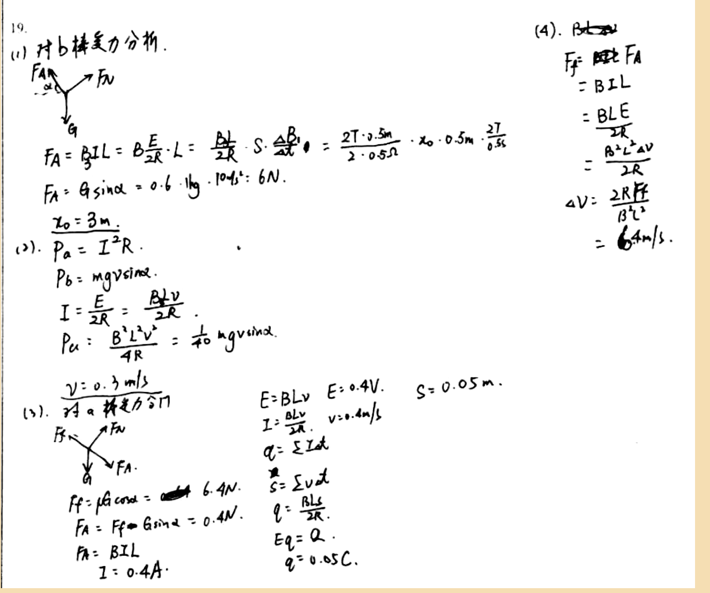

# 审查报告：stu_ans_13

## 1) 样本与任务元信息

- `db_id`: `13`
- `task_id`: `batch-question_19-2a4f3231`
- `question_id(DB)`: `question_19`
- `question_key(映射)`: `question_19`
- `created_at`: `2026-03-24 14:03:46`
- `is_pass`: **False**
- `total_deduction`: **7.0**

## 1.1 标准答案与学生作答图片

### 标准答案


### 学生作答



## 2) Qwen 感知层输出

- `readability_status`: **CLEAR**
- `global_confidence`: **0.95**

### 2.1 结构化元素明细

| element_id | content_type | confidence | raw_content |
|---|---|---:|---|
| `p0_1` | `plain_text` | 0.98 | 19. |
| `p0_2` | `plain_text` | 0.97 | (1) 对b棒受力分析. |
| `p0_3` | `image_diagram` | 0.96 | A force diagram showing three vectors: F_A, F_N, and G acting on a point with angle α between F_A and F_N. |
| `p0_4` | `latex_formula` | 0.95 | F_{A}=BIL=B\frac{E}{2R}\cdot L=\frac{BL}{2R}\cdot S\cdot \frac{\Delta B}{\Delta t}\cdot =\frac{2T\cdot 0.5m}{2\cdot 0.5\Omega}\cdot x_{0}\cdot 0.5m\cdot \frac{2T}{0.5s} |
| `p0_5` | `latex_formula` | 0.94 | F_{A}=G\sin\alpha=0.6\cdot 1kg\cdot 10m/s^{2}=6N. |
| `p0_6` | `latex_formula` | 0.93 | \frac{x_{0}=3m}{ } |
| `p0_7` | `latex_formula` | 0.95 | (2).\ P_{a}=I^{2}R. |
| `p0_8` | `latex_formula` | 0.94 | P_{b}=mgv\sin\alpha. |
| `p0_9` | `latex_formula` | 0.95 | I=\frac{E}{2R}=\frac{BLv}{2R}. |
| `p0_10` | `latex_formula` | 0.93 | P_{a}=\frac{B^{2}L^{2}v^{2}}{4R}=\neq 0\ mgv\sin\alpha. |
| `p0_11` | `latex_formula` | 0.96 | v=0.3m/s |
| `p0_12` | `plain_text` | 0.97 | (3). 对a棒受力分析 |
| `p0_13` | `image_diagram` | 0.95 | A force diagram showing three vectors: F_f, F_N, and G acting on a point with F_A labeled as the resultant of F_f and G sinα. |
| `p0_14` | `latex_formula` | 0.94 | F_{f}=\mu G\cos\alpha=\boxed{6.4N}. |
| `p0_15` | `latex_formula` | 0.95 | F_{A}=F_{f}-G\sin\alpha=0.4N. |
| `p0_16` | `latex_formula` | 0.96 | F_{A}=BIL |
| `p0_17` | `latex_formula` | 0.95 | I=0.4A. |
| `p0_18` | `latex_formula` | 0.94 | E=BLv\quad E=0.4V. |
| `p0_19` | `latex_formula` | 0.95 | S=0.05m. |
| `p0_20` | `latex_formula` | 0.94 | I=\frac{BLv}{2R},\quad v=0.4m/s |
| `p0_21` | `latex_formula` | 0.93 | a=\sum I\Delta t |
| `p0_22` | `latex_formula` | 0.94 | s=\sum v\Delta t |
| `p0_23` | `latex_formula` | 0.95 | q=\frac{BLs}{2R}. |
| `p0_24` | `latex_formula` | 0.94 | Eq=Q. |
| `p0_25` | `latex_formula` | 0.95 | q=0.05C. |
| `p0_26` | `plain_text` | 0.97 | (4). |
| `p0_27` | `latex_formula` | 0.94 | F_{F}=FA |
| `p0_28` | `latex_formula` | 0.95 | =BIL |
| `p0_29` | `latex_formula` | 0.94 | =\frac{BLE}{2R} |
| `p0_30` | `latex_formula` | 0.93 | =\frac{B^{2}L^{2}\Delta V}{2R} |
| `p0_31` | `latex_formula` | 0.94 | \Delta V=\frac{2RF_{F}}{B^{2}L^{2}} |
| `p0_32` | `latex_formula` | 0.95 | =6.4m/s. |

### 2.2 image_diagram 转译高亮

#### image_diagram 高亮：`p0_3`

```text
A force diagram showing three vectors: F_A, F_N, and G acting on a point with angle α between F_A and F_N.
```
#### image_diagram 高亮：`p0_13`

```text
A force diagram showing three vectors: F_f, F_N, and G acting on a point with F_A labeled as the resultant of F_f and G sinα.
```

## 3) DeepSeek 认知层输出

- 最终判定 `is_fully_correct`: **False**
- 扣分 `total_score_deduction`: **7.0**
- 人工复核标记 `requires_human_review`: **False**
- 系统置信度 `system_confidence`: **0.95**

### 3.1 逻辑推导（可审查视图）

```text
模型未显式输出思维链字段，以下为基于 `step_evaluations` 的可审查推导摘要：
[1] 锚点 `p0_4` -> 正确（NONE）：无补充说明。
[2] 锚点 `p0_6` -> 正确（NONE）：无补充说明。
[3] 锚点 `p0_7` -> 正确（NONE）：无补充说明。
[4] 锚点 `p0_8` -> 正确（NONE）：无补充说明。
[5] 锚点 `p0_11` -> 正确（NONE）：无补充说明。
[6] 锚点 `p0_15` -> 正确（NONE）：无补充说明。
[7] 锚点 `p0_17` -> 正确（NONE）：无补充说明。
[8] 锚点 `p0_20` -> 正确（NONE）：无补充说明。
[9] 锚点 `p0_19` -> 错误（CALCULATION）：Incorrect distance s. Use energy conservation: mg sinα s = 1/2 m v^2 + 2Q, with Q=0.02J per rod, so s=0.02m.
[10] 锚点 `p0_32` -> 错误（CALCULATION）：Incorrect velocity difference Δv. Set up equations of motion for both rods in steady state: mg sinα - BIL = m a and mg sinα + BIL - μ mg cosα = m a, then solve for Δv = 3.2 m/s.
```

### 3.2 最终反馈

> Good work on parts (1), (2), and the force balance in (3). However, there is an error in the energy conservation calculation for part (3), leading to an incorrect distance s=0.05m instead of 0.02m. Additionally, in part (4), the steady-state velocity difference is miscalculated as 6.4 m/s instead of 3.2 m/s. Review the energy equation and the force balance conditions for both rods in motion.

### 3.3 错误步骤锚点

- 错误锚点数量：**2**
- 错误锚点列表：`p0_19`, `p0_32`

### 3.4 Step 级别明细

| 锚点(reference_element_id) | 正误 | error_type | correction_suggestion |
|---|---|---|---|
| `p0_4` | 正确 | `None` | None |
| `p0_6` | 正确 | `None` | None |
| `p0_7` | 正确 | `None` | None |
| `p0_8` | 正确 | `None` | None |
| `p0_11` | 正确 | `None` | None |
| `p0_15` | 正确 | `None` | None |
| `p0_17` | 正确 | `None` | None |
| `p0_20` | 正确 | `None` | None |
| `p0_19` | 错误 | `CALCULATION` | Incorrect distance s. Use energy conservation: mg sinα s = 1/2 m v^2 + 2Q, with Q=0.02J per rod, so s=0.02m. |
| `p0_32` | 错误 | `CALCULATION` | Incorrect velocity difference Δv. Set up equations of motion for both rods in steady state: mg sinα - BIL = m a and mg sinα + BIL - μ mg cosα = m a, then solve for Δv = 3.2 m/s. |

## 4) 原始 JSON（审计留痕）

```json
{
  "perception_output": {
    "readability_status": "CLEAR",
    "elements": [
      {
        "element_id": "p0_1",
        "content_type": "plain_text",
        "raw_content": "19.",
        "confidence_score": 0.98,
        "bbox": {
          "x_min": 0.02,
          "y_min": 0.03,
          "x_max": 0.05,
          "y_max": 0.06
        }
      },
      {
        "element_id": "p0_2",
        "content_type": "plain_text",
        "raw_content": "(1) 对b棒受力分析.",
        "confidence_score": 0.97,
        "bbox": {
          "x_min": 0.02,
          "y_min": 0.07,
          "x_max": 0.18,
          "y_max": 0.11
        }
      },
      {
        "element_id": "p0_3",
        "content_type": "image_diagram",
        "raw_content": "A force diagram showing three vectors: F_A, F_N, and G acting on a point with angle α between F_A and F_N.",
        "confidence_score": 0.96,
        "bbox": {
          "x_min": 0.03,
          "y_min": 0.11,
          "x_max": 0.14,
          "y_max": 0.18
        }
      },
      {
        "element_id": "p0_4",
        "content_type": "latex_formula",
        "raw_content": "F_{A}=BIL=B\\frac{E}{2R}\\cdot L=\\frac{BL}{2R}\\cdot S\\cdot \\frac{\\Delta B}{\\Delta t}\\cdot =\\frac{2T\\cdot 0.5m}{2\\cdot 0.5\\Omega}\\cdot x_{0}\\cdot 0.5m\\cdot \\frac{2T}{0.5s}",
        "confidence_score": 0.95,
        "bbox": {
          "x_min": 0.03,
          "y_min": 0.18,
          "x_max": 0.65,
          "y_max": 0.25
        }
      },
      {
        "element_id": "p0_5",
        "content_type": "latex_formula",
        "raw_content": "F_{A}=G\\sin\\alpha=0.6\\cdot 1kg\\cdot 10m/s^{2}=6N.",
        "confidence_score": 0.94,
        "bbox": {
          "x_min": 0.03,
          "y_min": 0.25,
          "x_max": 0.38,
          "y_max": 0.29
        }
      },
      {
        "element_id": "p0_6",
        "content_type": "latex_formula",
        "raw_content": "\\frac{x_{0}=3m}{ }",
        "confidence_score": 0.93,
        "bbox": {
          "x_min": 0.07,
          "y_min": 0.3,
          "x_max": 0.18,
          "y_max": 0.34
        }
      },
      {
        "element_id": "p0_7",
        "content_type": "latex_formula",
        "raw_content": "(2).\\ P_{a}=I^{2}R.",
        "confidence_score": 0.95,
        "bbox": {
          "x_min": 0.02,
          "y_min": 0.35,
          "x_max": 0.18,
          "y_max": 0.39
        }
      },
      {
        "element_id": "p0_8",
        "content_type": "latex_formula",
        "raw_content": "P_{b}=mgv\\sin\\alpha.",
        "confidence_score": 0.94,
        "bbox": {
          "x_min": 0.03,
          "y_min": 0.39,
          "x_max": 0.21,
          "y_max": 0.43
        }
      },
      {
        "element_id": "p0_9",
        "content_type": "latex_formula",
        "raw_content": "I=\\frac{E}{2R}=\\frac{BLv}{2R}.",
        "confidence_score": 0.95,
        "bbox": {
          "x_min": 0.03,
          "y_min": 0.43,
          "x_max": 0.28,
          "y_max": 0.47
        }
      },
      {
        "element_id": "p0_10",
        "content_type": "latex_formula",
        "raw_content": "P_{a}=\\frac{B^{2}L^{2}v^{2}}{4R}=\\neq 0\\ mgv\\sin\\alpha.",
        "confidence_score": 0.93,
        "bbox": {
          "x_min": 0.03,
          "y_min": 0.47,
          "x_max": 0.42,
          "y_max": 0.52
        }
      },
      {
        "element_id": "p0_11",
        "content_type": "latex_formula",
        "raw_content": "v=0.3m/s",
        "confidence_score": 0.96,
        "bbox": {
          "x_min": 0.07,
          "y_min": 0.54,
          "x_max": 0.18,
          "y_max": 0.58
        }
      },
      {
        "element_id": "p0_12",
        "content_type": "plain_text",
        "raw_content": "(3). 对a棒受力分析",
        "confidence_score": 0.97,
        "bbox": {
          "x_min": 0.02,
          "y_min": 0.58,
          "x_max": 0.2,
          "y_max": 0.62
        }
      },
      {
        "element_id": "p0_13",
        "content_type": "image_diagram",
        "raw_content": "A force diagram showing three vectors: F_f, F_N, and G acting on a point with F_A labeled as the resultant of F_f and G sinα.",
        "confidence_score": 0.95,
        "bbox": {
          "x_min": 0.03,
          "y_min": 0.62,
          "x_max": 0.14,
          "y_max": 0.7
        }
      },
      {
        "element_id": "p0_14",
        "content_type": "latex_formula",
        "raw_content": "F_{f}=\\mu G\\cos\\alpha=\\boxed{6.4N}.",
        "confidence_score": 0.94,
        "bbox": {
          "x_min": 0.03,
          "y_min": 0.7,
          "x_max": 0.3,
          "y_max": 0.74
        }
      },
      {
        "element_id": "p0_15",
        "content_type": "latex_formula",
        "raw_content": "F_{A}=F_{f}-G\\sin\\alpha=0.4N.",
        "confidence_score": 0.95,
        "bbox": {
          "x_min": 0.03,
          "y_min": 0.74,
          "x_max": 0.28,
          "y_max": 0.78
        }
      },
      {
        "element_id": "p0_16",
        "content_type": "latex_formula",
        "raw_content": "F_{A}=BIL",
        "confidence_score": 0.96,
        "bbox": {
          "x_min": 0.03,
          "y_min": 0.78,
          "x_max": 0.14,
          "y_max": 0.82
        }
      },
      {
        "element_id": "p0_17",
        "content_type": "latex_formula",
        "raw_content": "I=0.4A.",
        "confidence_score": 0.95,
        "bbox": {
          "x_min": 0.03,
          "y_min": 0.82,
          "x_max": 0.14,
          "y_max": 0.86
        }
      },
      {
        "element_id": "p0_18",
        "content_type": "latex_formula",
        "raw_content": "E=BLv\\quad E=0.4V.",
        "confidence_score": 0.94,
        "bbox": {
          "x_min": 0.38,
          "y_min": 0.54,
          "x_max": 0.54,
          "y_max": 0.58
        }
      },
      {
        "element_id": "p0_19",
        "content_type": "latex_formula",
        "raw_content": "S=0.05m.",
        "confidence_score": 0.95,
        "bbox": {
          "x_min": 0.55,
          "y_min": 0.54,
          "x_max": 0.65,
          "y_max": 0.58
        }
      },
      {
        "element_id": "p0_20",
        "content_type": "latex_formula",
        "raw_content": "I=\\frac{BLv}{2R},\\quad v=0.4m/s",
        "confidence_score": 0.94,
        "bbox": {
          "x_min": 0.38,
          "y_min": 0.58,
          "x_max": 0.58,
          "y_max": 0.62
        }
      },
      {
        "element_id": "p0_21",
        "content_type": "latex_formula",
        "raw_content": "a=\\sum I\\Delta t",
        "confidence_score": 0.93,
        "bbox": {
          "x_min": 0.38,
          "y_min": 0.62,
          "x_max": 0.5,
          "y_max": 0.66
        }
      },
      {
        "element_id": "p0_22",
        "content_type": "latex_formula",
        "raw_content": "s=\\sum v\\Delta t",
        "confidence_score": 0.94,
        "bbox": {
          "x_min": 0.38,
          "y_min": 0.66,
          "x_max": 0.5,
          "y_max": 0.7
        }
      },
      {
        "element_id": "p0_23",
        "content_type": "latex_formula",
        "raw_content": "q=\\frac{BLs}{2R}.",
        "confidence_score": 0.95,
        "bbox": {
          "x_min": 0.38,
          "y_min": 0.7,
          "x_max": 0.5,
          "y_max": 0.74
        }
      },
      {
        "element_id": "p0_24",
        "content_type": "latex_formula",
        "raw_content": "Eq=Q.",
        "confidence_score": 0.94,
        "bbox": {
          "x_min": 0.38,
          "y_min": 0.74,
          "x_max": 0.48,
          "y_max": 0.78
        }
      },
      {
        "element_id": "p0_25",
        "content_type": "latex_formula",
        "raw_content": "q=0.05C.",
        "confidence_score": 0.95,
        "bbox": {
          "x_min": 0.38,
          "y_min": 0.78,
          "x_max": 0.5,
          "y_max": 0.82
        }
      },
      {
        "element_id": "p0_26",
        "content_type": "plain_text",
        "raw_content": "(4).",
        "confidence_score": 0.97,
        "bbox": {
          "x_min": 0.75,
          "y_min": 0.03,
          "x_max": 0.8,
          "y_max": 0.06
        }
      },
      {
        "element_id": "p0_27",
        "content_type": "latex_formula",
        "raw_content": "F_{F}=FA",
        "confidence_score": 0.94,
        "bbox": {
          "x_min": 0.75,
          "y_min": 0.07,
          "x_max": 0.88,
          "y_max": 0.11
        }
      },
      {
        "element_id": "p0_28",
        "content_type": "latex_formula",
        "raw_content": "=BIL",
        "confidence_score": 0.95,
        "bbox": {
          "x_min": 0.75,
          "y_min": 0.11,
          "x_max": 0.85,
          "y_max": 0.15
        }
      },
      {
        "element_id": "p0_29",
        "content_type": "latex_formula",
        "raw_content": "=\\frac{BLE}{2R}",
        "confidence_score": 0.94,
        "bbox": {
          "x_min": 0.75,
          "y_min": 0.15,
          "x_max": 0.88,
          "y_max": 0.19
        }
      },
      {
        "element_id": "p0_30",
        "content_type": "latex_formula",
        "raw_content": "=\\frac{B^{2}L^{2}\\Delta V}{2R}",
        "confidence_score": 0.93,
        "bbox": {
          "x_min": 0.75,
          "y_min": 0.19,
          "x_max": 0.88,
          "y_max": 0.23
        }
      },
      {
        "element_id": "p0_31",
        "content_type": "latex_formula",
        "raw_content": "\\Delta V=\\frac{2RF_{F}}{B^{2}L^{2}}",
        "confidence_score": 0.94,
        "bbox": {
          "x_min": 0.75,
          "y_min": 0.23,
          "x_max": 0.88,
          "y_max": 0.27
        }
      },
      {
        "element_id": "p0_32",
        "content_type": "latex_formula",
        "raw_content": "=6.4m/s.",
        "confidence_score": 0.95,
        "bbox": {
          "x_min": 0.75,
          "y_min": 0.27,
          "x_max": 0.88,
          "y_max": 0.31
        }
      }
    ],
    "global_confidence": 0.95,
    "trigger_short_circuit": false
  },
  "evaluation_report": {
    "is_fully_correct": false,
    "total_score_deduction": 7.0,
    "step_evaluations": [
      {
        "reference_element_id": "p0_4",
        "is_correct": true,
        "error_type": null,
        "correction_suggestion": null
      },
      {
        "reference_element_id": "p0_6",
        "is_correct": true,
        "error_type": null,
        "correction_suggestion": null
      },
      {
        "reference_element_id": "p0_7",
        "is_correct": true,
        "error_type": null,
        "correction_suggestion": null
      },
      {
        "reference_element_id": "p0_8",
        "is_correct": true,
        "error_type": null,
        "correction_suggestion": null
      },
      {
        "reference_element_id": "p0_11",
        "is_correct": true,
        "error_type": null,
        "correction_suggestion": null
      },
      {
        "reference_element_id": "p0_15",
        "is_correct": true,
        "error_type": null,
        "correction_suggestion": null
      },
      {
        "reference_element_id": "p0_17",
        "is_correct": true,
        "error_type": null,
        "correction_suggestion": null
      },
      {
        "reference_element_id": "p0_20",
        "is_correct": true,
        "error_type": null,
        "correction_suggestion": null
      },
      {
        "reference_element_id": "p0_19",
        "is_correct": false,
        "error_type": "CALCULATION",
        "correction_suggestion": "Incorrect distance s. Use energy conservation: mg sinα s = 1/2 m v^2 + 2Q, with Q=0.02J per rod, so s=0.02m."
      },
      {
        "reference_element_id": "p0_32",
        "is_correct": false,
        "error_type": "CALCULATION",
        "correction_suggestion": "Incorrect velocity difference Δv. Set up equations of motion for both rods in steady state: mg sinα - BIL = m a and mg sinα + BIL - μ mg cosα = m a, then solve for Δv = 3.2 m/s."
      }
    ],
    "overall_feedback": "Good work on parts (1), (2), and the force balance in (3). However, there is an error in the energy conservation calculation for part (3), leading to an incorrect distance s=0.05m instead of 0.02m. Additionally, in part (4), the steady-state velocity difference is miscalculated as 6.4 m/s instead of 3.2 m/s. Review the energy equation and the force balance conditions for both rods in motion.",
    "system_confidence": 0.95,
    "requires_human_review": false
  }
}
```
