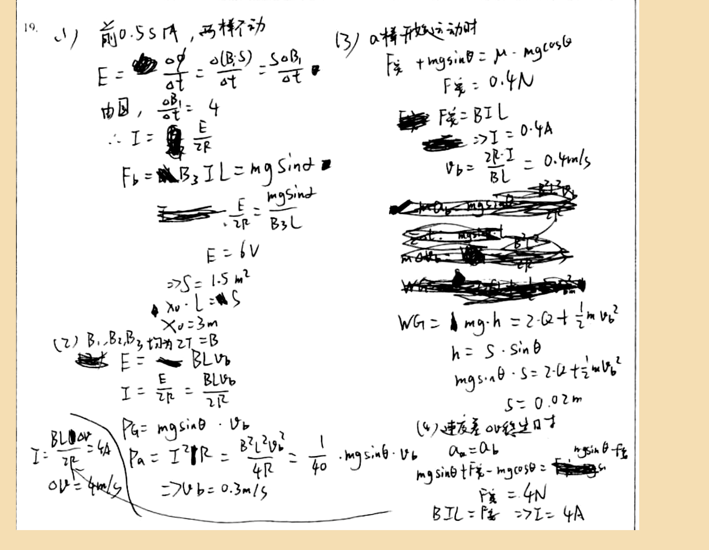

# 审查报告：stu_ans_14

## 1) 样本与任务元信息

- `db_id`: `14`
- `task_id`: `batch-question_19-2a4f3231`
- `question_id(DB)`: `question_19`
- `question_key(映射)`: `question_19`
- `created_at`: `2026-03-24 14:03:46`
- `is_pass`: **False**
- `total_deduction`: **4.0**

## 1.1 标准答案与学生作答图片

### 标准答案


### 学生作答



## 2) Qwen 感知层输出

- `readability_status`: **CLEAR**
- `global_confidence`: **0.95**

### 2.1 结构化元素明细

| element_id | content_type | confidence | raw_content |
|---|---|---:|---|
| `p0_e1` | `plain_text` | 0.98 | 19. (1) 前0.5s内，两棒不动 |
| `p0_e2` | `latex_formula` | 0.97 | E = \frac{\partial \phi}{\partial t} = \frac{\partial (B_3 S)}{\partial t} = \frac{S \partial B_3}{\partial t} |
| `p0_e3` | `plain_text` | 0.96 | 由题，\frac{\partial B_3}{\partial t} = 4 |
| `p0_e4` | `latex_formula` | 0.95 | I = \frac{E}{2R} |
| `p0_e5` | `latex_formula` | 0.96 | F_b = B_3 I L = mg \sin \theta |
| `p0_e6` | `latex_formula` | 0.94 | \frac{E}{2R} = \frac{mg \sin \theta}{B_3 L} |
| `p0_e7` | `latex_formula` | 0.97 | E = 6V |
| `p0_e8` | `latex_formula` | 0.95 | S = 1.5 m^2 |
| `p0_e9` | `latex_formula` | 0.94 | x_0 \cdot L = S |
| `p0_e10` | `latex_formula` | 0.96 | x_0 = 3m |
| `p0_e11` | `plain_text` | 0.97 | (2) B₁,B₂,B₃均为2T=B |
| `p0_e12` | `latex_formula` | 0.95 | E = BL v_b |
| `p0_e13` | `latex_formula` | 0.96 | I = \frac{E}{2R} = \frac{BL v_b}{2R} |
| `p0_e14` | `latex_formula` | 0.95 | P_g = mg \sin \theta \cdot v_b |
| `p0_e15` | `latex_formula` | 0.94 | P_a = I^2 R = \frac{B^2 L^2 v_b^2}{4R} = \frac{1}{40} \cdot mg \sin \theta \cdot v_b |
| `p0_e16` | `latex_formula` | 0.96 | v_b = 0.3m/s |
| `p0_e17` | `latex_formula` | 0.95 | I = \frac{BL \omega}{2R} = 4A |
| `p0_e18` | `latex_formula` | 0.94 | \omega = 4m/s |
| `p0_e19` | `plain_text` | 0.97 | (3) a棒开始运动时 |
| `p0_e20` | `latex_formula` | 0.96 | F_{安} + mg \sin \theta = \mu - mg \cos \theta |
| `p0_e21` | `latex_formula` | 0.95 | F_{安} = 0.4N |
| `p0_e22` | `latex_formula` | 0.94 | F_{安} = BIL |
| `p0_e23` | `latex_formula` | 0.95 | I = 0.4A |
| `p0_e24` | `latex_formula` | 0.94 | v_b = \frac{2R \cdot I}{BL} = 0.4m/s |
| `p0_e25` | `latex_formula` | 0.95 | W_G = mg \cdot h = 2Q + \frac{1}{2}mv_b^2 |
| `p0_e26` | `latex_formula` | 0.96 | h = S \cdot \sin \theta |
| `p0_e27` | `latex_formula` | 0.94 | mg \sin \theta \cdot S = 2Q + \frac{1}{2}mv_b^2 |
| `p0_e28` | `latex_formula` | 0.95 | S = 0.02m |
| `p0_e29` | `plain_text` | 0.96 | (4) 连接差0u经生日时 |
| `p0_e30` | `latex_formula` | 0.95 | a_a = a_b |
| `p0_e31` | `latex_formula` | 0.94 | mg \sin \theta + F_{安} - mg \cos \theta = F_{安} |
| `p0_e32` | `latex_formula` | 0.95 | F_{安} = 4N |
| `p0_e33` | `latex_formula` | 0.94 | BIL = F_{安} \Rightarrow I = 4A |

### 2.2 image_diagram 转译高亮

> 本样本无 `image_diagram` 节点。

## 3) DeepSeek 认知层输出

- 最终判定 `is_fully_correct`: **False**
- 扣分 `total_score_deduction`: **4.0**
- 人工复核标记 `requires_human_review`: **False**
- 系统置信度 `system_confidence`: **0.95**

### 3.1 逻辑推导（可审查视图）

```text
模型未显式输出思维链字段，以下为基于 `step_evaluations` 的可审查推导摘要：
[1] 锚点 `p0_e5` -> 正确（NONE）：无补充说明。
[2] 锚点 `p0_e10` -> 正确（NONE）：无补充说明。
[3] 锚点 `p0_e15` -> 正确（NONE）：无补充说明。
[4] 锚点 `p0_e14` -> 正确（NONE）：无补充说明。
[5] 锚点 `p0_e16` -> 正确（NONE）：无补充说明。
[6] 锚点 `p0_e20` -> 正确（TRANSCRIPTION_ERROR）：力平衡方程应写为 $BIL + mg\sin\theta = \mu mg\cos\theta$。
[7] 锚点 `p0_e24` -> 正确（NONE）：无补充说明。
[8] 锚点 `p0_e27` -> 正确（NONE）：无补充说明。
[9] 锚点 `p0_e28` -> 正确（NONE）：无补充说明。
[10] 锚点 `p0_e29` -> 错误（CONCEPTUAL）：需要正确写出动生电动势表达式：$\varepsilon = BL(v_b - v_a)$。
[11] 锚点 `p0_e31` -> 错误（CONCEPTUAL）：两棒的运动方程错误。正确方程为：对b棒 $mg\sin\theta - BIL = ma$；对a棒 $mg\sin\theta + BIL - \mu mg\cos\theta = ma$。
[12] 锚点 `p0_e31` -> 错误（CONCEPTUAL）：两棒的运动方程错误。正确方程为：对b棒 $mg\sin\theta - BIL = ma$；对a棒 $mg\sin\theta + BIL - \mu mg\cos\theta = ma$。
[13] 锚点 `p0_e30` -> 正确（NONE）：无补充说明。
[14] 锚点 `p0_e29` -> 错误（CONCEPTUAL）：未求出稳态速度差。应联立运动方程与稳态加速度相等条件，解得 $\Delta v = v_b - v_a = 3.2\,\text{m/s}$。
```

### 3.2 最终反馈

> 前三个小问解答正确，思路清晰。第四小问对两棒都运动时的物理过程分析有误，未能正确建立动生电动势表达式和运动方程，导致未能求出速度差。请重点复习电磁感应中的相对运动电动势以及连接体动力学分析方法。

### 3.3 错误步骤锚点

- 错误锚点数量：**4**
- 错误锚点列表：`p0_e29`, `p0_e31`, `p0_e31`, `p0_e29`

### 3.4 Step 级别明细

| 锚点(reference_element_id) | 正误 | error_type | correction_suggestion |
|---|---|---|---|
| `p0_e5` | 正确 | `NONE` | None |
| `p0_e10` | 正确 | `NONE` | None |
| `p0_e15` | 正确 | `NONE` | None |
| `p0_e14` | 正确 | `NONE` | None |
| `p0_e16` | 正确 | `NONE` | None |
| `p0_e20` | 正确 | `TRANSCRIPTION_ERROR` | 力平衡方程应写为 $BIL + mg\sin\theta = \mu mg\cos\theta$。 |
| `p0_e24` | 正确 | `NONE` | None |
| `p0_e27` | 正确 | `NONE` | None |
| `p0_e28` | 正确 | `NONE` | None |
| `p0_e29` | 错误 | `CONCEPTUAL` | 需要正确写出动生电动势表达式：$\varepsilon = BL(v_b - v_a)$。 |
| `p0_e31` | 错误 | `CONCEPTUAL` | 两棒的运动方程错误。正确方程为：对b棒 $mg\sin\theta - BIL = ma$；对a棒 $mg\sin\theta + BIL - \mu mg\cos\theta = ma$。 |
| `p0_e31` | 错误 | `CONCEPTUAL` | 两棒的运动方程错误。正确方程为：对b棒 $mg\sin\theta - BIL = ma$；对a棒 $mg\sin\theta + BIL - \mu mg\cos\theta = ma$。 |
| `p0_e30` | 正确 | `NONE` | None |
| `p0_e29` | 错误 | `CONCEPTUAL` | 未求出稳态速度差。应联立运动方程与稳态加速度相等条件，解得 $\Delta v = v_b - v_a = 3.2\,\text{m/s}$。 |

## 4) 原始 JSON（审计留痕）

```json
{
  "perception_output": {
    "readability_status": "CLEAR",
    "elements": [
      {
        "element_id": "p0_e1",
        "content_type": "plain_text",
        "raw_content": "19. (1) 前0.5s内，两棒不动",
        "confidence_score": 0.98,
        "bbox": {
          "x_min": 0.02,
          "y_min": 0.03,
          "x_max": 0.34,
          "y_max": 0.11
        }
      },
      {
        "element_id": "p0_e2",
        "content_type": "latex_formula",
        "raw_content": "E = \\frac{\\partial \\phi}{\\partial t} = \\frac{\\partial (B_3 S)}{\\partial t} = \\frac{S \\partial B_3}{\\partial t}",
        "confidence_score": 0.97,
        "bbox": {
          "x_min": 0.14,
          "y_min": 0.11,
          "x_max": 0.46,
          "y_max": 0.18
        }
      },
      {
        "element_id": "p0_e3",
        "content_type": "plain_text",
        "raw_content": "由题，\\frac{\\partial B_3}{\\partial t} = 4",
        "confidence_score": 0.96,
        "bbox": {
          "x_min": 0.15,
          "y_min": 0.18,
          "x_max": 0.34,
          "y_max": 0.24
        }
      },
      {
        "element_id": "p0_e4",
        "content_type": "latex_formula",
        "raw_content": "I = \\frac{E}{2R}",
        "confidence_score": 0.95,
        "bbox": {
          "x_min": 0.18,
          "y_min": 0.24,
          "x_max": 0.32,
          "y_max": 0.3
        }
      },
      {
        "element_id": "p0_e5",
        "content_type": "latex_formula",
        "raw_content": "F_b = B_3 I L = mg \\sin \\theta",
        "confidence_score": 0.96,
        "bbox": {
          "x_min": 0.18,
          "y_min": 0.3,
          "x_max": 0.47,
          "y_max": 0.37
        }
      },
      {
        "element_id": "p0_e6",
        "content_type": "latex_formula",
        "raw_content": "\\frac{E}{2R} = \\frac{mg \\sin \\theta}{B_3 L}",
        "confidence_score": 0.94,
        "bbox": {
          "x_min": 0.24,
          "y_min": 0.37,
          "x_max": 0.48,
          "y_max": 0.44
        }
      },
      {
        "element_id": "p0_e7",
        "content_type": "latex_formula",
        "raw_content": "E = 6V",
        "confidence_score": 0.97,
        "bbox": {
          "x_min": 0.32,
          "y_min": 0.44,
          "x_max": 0.42,
          "y_max": 0.5
        }
      },
      {
        "element_id": "p0_e8",
        "content_type": "latex_formula",
        "raw_content": "S = 1.5 m^2",
        "confidence_score": 0.95,
        "bbox": {
          "x_min": 0.28,
          "y_min": 0.5,
          "x_max": 0.44,
          "y_max": 0.56
        }
      },
      {
        "element_id": "p0_e9",
        "content_type": "latex_formula",
        "raw_content": "x_0 \\cdot L = S",
        "confidence_score": 0.94,
        "bbox": {
          "x_min": 0.27,
          "y_min": 0.56,
          "x_max": 0.43,
          "y_max": 0.62
        }
      },
      {
        "element_id": "p0_e10",
        "content_type": "latex_formula",
        "raw_content": "x_0 = 3m",
        "confidence_score": 0.96,
        "bbox": {
          "x_min": 0.28,
          "y_min": 0.62,
          "x_max": 0.42,
          "y_max": 0.68
        }
      },
      {
        "element_id": "p0_e11",
        "content_type": "plain_text",
        "raw_content": "(2) B₁,B₂,B₃均为2T=B",
        "confidence_score": 0.97,
        "bbox": {
          "x_min": 0.08,
          "y_min": 0.68,
          "x_max": 0.35,
          "y_max": 0.74
        }
      },
      {
        "element_id": "p0_e12",
        "content_type": "latex_formula",
        "raw_content": "E = BL v_b",
        "confidence_score": 0.95,
        "bbox": {
          "x_min": 0.22,
          "y_min": 0.74,
          "x_max": 0.4,
          "y_max": 0.8
        }
      },
      {
        "element_id": "p0_e13",
        "content_type": "latex_formula",
        "raw_content": "I = \\frac{E}{2R} = \\frac{BL v_b}{2R}",
        "confidence_score": 0.96,
        "bbox": {
          "x_min": 0.21,
          "y_min": 0.8,
          "x_max": 0.45,
          "y_max": 0.87
        }
      },
      {
        "element_id": "p0_e14",
        "content_type": "latex_formula",
        "raw_content": "P_g = mg \\sin \\theta \\cdot v_b",
        "confidence_score": 0.95,
        "bbox": {
          "x_min": 0.18,
          "y_min": 0.87,
          "x_max": 0.42,
          "y_max": 0.94
        }
      },
      {
        "element_id": "p0_e15",
        "content_type": "latex_formula",
        "raw_content": "P_a = I^2 R = \\frac{B^2 L^2 v_b^2}{4R} = \\frac{1}{40} \\cdot mg \\sin \\theta \\cdot v_b",
        "confidence_score": 0.94,
        "bbox": {
          "x_min": 0.18,
          "y_min": 0.94,
          "x_max": 0.6,
          "y_max": 1.0
        }
      },
      {
        "element_id": "p0_e16",
        "content_type": "latex_formula",
        "raw_content": "v_b = 0.3m/s",
        "confidence_score": 0.96,
        "bbox": {
          "x_min": 0.25,
          "y_min": 1.0,
          "x_max": 0.42,
          "y_max": 1.0
        }
      },
      {
        "element_id": "p0_e17",
        "content_type": "latex_formula",
        "raw_content": "I = \\frac{BL \\omega}{2R} = 4A",
        "confidence_score": 0.95,
        "bbox": {
          "x_min": 0.08,
          "y_min": 0.87,
          "x_max": 0.18,
          "y_max": 0.94
        }
      },
      {
        "element_id": "p0_e18",
        "content_type": "latex_formula",
        "raw_content": "\\omega = 4m/s",
        "confidence_score": 0.94,
        "bbox": {
          "x_min": 0.08,
          "y_min": 0.94,
          "x_max": 0.18,
          "y_max": 1.0
        }
      },
      {
        "element_id": "p0_e19",
        "content_type": "plain_text",
        "raw_content": "(3) a棒开始运动时",
        "confidence_score": 0.97,
        "bbox": {
          "x_min": 0.47,
          "y_min": 0.03,
          "x_max": 0.68,
          "y_max": 0.09
        }
      },
      {
        "element_id": "p0_e20",
        "content_type": "latex_formula",
        "raw_content": "F_{安} + mg \\sin \\theta = \\mu - mg \\cos \\theta",
        "confidence_score": 0.96,
        "bbox": {
          "x_min": 0.52,
          "y_min": 0.09,
          "x_max": 0.82,
          "y_max": 0.16
        }
      },
      {
        "element_id": "p0_e21",
        "content_type": "latex_formula",
        "raw_content": "F_{安} = 0.4N",
        "confidence_score": 0.95,
        "bbox": {
          "x_min": 0.62,
          "y_min": 0.16,
          "x_max": 0.75,
          "y_max": 0.22
        }
      },
      {
        "element_id": "p0_e22",
        "content_type": "latex_formula",
        "raw_content": "F_{安} = BIL",
        "confidence_score": 0.94,
        "bbox": {
          "x_min": 0.58,
          "y_min": 0.22,
          "x_max": 0.74,
          "y_max": 0.28
        }
      },
      {
        "element_id": "p0_e23",
        "content_type": "latex_formula",
        "raw_content": "I = 0.4A",
        "confidence_score": 0.95,
        "bbox": {
          "x_min": 0.62,
          "y_min": 0.28,
          "x_max": 0.74,
          "y_max": 0.34
        }
      },
      {
        "element_id": "p0_e24",
        "content_type": "latex_formula",
        "raw_content": "v_b = \\frac{2R \\cdot I}{BL} = 0.4m/s",
        "confidence_score": 0.94,
        "bbox": {
          "x_min": 0.58,
          "y_min": 0.34,
          "x_max": 0.8,
          "y_max": 0.41
        }
      },
      {
        "element_id": "p0_e25",
        "content_type": "latex_formula",
        "raw_content": "W_G = mg \\cdot h = 2Q + \\frac{1}{2}mv_b^2",
        "confidence_score": 0.95,
        "bbox": {
          "x_min": 0.55,
          "y_min": 0.47,
          "x_max": 0.85,
          "y_max": 0.54
        }
      },
      {
        "element_id": "p0_e26",
        "content_type": "latex_formula",
        "raw_content": "h = S \\cdot \\sin \\theta",
        "confidence_score": 0.96,
        "bbox": {
          "x_min": 0.65,
          "y_min": 0.54,
          "x_max": 0.78,
          "y_max": 0.6
        }
      },
      {
        "element_id": "p0_e27",
        "content_type": "latex_formula",
        "raw_content": "mg \\sin \\theta \\cdot S = 2Q + \\frac{1}{2}mv_b^2",
        "confidence_score": 0.94,
        "bbox": {
          "x_min": 0.6,
          "y_min": 0.6,
          "x_max": 0.85,
          "y_max": 0.67
        }
      },
      {
        "element_id": "p0_e28",
        "content_type": "latex_formula",
        "raw_content": "S = 0.02m",
        "confidence_score": 0.95,
        "bbox": {
          "x_min": 0.68,
          "y_min": 0.67,
          "x_max": 0.8,
          "y_max": 0.73
        }
      },
      {
        "element_id": "p0_e29",
        "content_type": "plain_text",
        "raw_content": "(4) 连接差0u经生日时",
        "confidence_score": 0.96,
        "bbox": {
          "x_min": 0.58,
          "y_min": 0.73,
          "x_max": 0.78,
          "y_max": 0.79
        }
      },
      {
        "element_id": "p0_e30",
        "content_type": "latex_formula",
        "raw_content": "a_a = a_b",
        "confidence_score": 0.95,
        "bbox": {
          "x_min": 0.62,
          "y_min": 0.79,
          "x_max": 0.74,
          "y_max": 0.85
        }
      },
      {
        "element_id": "p0_e31",
        "content_type": "latex_formula",
        "raw_content": "mg \\sin \\theta + F_{安} - mg \\cos \\theta = F_{安}",
        "confidence_score": 0.94,
        "bbox": {
          "x_min": 0.55,
          "y_min": 0.85,
          "x_max": 0.82,
          "y_max": 0.92
        }
      },
      {
        "element_id": "p0_e32",
        "content_type": "latex_formula",
        "raw_content": "F_{安} = 4N",
        "confidence_score": 0.95,
        "bbox": {
          "x_min": 0.65,
          "y_min": 0.92,
          "x_max": 0.76,
          "y_max": 0.98
        }
      },
      {
        "element_id": "p0_e33",
        "content_type": "latex_formula",
        "raw_content": "BIL = F_{安} \\Rightarrow I = 4A",
        "confidence_score": 0.94,
        "bbox": {
          "x_min": 0.58,
          "y_min": 0.98,
          "x_max": 0.8,
          "y_max": 1.0
        }
      }
    ],
    "global_confidence": 0.95,
    "trigger_short_circuit": false
  },
  "evaluation_report": {
    "is_fully_correct": false,
    "total_score_deduction": 4.0,
    "step_evaluations": [
      {
        "reference_element_id": "p0_e5",
        "is_correct": true,
        "error_type": "NONE",
        "correction_suggestion": null
      },
      {
        "reference_element_id": "p0_e10",
        "is_correct": true,
        "error_type": "NONE",
        "correction_suggestion": null
      },
      {
        "reference_element_id": "p0_e15",
        "is_correct": true,
        "error_type": "NONE",
        "correction_suggestion": null
      },
      {
        "reference_element_id": "p0_e14",
        "is_correct": true,
        "error_type": "NONE",
        "correction_suggestion": null
      },
      {
        "reference_element_id": "p0_e16",
        "is_correct": true,
        "error_type": "NONE",
        "correction_suggestion": null
      },
      {
        "reference_element_id": "p0_e20",
        "is_correct": true,
        "error_type": "TRANSCRIPTION_ERROR",
        "correction_suggestion": "力平衡方程应写为 $BIL + mg\\sin\\theta = \\mu mg\\cos\\theta$。"
      },
      {
        "reference_element_id": "p0_e24",
        "is_correct": true,
        "error_type": "NONE",
        "correction_suggestion": null
      },
      {
        "reference_element_id": "p0_e27",
        "is_correct": true,
        "error_type": "NONE",
        "correction_suggestion": null
      },
      {
        "reference_element_id": "p0_e28",
        "is_correct": true,
        "error_type": "NONE",
        "correction_suggestion": null
      },
      {
        "reference_element_id": "p0_e29",
        "is_correct": false,
        "error_type": "CONCEPTUAL",
        "correction_suggestion": "需要正确写出动生电动势表达式：$\\varepsilon = BL(v_b - v_a)$。"
      },
      {
        "reference_element_id": "p0_e31",
        "is_correct": false,
        "error_type": "CONCEPTUAL",
        "correction_suggestion": "两棒的运动方程错误。正确方程为：对b棒 $mg\\sin\\theta - BIL = ma$；对a棒 $mg\\sin\\theta + BIL - \\mu mg\\cos\\theta = ma$。"
      },
      {
        "reference_element_id": "p0_e31",
        "is_correct": false,
        "error_type": "CONCEPTUAL",
        "correction_suggestion": "两棒的运动方程错误。正确方程为：对b棒 $mg\\sin\\theta - BIL = ma$；对a棒 $mg\\sin\\theta + BIL - \\mu mg\\cos\\theta = ma$。"
      },
      {
        "reference_element_id": "p0_e30",
        "is_correct": true,
        "error_type": "NONE",
        "correction_suggestion": null
      },
      {
        "reference_element_id": "p0_e29",
        "is_correct": false,
        "error_type": "CONCEPTUAL",
        "correction_suggestion": "未求出稳态速度差。应联立运动方程与稳态加速度相等条件，解得 $\\Delta v = v_b - v_a = 3.2\\,\\text{m/s}$。"
      }
    ],
    "overall_feedback": "前三个小问解答正确，思路清晰。第四小问对两棒都运动时的物理过程分析有误，未能正确建立动生电动势表达式和运动方程，导致未能求出速度差。请重点复习电磁感应中的相对运动电动势以及连接体动力学分析方法。",
    "system_confidence": 0.95,
    "requires_human_review": false
  }
}
```
