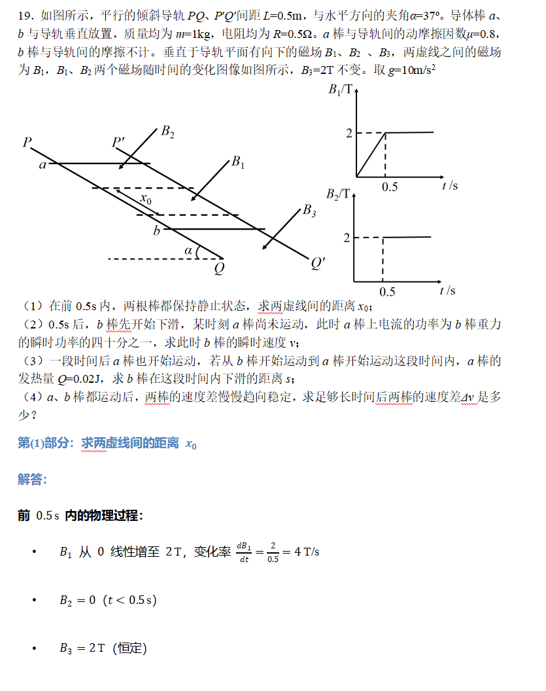
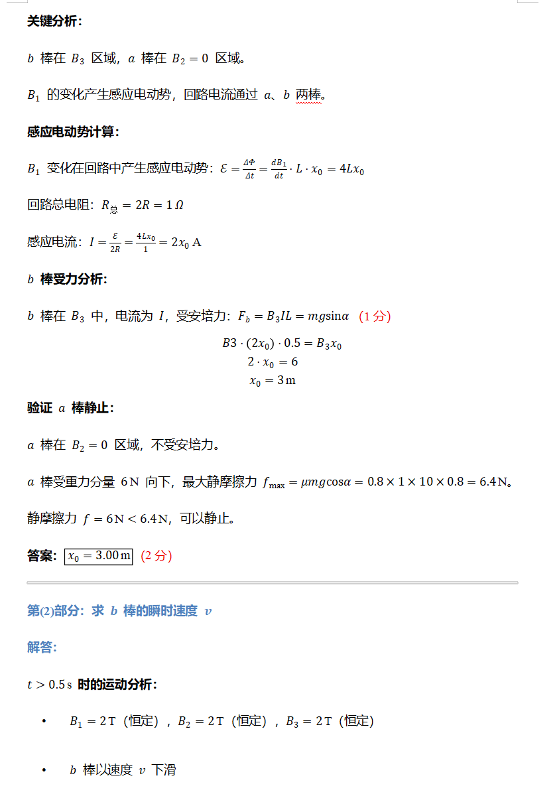
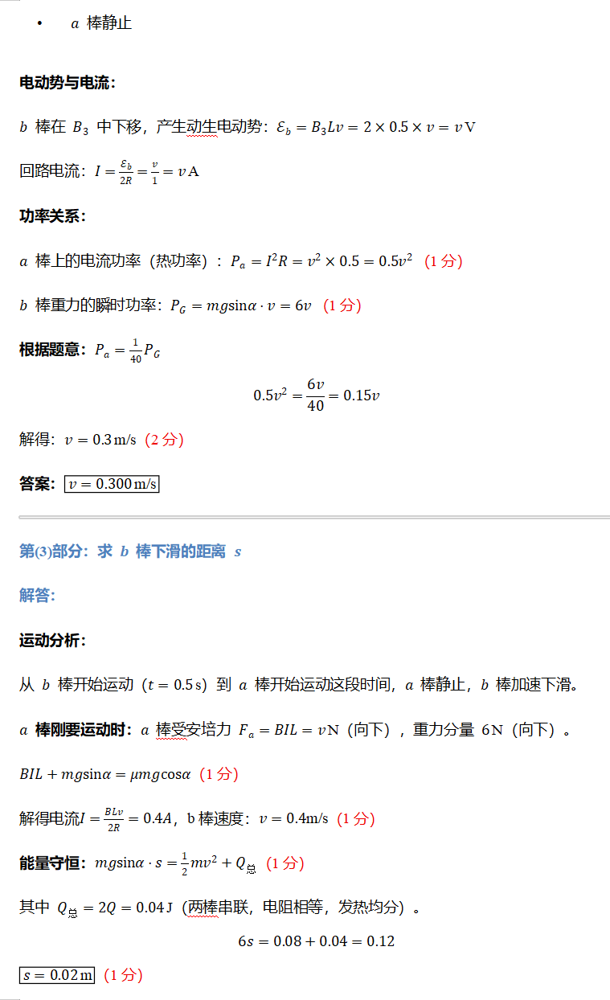
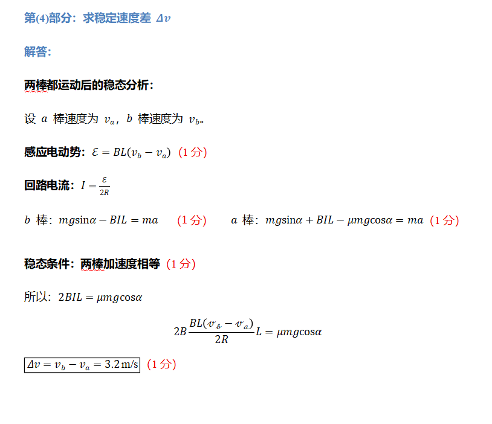
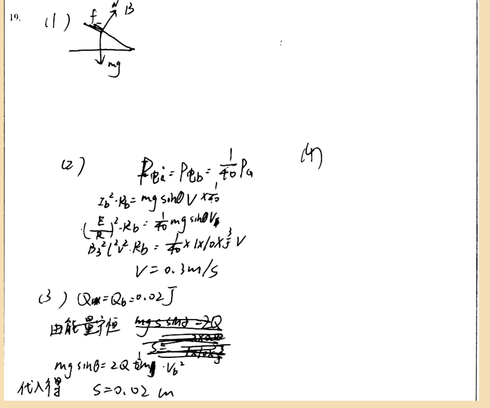

# 审查报告：stu_ans_15

## 1) 样本与任务元信息

- `db_id`: `15`
- `task_id`: `batch-question_19-2a4f3231`
- `question_id(DB)`: `question_19`
- `question_key(映射)`: `question_19`
- `created_at`: `2026-03-24 14:03:46`
- `is_pass`: **False**
- `total_deduction`: **11.0**

## 1.1 标准答案与学生作答图片

### 标准答案






### 学生作答



## 2) Qwen 感知层输出

- `readability_status`: **CLEAR**
- `global_confidence`: **0.93**

### 2.1 结构化元素明细

| element_id | content_type | confidence | raw_content |
|---|---|---:|---|
| `p0_1` | `plain_text` | 0.98 | 19. |
| `p0_2` | `plain_text` | 0.97 | (1) |
| `p0_3` | `image_diagram` | 0.95 | A force diagram showing a right triangle with labeled forces: an upward arrow labeled 'f', a downward arrow labeled 'mg', and a horizontal arrow labeled 'B'. The angle between the vertical and the hypotenuse is marked as θ. |
| `p0_4` | `plain_text` | 0.96 | (2) |
| `p0_5` | `latex_formula` | 0.94 | P_{电a}=P_{电b}=\frac{1}{40}P_{a} |
| `p0_6` | `plain_text` | 0.95 | (4) |
| `p0_7` | `latex_formula` | 0.93 | I_{b}^{2}\cdot R_{b}=mg\sin\theta\cdot V\times\frac{1}{40} |
| `p0_8` | `latex_formula` | 0.92 | \left(\frac{E}{R}\right)^{2}\cdot R_{b}=\frac{1}{40}mg\sin\theta V_{b} |
| `p0_9` | `latex_formula` | 0.91 | \frac{B^{2}l^{2}v^{2}}{R_{b}}=\frac{1}{40}\times1\times10\times\frac{3}{5}V |
| `p0_10` | `latex_formula` | 0.95 | V=0.3m/s |
| `p0_11` | `plain_text` | 0.96 | (3) |
| `p0_12` | `latex_formula` | 0.94 | Q_{a}=Q_{b}=0.02J |
| `p0_13` | `plain_text` | 0.93 | 由能量守恒 |
| `p0_14` | `latex_formula` | 0.92 | mg\sin\theta\cdot s=2Q |
| `p0_15` | `latex_formula` | 0.91 | s=\frac{2Q}{mg\sin\theta} |
| `p0_16` | `latex_formula` | 0.9 | mg\sin\theta=2Q\cdot\frac{1}{2}mv_{b}^{2} |
| `p0_17` | `plain_text` | 0.95 | 代入得 |
| `p0_18` | `latex_formula` | 0.94 | s=0.02m |

### 2.2 image_diagram 转译高亮

#### image_diagram 高亮：`p0_3`

```text
A force diagram showing a right triangle with labeled forces: an upward arrow labeled 'f', a downward arrow labeled 'mg', and a horizontal arrow labeled 'B'. The angle between the vertical and the hypotenuse is marked as θ.
```

## 3) DeepSeek 认知层输出

- 最终判定 `is_fully_correct`: **False**
- 扣分 `total_score_deduction`: **11.0**
- 人工复核标记 `requires_human_review`: **False**
- 系统置信度 `system_confidence`: **0.9**

### 3.1 逻辑推导（可审查视图）

```text
模型未显式输出思维链字段，以下为基于 `step_evaluations` 的可审查推导摘要：
[1] 锚点 `p0_3` -> 错误（CONCEPTUAL）：第(1)问需要设置力平衡方程 B3 * I * L = mg sinα，并求解 x0。图像中未展示必要的方程推导和计算。
[2] 锚点 `p0_5` -> 正确（NONE）：无补充说明。
[3] 锚点 `p0_12` -> 错误（LOGIC）：第(3)问的能量守恒方程不完整，应包含动能项：mg sinα · s = (1/2) m v² + Q_total，其中 Q_total = 2Q。需要先通过力平衡方程求电流 I 和速度 v。
[4] 锚点 `p0_6` -> 错误（LOGIC）：第(4)问未作答，需要推导稳态速度差 Δv。应设置两棒的运动方程，利用感应电动势 ε = B L (v_b - v_a)，并在加速度相同的稳态条件下求解。
```

### 3.2 最终反馈

> 作业部分正确：第(2)问功率平衡和速度求解正确；但第(1)问缺少力平衡方程和计算，第(3)问能量守恒方程不完整且缺少关键步骤，第(4)问未作答。请根据物理定律补充完整推导过程。

### 3.3 错误步骤锚点

- 错误锚点数量：**3**
- 错误锚点列表：`p0_3`, `p0_12`, `p0_6`

### 3.4 Step 级别明细

| 锚点(reference_element_id) | 正误 | error_type | correction_suggestion |
|---|---|---|---|
| `p0_3` | 错误 | `CONCEPTUAL` | 第(1)问需要设置力平衡方程 B3 * I * L = mg sinα，并求解 x0。图像中未展示必要的方程推导和计算。 |
| `p0_5` | 正确 | `NONE` | None |
| `p0_12` | 错误 | `LOGIC` | 第(3)问的能量守恒方程不完整，应包含动能项：mg sinα · s = (1/2) m v² + Q_total，其中 Q_total = 2Q。需要先通过力平衡方程求电流 I 和速度 v。 |
| `p0_6` | 错误 | `LOGIC` | 第(4)问未作答，需要推导稳态速度差 Δv。应设置两棒的运动方程，利用感应电动势 ε = B L (v_b - v_a)，并在加速度相同的稳态条件下求解。 |

## 4) 原始 JSON（审计留痕）

```json
{
  "perception_output": {
    "readability_status": "CLEAR",
    "elements": [
      {
        "element_id": "p0_1",
        "content_type": "plain_text",
        "raw_content": "19.",
        "confidence_score": 0.98,
        "bbox": {
          "x_min": 0.02,
          "y_min": 0.03,
          "x_max": 0.06,
          "y_max": 0.07
        }
      },
      {
        "element_id": "p0_2",
        "content_type": "plain_text",
        "raw_content": "(1)",
        "confidence_score": 0.97,
        "bbox": {
          "x_min": 0.08,
          "y_min": 0.03,
          "x_max": 0.14,
          "y_max": 0.07
        }
      },
      {
        "element_id": "p0_3",
        "content_type": "image_diagram",
        "raw_content": "A force diagram showing a right triangle with labeled forces: an upward arrow labeled 'f', a downward arrow labeled 'mg', and a horizontal arrow labeled 'B'. The angle between the vertical and the hypotenuse is marked as θ.",
        "confidence_score": 0.95,
        "bbox": {
          "x_min": 0.15,
          "y_min": 0.03,
          "x_max": 0.28,
          "y_max": 0.15
        }
      },
      {
        "element_id": "p0_4",
        "content_type": "plain_text",
        "raw_content": "(2)",
        "confidence_score": 0.96,
        "bbox": {
          "x_min": 0.13,
          "y_min": 0.32,
          "x_max": 0.18,
          "y_max": 0.37
        }
      },
      {
        "element_id": "p0_5",
        "content_type": "latex_formula",
        "raw_content": "P_{电a}=P_{电b}=\\frac{1}{40}P_{a}",
        "confidence_score": 0.94,
        "bbox": {
          "x_min": 0.28,
          "y_min": 0.31,
          "x_max": 0.52,
          "y_max": 0.39
        }
      },
      {
        "element_id": "p0_6",
        "content_type": "plain_text",
        "raw_content": "(4)",
        "confidence_score": 0.95,
        "bbox": {
          "x_min": 0.61,
          "y_min": 0.32,
          "x_max": 0.66,
          "y_max": 0.37
        }
      },
      {
        "element_id": "p0_7",
        "content_type": "latex_formula",
        "raw_content": "I_{b}^{2}\\cdot R_{b}=mg\\sin\\theta\\cdot V\\times\\frac{1}{40}",
        "confidence_score": 0.93,
        "bbox": {
          "x_min": 0.21,
          "y_min": 0.4,
          "x_max": 0.48,
          "y_max": 0.47
        }
      },
      {
        "element_id": "p0_8",
        "content_type": "latex_formula",
        "raw_content": "\\left(\\frac{E}{R}\\right)^{2}\\cdot R_{b}=\\frac{1}{40}mg\\sin\\theta V_{b}",
        "confidence_score": 0.92,
        "bbox": {
          "x_min": 0.19,
          "y_min": 0.47,
          "x_max": 0.5,
          "y_max": 0.54
        }
      },
      {
        "element_id": "p0_9",
        "content_type": "latex_formula",
        "raw_content": "\\frac{B^{2}l^{2}v^{2}}{R_{b}}=\\frac{1}{40}\\times1\\times10\\times\\frac{3}{5}V",
        "confidence_score": 0.91,
        "bbox": {
          "x_min": 0.19,
          "y_min": 0.54,
          "x_max": 0.51,
          "y_max": 0.61
        }
      },
      {
        "element_id": "p0_10",
        "content_type": "latex_formula",
        "raw_content": "V=0.3m/s",
        "confidence_score": 0.95,
        "bbox": {
          "x_min": 0.32,
          "y_min": 0.61,
          "x_max": 0.45,
          "y_max": 0.67
        }
      },
      {
        "element_id": "p0_11",
        "content_type": "plain_text",
        "raw_content": "(3)",
        "confidence_score": 0.96,
        "bbox": {
          "x_min": 0.07,
          "y_min": 0.68,
          "x_max": 0.12,
          "y_max": 0.73
        }
      },
      {
        "element_id": "p0_12",
        "content_type": "latex_formula",
        "raw_content": "Q_{a}=Q_{b}=0.02J",
        "confidence_score": 0.94,
        "bbox": {
          "x_min": 0.15,
          "y_min": 0.68,
          "x_max": 0.36,
          "y_max": 0.74
        }
      },
      {
        "element_id": "p0_13",
        "content_type": "plain_text",
        "raw_content": "由能量守恒",
        "confidence_score": 0.93,
        "bbox": {
          "x_min": 0.12,
          "y_min": 0.75,
          "x_max": 0.28,
          "y_max": 0.81
        }
      },
      {
        "element_id": "p0_14",
        "content_type": "latex_formula",
        "raw_content": "mg\\sin\\theta\\cdot s=2Q",
        "confidence_score": 0.92,
        "bbox": {
          "x_min": 0.29,
          "y_min": 0.75,
          "x_max": 0.48,
          "y_max": 0.81
        }
      },
      {
        "element_id": "p0_15",
        "content_type": "latex_formula",
        "raw_content": "s=\\frac{2Q}{mg\\sin\\theta}",
        "confidence_score": 0.91,
        "bbox": {
          "x_min": 0.29,
          "y_min": 0.81,
          "x_max": 0.48,
          "y_max": 0.87
        }
      },
      {
        "element_id": "p0_16",
        "content_type": "latex_formula",
        "raw_content": "mg\\sin\\theta=2Q\\cdot\\frac{1}{2}mv_{b}^{2}",
        "confidence_score": 0.9,
        "bbox": {
          "x_min": 0.12,
          "y_min": 0.87,
          "x_max": 0.45,
          "y_max": 0.94
        }
      },
      {
        "element_id": "p0_17",
        "content_type": "plain_text",
        "raw_content": "代入得",
        "confidence_score": 0.95,
        "bbox": {
          "x_min": 0.02,
          "y_min": 0.94,
          "x_max": 0.12,
          "y_max": 0.99
        }
      },
      {
        "element_id": "p0_18",
        "content_type": "latex_formula",
        "raw_content": "s=0.02m",
        "confidence_score": 0.94,
        "bbox": {
          "x_min": 0.15,
          "y_min": 0.94,
          "x_max": 0.33,
          "y_max": 0.99
        }
      }
    ],
    "global_confidence": 0.93,
    "trigger_short_circuit": false
  },
  "evaluation_report": {
    "is_fully_correct": false,
    "total_score_deduction": 11.0,
    "step_evaluations": [
      {
        "reference_element_id": "p0_3",
        "is_correct": false,
        "error_type": "CONCEPTUAL",
        "correction_suggestion": "第(1)问需要设置力平衡方程 B3 * I * L = mg sinα，并求解 x0。图像中未展示必要的方程推导和计算。"
      },
      {
        "reference_element_id": "p0_5",
        "is_correct": true,
        "error_type": "NONE",
        "correction_suggestion": null
      },
      {
        "reference_element_id": "p0_12",
        "is_correct": false,
        "error_type": "LOGIC",
        "correction_suggestion": "第(3)问的能量守恒方程不完整，应包含动能项：mg sinα · s = (1/2) m v² + Q_total，其中 Q_total = 2Q。需要先通过力平衡方程求电流 I 和速度 v。"
      },
      {
        "reference_element_id": "p0_6",
        "is_correct": false,
        "error_type": "LOGIC",
        "correction_suggestion": "第(4)问未作答，需要推导稳态速度差 Δv。应设置两棒的运动方程，利用感应电动势 ε = B L (v_b - v_a)，并在加速度相同的稳态条件下求解。"
      }
    ],
    "overall_feedback": "作业部分正确：第(2)问功率平衡和速度求解正确；但第(1)问缺少力平衡方程和计算，第(3)问能量守恒方程不完整且缺少关键步骤，第(4)问未作答。请根据物理定律补充完整推导过程。",
    "system_confidence": 0.9,
    "requires_human_review": false
  }
}
```
