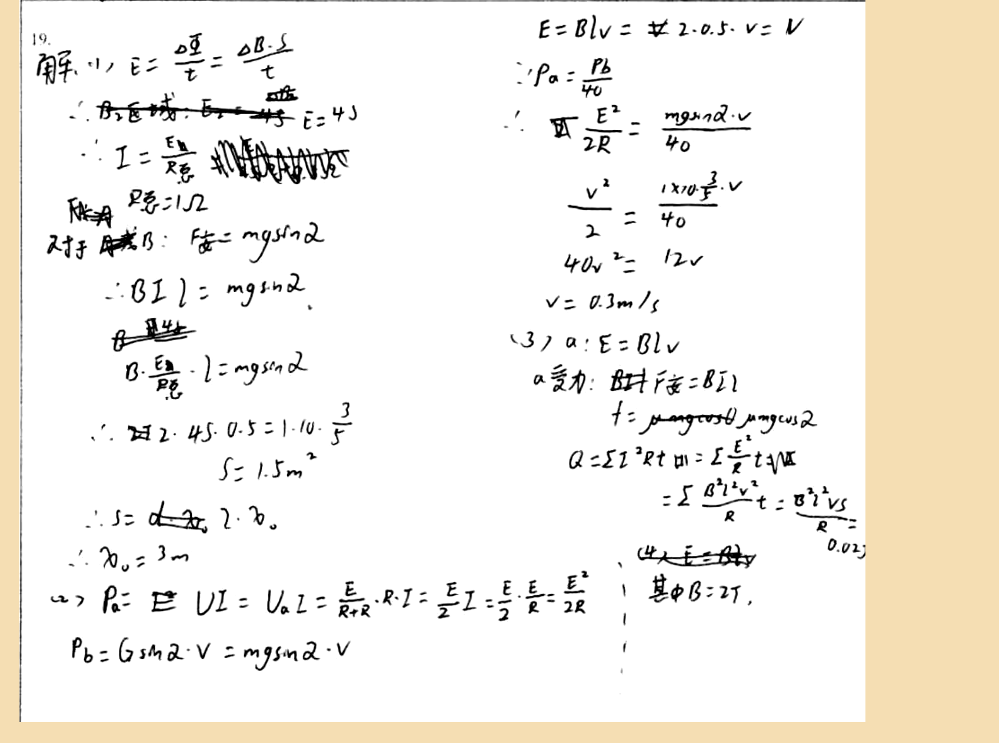

# 审查报告：stu_ans_16

## 1) 样本与任务元信息

- `db_id`: `16`
- `task_id`: `batch-question_19-2a4f3231`
- `question_id(DB)`: `question_19`
- `question_key(映射)`: `question_19`
- `created_at`: `2026-03-24 14:03:46`
- `is_pass`: **False**
- `total_deduction`: **9.0**

## 1.1 标准答案与学生作答图片

### 标准答案


### 学生作答



## 2) Qwen 感知层输出

- `readability_status`: **CLEAR**
- `global_confidence`: **0.96**

### 2.1 结构化元素明细

| element_id | content_type | confidence | raw_content |
|---|---|---:|---|
| `p0_1` | `plain_text` | 0.98 | 19. |
| `p0_2` | `latex_formula` | 0.97 | E = \frac{\Delta \varphi}{t} = \frac{\Delta B \cdot S}{t} |
| `p0_3` | `plain_text` | 0.95 | B_2区域，E=4J |
| `p0_4` | `latex_formula` | 0.96 | I = \frac{E_0}{R_{总}} |
| `p0_5` | `plain_text` | 0.94 | R_{总}=1\Omega |
| `p0_6` | `plain_text` | 0.95 | 对于A: F_{安}=mg\sin\alpha |
| `p0_7` | `latex_formula` | 0.96 | BIL = mg\sin\alpha |
| `p0_8` | `latex_formula` | 0.95 | B\cdot\frac{E_0}{R_{总}}\cdot l = mg\sin\alpha |
| `p0_9` | `latex_formula` | 0.96 | \therefore 2 \cdot 4.5 \cdot 0.5 = 1 \cdot 10 \cdot \frac{3}{5} |
| `p0_10` | `latex_formula` | 0.95 | S = 1.5m^2 |
| `p0_11` | `latex_formula` | 0.94 | \therefore S = d \cdot x_0 |
| `p0_12` | `latex_formula` | 0.95 | \therefore x_0 = 3m |
| `p0_13` | `latex_formula` | 0.96 | P_a = UI = U_a I = \frac{E}{R+r} \cdot R \cdot I = \frac{E}{2} I = \frac{E}{2} \cdot \frac{E}{R} = \frac{E^2}{2R} |
| `p0_14` | `latex_formula` | 0.95 | P_b = G\sin\alpha \cdot v = mg\sin\alpha \cdot v |
| `p0_15` | `latex_formula` | 0.97 | E = BLv = \pm 2 \cdot 0.5 \cdot v = V |
| `p0_16` | `latex_formula` | 0.96 | \because P_a = \frac{P_b}{40} |
| `p0_17` | `latex_formula` | 0.95 | \therefore \frac{E^2}{2R} = \frac{mg\sin\alpha \cdot v}{40} |
| `p0_18` | `latex_formula` | 0.96 | \frac{v^2}{2} = \frac{1 \times 10 \cdot \frac{3}{5} \cdot v}{40} |
| `p0_19` | `latex_formula` | 0.97 | 40v^2 = 12v |
| `p0_20` | `latex_formula` | 0.96 | v = 0.3m/s |
| `p0_21` | `plain_text` | 0.95 | (3) a: E = BLv |
| `p0_22` | `plain_text` | 0.94 | a.受力: B\uparrow F_{安}=BIl |
| `p0_23` | `latex_formula` | 0.95 | f = \mu mg\cos\theta, \mu mg\cos\alpha |
| `p0_24` | `latex_formula` | 0.96 | Q = \Sigma I^2 R t = \Sigma \frac{E^2}{R} t = \Sigma \frac{B^2 l^2 v^2}{R} t = \frac{B^2 l^2 v s}{R} = 0.02J |
| `p0_25` | `plain_text` | 0.95 | (4) 其中B=2T |

### 2.2 image_diagram 转译高亮

> 本样本无 `image_diagram` 节点。

## 3) DeepSeek 认知层输出

- 最终判定 `is_fully_correct`: **False**
- 扣分 `total_score_deduction`: **9.0**
- 人工复核标记 `requires_human_review`: **False**
- 系统置信度 `system_confidence`: **0.95**

### 3.1 逻辑推导（可审查视图）

```text
模型未显式输出思维链字段，以下为基于 `step_evaluations` 的可审查推导摘要：
[1] 锚点 `p0_6` -> 正确（NONE）：无补充说明。
[2] 锚点 `p0_12` -> 正确（NONE）：无补充说明。
[3] 锚点 `p0_13` -> 正确（NONE）：无补充说明。
[4] 锚点 `p0_14` -> 正确（NONE）：无补充说明。
[5] 锚点 `p0_20` -> 正确（NONE）：无补充说明。
[6] 锚点 `p0_22` -> 错误（CONCEPTUAL）：需要设置杆a的力平衡方程：BIL + mg sinα = μ mg cosα，以找到电流和速度。
[7] 锚点 `p0_22` -> 错误（CONCEPTUAL）：从力平衡解出I=0.4 A，然后v=I=0.4 m/s（因为E=BLv，I=E/R）。
[8] 锚点 `p0_24` -> 错误（CONCEPTUAL）：应用能量守恒：mg sinα s = (1/2) m v^2 + Q_total，其中Q_total=2Q。
[9] 锚点 `p0_24` -> 错误（CONCEPTUAL）：从能量守恒解出s=0.02 m。
[10] 锚点 `p0_25` -> 错误（CONCEPTUAL）：需要表达式 for induced emf: ε = B L (v_b - v_a)。
[11] 锚点 `p0_25` -> 错误（CONCEPTUAL）：需要杆b的运动方程：mg sinα - B I L = m a。
[12] 锚点 `p0_25` -> 错误（CONCEPTUAL）：需要杆a的运动方程：mg sinα + B I L - μ mg cosα = m a。
[13] 锚点 `p0_25` -> 错误（CONCEPTUAL）：在稳态，两杆加速度相同，设置a_b = a_a。
[14] 锚点 `p0_25` -> 错误（CONCEPTUAL）：解出稳态速度差 Δv = v_b - v_a = 3.2 m/s。
```

### 3.2 最终反馈

> 学生正确解决了第一部分和第二部分，得到了x0=3 m和v=0.3 m/s。然而，第三部分和第四部分不完整或缺失，缺少必要的力平衡方程、能量守恒和运动方程。建议补充完整推导。

### 3.3 错误步骤锚点

- 错误锚点数量：**9**
- 错误锚点列表：`p0_22`, `p0_22`, `p0_24`, `p0_24`, `p0_25`, `p0_25`, `p0_25`, `p0_25`, `p0_25`

### 3.4 Step 级别明细

| 锚点(reference_element_id) | 正误 | error_type | correction_suggestion |
|---|---|---|---|
| `p0_6` | 正确 | `None` | None |
| `p0_12` | 正确 | `None` | None |
| `p0_13` | 正确 | `None` | None |
| `p0_14` | 正确 | `None` | None |
| `p0_20` | 正确 | `None` | None |
| `p0_22` | 错误 | `CONCEPTUAL` | 需要设置杆a的力平衡方程：BIL + mg sinα = μ mg cosα，以找到电流和速度。 |
| `p0_22` | 错误 | `CONCEPTUAL` | 从力平衡解出I=0.4 A，然后v=I=0.4 m/s（因为E=BLv，I=E/R）。 |
| `p0_24` | 错误 | `CONCEPTUAL` | 应用能量守恒：mg sinα s = (1/2) m v^2 + Q_total，其中Q_total=2Q。 |
| `p0_24` | 错误 | `CONCEPTUAL` | 从能量守恒解出s=0.02 m。 |
| `p0_25` | 错误 | `CONCEPTUAL` | 需要表达式 for induced emf: ε = B L (v_b - v_a)。 |
| `p0_25` | 错误 | `CONCEPTUAL` | 需要杆b的运动方程：mg sinα - B I L = m a。 |
| `p0_25` | 错误 | `CONCEPTUAL` | 需要杆a的运动方程：mg sinα + B I L - μ mg cosα = m a。 |
| `p0_25` | 错误 | `CONCEPTUAL` | 在稳态，两杆加速度相同，设置a_b = a_a。 |
| `p0_25` | 错误 | `CONCEPTUAL` | 解出稳态速度差 Δv = v_b - v_a = 3.2 m/s。 |

## 4) 原始 JSON（审计留痕）

```json
{
  "perception_output": {
    "readability_status": "CLEAR",
    "elements": [
      {
        "element_id": "p0_1",
        "content_type": "plain_text",
        "raw_content": "19.",
        "confidence_score": 0.98,
        "bbox": {
          "x_min": 0.02,
          "y_min": 0.03,
          "x_max": 0.06,
          "y_max": 0.07
        }
      },
      {
        "element_id": "p0_2",
        "content_type": "latex_formula",
        "raw_content": "E = \\frac{\\Delta \\varphi}{t} = \\frac{\\Delta B \\cdot S}{t}",
        "confidence_score": 0.97,
        "bbox": {
          "x_min": 0.04,
          "y_min": 0.07,
          "x_max": 0.27,
          "y_max": 0.12
        }
      },
      {
        "element_id": "p0_3",
        "content_type": "plain_text",
        "raw_content": "B_2区域，E=4J",
        "confidence_score": 0.95,
        "bbox": {
          "x_min": 0.05,
          "y_min": 0.12,
          "x_max": 0.28,
          "y_max": 0.17
        }
      },
      {
        "element_id": "p0_4",
        "content_type": "latex_formula",
        "raw_content": "I = \\frac{E_0}{R_{总}}",
        "confidence_score": 0.96,
        "bbox": {
          "x_min": 0.05,
          "y_min": 0.17,
          "x_max": 0.25,
          "y_max": 0.22
        }
      },
      {
        "element_id": "p0_5",
        "content_type": "plain_text",
        "raw_content": "R_{总}=1\\Omega",
        "confidence_score": 0.94,
        "bbox": {
          "x_min": 0.05,
          "y_min": 0.22,
          "x_max": 0.22,
          "y_max": 0.27
        }
      },
      {
        "element_id": "p0_6",
        "content_type": "plain_text",
        "raw_content": "对于A: F_{安}=mg\\sin\\alpha",
        "confidence_score": 0.95,
        "bbox": {
          "x_min": 0.04,
          "y_min": 0.27,
          "x_max": 0.31,
          "y_max": 0.32
        }
      },
      {
        "element_id": "p0_7",
        "content_type": "latex_formula",
        "raw_content": "BIL = mg\\sin\\alpha",
        "confidence_score": 0.96,
        "bbox": {
          "x_min": 0.05,
          "y_min": 0.32,
          "x_max": 0.3,
          "y_max": 0.37
        }
      },
      {
        "element_id": "p0_8",
        "content_type": "latex_formula",
        "raw_content": "B\\cdot\\frac{E_0}{R_{总}}\\cdot l = mg\\sin\\alpha",
        "confidence_score": 0.95,
        "bbox": {
          "x_min": 0.05,
          "y_min": 0.37,
          "x_max": 0.3,
          "y_max": 0.42
        }
      },
      {
        "element_id": "p0_9",
        "content_type": "latex_formula",
        "raw_content": "\\therefore 2 \\cdot 4.5 \\cdot 0.5 = 1 \\cdot 10 \\cdot \\frac{3}{5}",
        "confidence_score": 0.96,
        "bbox": {
          "x_min": 0.05,
          "y_min": 0.42,
          "x_max": 0.33,
          "y_max": 0.47
        }
      },
      {
        "element_id": "p0_10",
        "content_type": "latex_formula",
        "raw_content": "S = 1.5m^2",
        "confidence_score": 0.95,
        "bbox": {
          "x_min": 0.15,
          "y_min": 0.47,
          "x_max": 0.28,
          "y_max": 0.52
        }
      },
      {
        "element_id": "p0_11",
        "content_type": "latex_formula",
        "raw_content": "\\therefore S = d \\cdot x_0",
        "confidence_score": 0.94,
        "bbox": {
          "x_min": 0.05,
          "y_min": 0.52,
          "x_max": 0.27,
          "y_max": 0.57
        }
      },
      {
        "element_id": "p0_12",
        "content_type": "latex_formula",
        "raw_content": "\\therefore x_0 = 3m",
        "confidence_score": 0.95,
        "bbox": {
          "x_min": 0.05,
          "y_min": 0.57,
          "x_max": 0.25,
          "y_max": 0.62
        }
      },
      {
        "element_id": "p0_13",
        "content_type": "latex_formula",
        "raw_content": "P_a = UI = U_a I = \\frac{E}{R+r} \\cdot R \\cdot I = \\frac{E}{2} I = \\frac{E}{2} \\cdot \\frac{E}{R} = \\frac{E^2}{2R}",
        "confidence_score": 0.96,
        "bbox": {
          "x_min": 0.04,
          "y_min": 0.62,
          "x_max": 0.58,
          "y_max": 0.69
        }
      },
      {
        "element_id": "p0_14",
        "content_type": "latex_formula",
        "raw_content": "P_b = G\\sin\\alpha \\cdot v = mg\\sin\\alpha \\cdot v",
        "confidence_score": 0.95,
        "bbox": {
          "x_min": 0.04,
          "y_min": 0.69,
          "x_max": 0.35,
          "y_max": 0.74
        }
      },
      {
        "element_id": "p0_15",
        "content_type": "latex_formula",
        "raw_content": "E = BLv = \\pm 2 \\cdot 0.5 \\cdot v = V",
        "confidence_score": 0.97,
        "bbox": {
          "x_min": 0.53,
          "y_min": 0.03,
          "x_max": 0.8,
          "y_max": 0.08
        }
      },
      {
        "element_id": "p0_16",
        "content_type": "latex_formula",
        "raw_content": "\\because P_a = \\frac{P_b}{40}",
        "confidence_score": 0.96,
        "bbox": {
          "x_min": 0.53,
          "y_min": 0.08,
          "x_max": 0.7,
          "y_max": 0.13
        }
      },
      {
        "element_id": "p0_17",
        "content_type": "latex_formula",
        "raw_content": "\\therefore \\frac{E^2}{2R} = \\frac{mg\\sin\\alpha \\cdot v}{40}",
        "confidence_score": 0.95,
        "bbox": {
          "x_min": 0.53,
          "y_min": 0.13,
          "x_max": 0.78,
          "y_max": 0.18
        }
      },
      {
        "element_id": "p0_18",
        "content_type": "latex_formula",
        "raw_content": "\\frac{v^2}{2} = \\frac{1 \\times 10 \\cdot \\frac{3}{5} \\cdot v}{40}",
        "confidence_score": 0.96,
        "bbox": {
          "x_min": 0.53,
          "y_min": 0.18,
          "x_max": 0.78,
          "y_max": 0.23
        }
      },
      {
        "element_id": "p0_19",
        "content_type": "latex_formula",
        "raw_content": "40v^2 = 12v",
        "confidence_score": 0.97,
        "bbox": {
          "x_min": 0.53,
          "y_min": 0.23,
          "x_max": 0.72,
          "y_max": 0.28
        }
      },
      {
        "element_id": "p0_20",
        "content_type": "latex_formula",
        "raw_content": "v = 0.3m/s",
        "confidence_score": 0.96,
        "bbox": {
          "x_min": 0.53,
          "y_min": 0.28,
          "x_max": 0.7,
          "y_max": 0.33
        }
      },
      {
        "element_id": "p0_21",
        "content_type": "plain_text",
        "raw_content": "(3) a: E = BLv",
        "confidence_score": 0.95,
        "bbox": {
          "x_min": 0.53,
          "y_min": 0.33,
          "x_max": 0.7,
          "y_max": 0.38
        }
      },
      {
        "element_id": "p0_22",
        "content_type": "plain_text",
        "raw_content": "a.受力: B\\uparrow F_{安}=BIl",
        "confidence_score": 0.94,
        "bbox": {
          "x_min": 0.53,
          "y_min": 0.38,
          "x_max": 0.75,
          "y_max": 0.43
        }
      },
      {
        "element_id": "p0_23",
        "content_type": "latex_formula",
        "raw_content": "f = \\mu mg\\cos\\theta, \\mu mg\\cos\\alpha",
        "confidence_score": 0.95,
        "bbox": {
          "x_min": 0.53,
          "y_min": 0.43,
          "x_max": 0.78,
          "y_max": 0.48
        }
      },
      {
        "element_id": "p0_24",
        "content_type": "latex_formula",
        "raw_content": "Q = \\Sigma I^2 R t = \\Sigma \\frac{E^2}{R} t = \\Sigma \\frac{B^2 l^2 v^2}{R} t = \\frac{B^2 l^2 v s}{R} = 0.02J",
        "confidence_score": 0.96,
        "bbox": {
          "x_min": 0.53,
          "y_min": 0.48,
          "x_max": 0.85,
          "y_max": 0.6
        }
      },
      {
        "element_id": "p0_25",
        "content_type": "plain_text",
        "raw_content": "(4) 其中B=2T",
        "confidence_score": 0.95,
        "bbox": {
          "x_min": 0.6,
          "y_min": 0.6,
          "x_max": 0.75,
          "y_max": 0.65
        }
      }
    ],
    "global_confidence": 0.96,
    "trigger_short_circuit": false
  },
  "evaluation_report": {
    "is_fully_correct": false,
    "total_score_deduction": 9.0,
    "step_evaluations": [
      {
        "reference_element_id": "p0_6",
        "is_correct": true,
        "error_type": null,
        "correction_suggestion": null
      },
      {
        "reference_element_id": "p0_12",
        "is_correct": true,
        "error_type": null,
        "correction_suggestion": null
      },
      {
        "reference_element_id": "p0_13",
        "is_correct": true,
        "error_type": null,
        "correction_suggestion": null
      },
      {
        "reference_element_id": "p0_14",
        "is_correct": true,
        "error_type": null,
        "correction_suggestion": null
      },
      {
        "reference_element_id": "p0_20",
        "is_correct": true,
        "error_type": null,
        "correction_suggestion": null
      },
      {
        "reference_element_id": "p0_22",
        "is_correct": false,
        "error_type": "CONCEPTUAL",
        "correction_suggestion": "需要设置杆a的力平衡方程：BIL + mg sinα = μ mg cosα，以找到电流和速度。"
      },
      {
        "reference_element_id": "p0_22",
        "is_correct": false,
        "error_type": "CONCEPTUAL",
        "correction_suggestion": "从力平衡解出I=0.4 A，然后v=I=0.4 m/s（因为E=BLv，I=E/R）。"
      },
      {
        "reference_element_id": "p0_24",
        "is_correct": false,
        "error_type": "CONCEPTUAL",
        "correction_suggestion": "应用能量守恒：mg sinα s = (1/2) m v^2 + Q_total，其中Q_total=2Q。"
      },
      {
        "reference_element_id": "p0_24",
        "is_correct": false,
        "error_type": "CONCEPTUAL",
        "correction_suggestion": "从能量守恒解出s=0.02 m。"
      },
      {
        "reference_element_id": "p0_25",
        "is_correct": false,
        "error_type": "CONCEPTUAL",
        "correction_suggestion": "需要表达式 for induced emf: ε = B L (v_b - v_a)。"
      },
      {
        "reference_element_id": "p0_25",
        "is_correct": false,
        "error_type": "CONCEPTUAL",
        "correction_suggestion": "需要杆b的运动方程：mg sinα - B I L = m a。"
      },
      {
        "reference_element_id": "p0_25",
        "is_correct": false,
        "error_type": "CONCEPTUAL",
        "correction_suggestion": "需要杆a的运动方程：mg sinα + B I L - μ mg cosα = m a。"
      },
      {
        "reference_element_id": "p0_25",
        "is_correct": false,
        "error_type": "CONCEPTUAL",
        "correction_suggestion": "在稳态，两杆加速度相同，设置a_b = a_a。"
      },
      {
        "reference_element_id": "p0_25",
        "is_correct": false,
        "error_type": "CONCEPTUAL",
        "correction_suggestion": "解出稳态速度差 Δv = v_b - v_a = 3.2 m/s。"
      }
    ],
    "overall_feedback": "学生正确解决了第一部分和第二部分，得到了x0=3 m和v=0.3 m/s。然而，第三部分和第四部分不完整或缺失，缺少必要的力平衡方程、能量守恒和运动方程。建议补充完整推导。",
    "system_confidence": 0.95,
    "requires_human_review": false
  }
}
```
