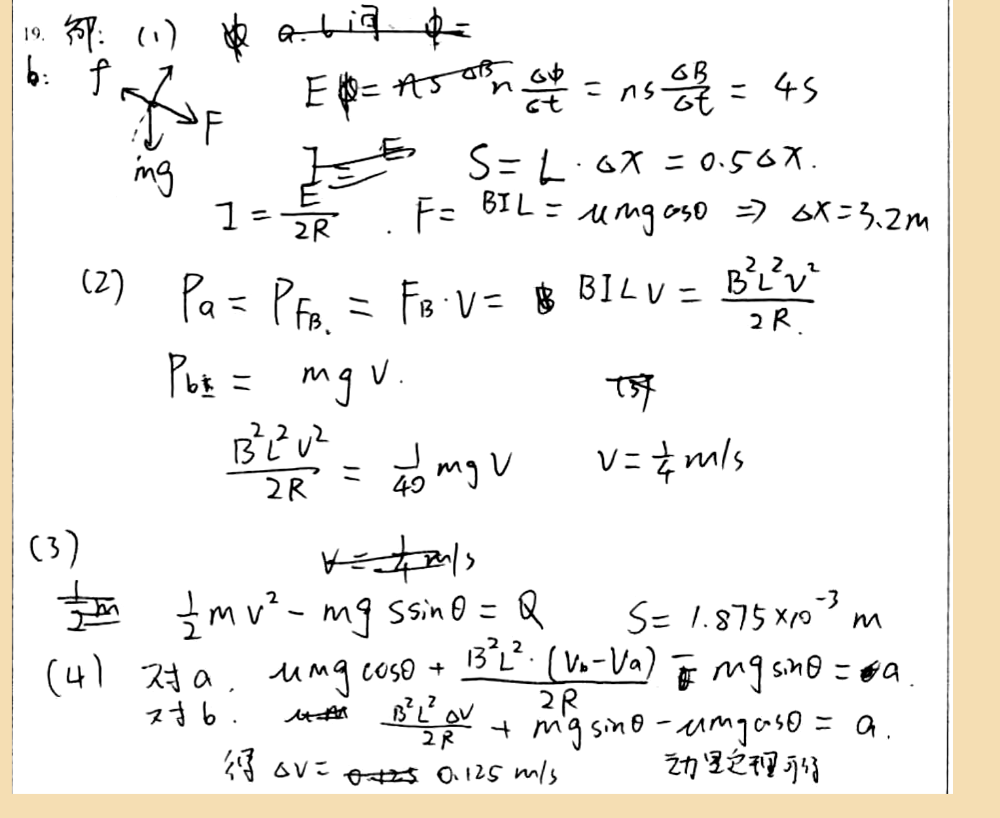

# 审查报告：stu_ans_17

## 1) 样本与任务元信息

- `db_id`: `17`
- `task_id`: `batch-question_19-2a4f3231`
- `question_id(DB)`: `question_19`
- `question_key(映射)`: `question_19`
- `created_at`: `2026-03-24 14:03:46`
- `is_pass`: **False**
- `total_deduction`: **15.0**

## 1.1 标准答案与学生作答图片

### 标准答案


### 学生作答



## 2) Qwen 感知层输出

- `readability_status`: **CLEAR**
- `global_confidence`: **0.96**

### 2.1 结构化元素明细

| element_id | content_type | confidence | raw_content |
|---|---|---:|---|
| `p0_1` | `plain_text` | 0.98 | 19. 解: (1) a.b间 φ= |
| `p0_2` | `latex_formula` | 0.96 | E\phi = ns\frac{\Delta \phi}{\Delta t} = ns\frac{\Delta B}{\Delta t} = 45 |
| `p0_3` | `image_diagram` | 0.95 | A force diagram showing two forces: F upward and mg downward, with an arrow labeled f pointing to the left. |
| `p0_4` | `latex_formula` | 0.97 | S = L \cdot \Delta x = 0.5 \Delta x |
| `p0_5` | `latex_formula` | 0.96 | I = \frac{E}{2R}, F = BIL = \mu mg \cos\theta \Rightarrow \Delta x = 3.2m |
| `p0_6` | `plain_text` | 0.98 | (2) |
| `p0_7` | `latex_formula` | 0.95 | P_a = P_{F_B} = F_B \cdot v = BILv = \frac{B^2L^2v^2}{2R} |
| `p0_8` | `latex_formula` | 0.96 | P_{b\text{总}} = mgv |
| `p0_9` | `latex_formula` | 0.95 | \frac{B^2L^2v^2}{2R} = \frac{1}{40}mgv |
| `p0_10` | `latex_formula` | 0.97 | v = \frac{1}{4} m/s |
| `p0_11` | `plain_text` | 0.98 | (3) |
| `p0_12` | `latex_formula` | 0.96 | v = \frac{1}{4} m/s |
| `p0_13` | `latex_formula` | 0.95 | \frac{1}{2}mv^2 - mgssin\theta = Q |
| `p0_14` | `latex_formula` | 0.96 | s = 1.875 \times 10^{-3} m |
| `p0_15` | `plain_text` | 0.98 | (4) |
| `p0_16` | `latex_formula` | 0.94 | 对a, \mu mg \cos\theta + \frac{B^2L^2 \cdot (v_b - v_a)}{2R} - mg \sin\theta = ma |
| `p0_17` | `latex_formula` | 0.94 | 对b, \frac{B^2L^2 \Delta v}{2R} + mg \sin\theta - \mu mg \cos\theta = a |
| `p0_18` | `latex_formula` | 0.95 | \Delta v = 0.125 m/s |
| `p0_19` | `plain_text` | 0.97 | 动力定理可行 |

### 2.2 image_diagram 转译高亮

#### image_diagram 高亮：`p0_3`

```text
A force diagram showing two forces: F upward and mg downward, with an arrow labeled f pointing to the left.
```

## 3) DeepSeek 认知层输出

- 最终判定 `is_fully_correct`: **False**
- 扣分 `total_score_deduction`: **15.0**
- 人工复核标记 `requires_human_review`: **False**
- 系统置信度 `system_confidence`: **0.95**

### 3.1 逻辑推导（可审查视图）

```text
模型未显式输出思维链字段，以下为基于 `step_evaluations` 的可审查推导摘要：
[1] 锚点 `p0_5` -> 错误（CONCEPTUAL）：For part (1), the force balance on rod b should be B3 * I * L = mg sinα, not involving friction. The correct x0 is 3.00 m.
[2] 锚点 `p0_7` -> 错误（CONCEPTUAL）：The correct expression for power in rod a is P_a = I^2 R = 0.5 v^2 W, with I = v A and R=0.5 Ω.
[3] 锚点 `p0_8` -> 错误（CONCEPTUAL）：The gravitational power on rod b is P_G = mg sinα v = 6v W, not mgv.
[4] 锚点 `p0_9` -> 错误（LOGIC）：Set up P_a = (1/40) P_G with correct expressions: 0.5 v^2 = (1/40) * 6v.
[5] 锚点 `p0_10` -> 错误（CALCULATION）：Solve for v: from 0.5 v^2 = 0.15v, v = 0.300 m/s.
[6] 锚点 `p0_13` -> 错误（CONCEPTUAL）：Energy conservation: mg sinα s = (1/2) m v^2 + Q_total, where Q_total = 2Q.
[7] 锚点 `p0_14` -> 错误（CALCULATION）：Correct s is 0.02 m.
[8] 锚点 `p0_16` -> 错误（CONCEPTUAL）：For rod a: mg sinα + B I L - μ mg cosα = m a.
[9] 锚点 `p0_17` -> 错误（CONCEPTUAL）：For rod b: mg sinα - B I L = m a.
[10] 锚点 `p0_18` -> 错误（CALCULATION）：The steady-state velocity difference Δv should be 3.2 m/s.
```

### 3.2 最终反馈

> 学生尝试解决问题，但在多个部分存在概念性错误，包括力平衡设置、功率表达式和能量守恒方程。需要复习电磁感应中的感生电动势、安培力计算以及斜面上物体的运动定律和能量守恒应用。

### 3.3 错误步骤锚点

- 错误锚点数量：**10**
- 错误锚点列表：`p0_5`, `p0_7`, `p0_8`, `p0_9`, `p0_10`, `p0_13`, `p0_14`, `p0_16`, `p0_17`, `p0_18`

### 3.4 Step 级别明细

| 锚点(reference_element_id) | 正误 | error_type | correction_suggestion |
|---|---|---|---|
| `p0_5` | 错误 | `CONCEPTUAL` | For part (1), the force balance on rod b should be B3 * I * L = mg sinα, not involving friction. The correct x0 is 3.00 m. |
| `p0_7` | 错误 | `CONCEPTUAL` | The correct expression for power in rod a is P_a = I^2 R = 0.5 v^2 W, with I = v A and R=0.5 Ω. |
| `p0_8` | 错误 | `CONCEPTUAL` | The gravitational power on rod b is P_G = mg sinα v = 6v W, not mgv. |
| `p0_9` | 错误 | `LOGIC` | Set up P_a = (1/40) P_G with correct expressions: 0.5 v^2 = (1/40) * 6v. |
| `p0_10` | 错误 | `CALCULATION` | Solve for v: from 0.5 v^2 = 0.15v, v = 0.300 m/s. |
| `p0_13` | 错误 | `CONCEPTUAL` | Energy conservation: mg sinα s = (1/2) m v^2 + Q_total, where Q_total = 2Q. |
| `p0_14` | 错误 | `CALCULATION` | Correct s is 0.02 m. |
| `p0_16` | 错误 | `CONCEPTUAL` | For rod a: mg sinα + B I L - μ mg cosα = m a. |
| `p0_17` | 错误 | `CONCEPTUAL` | For rod b: mg sinα - B I L = m a. |
| `p0_18` | 错误 | `CALCULATION` | The steady-state velocity difference Δv should be 3.2 m/s. |

## 4) 原始 JSON（审计留痕）

```json
{
  "perception_output": {
    "readability_status": "CLEAR",
    "elements": [
      {
        "element_id": "p0_1",
        "content_type": "plain_text",
        "raw_content": "19. 解: (1) a.b间 φ=",
        "confidence_score": 0.98,
        "bbox": {
          "x_min": 0.02,
          "y_min": 0.02,
          "x_max": 0.47,
          "y_max": 0.13
        }
      },
      {
        "element_id": "p0_2",
        "content_type": "latex_formula",
        "raw_content": "E\\phi = ns\\frac{\\Delta \\phi}{\\Delta t} = ns\\frac{\\Delta B}{\\Delta t} = 45",
        "confidence_score": 0.96,
        "bbox": {
          "x_min": 0.38,
          "y_min": 0.13,
          "x_max": 0.83,
          "y_max": 0.22
        }
      },
      {
        "element_id": "p0_3",
        "content_type": "image_diagram",
        "raw_content": "A force diagram showing two forces: F upward and mg downward, with an arrow labeled f pointing to the left.",
        "confidence_score": 0.95,
        "bbox": {
          "x_min": 0.12,
          "y_min": 0.13,
          "x_max": 0.25,
          "y_max": 0.28
        }
      },
      {
        "element_id": "p0_4",
        "content_type": "latex_formula",
        "raw_content": "S = L \\cdot \\Delta x = 0.5 \\Delta x",
        "confidence_score": 0.97,
        "bbox": {
          "x_min": 0.48,
          "y_min": 0.22,
          "x_max": 0.68,
          "y_max": 0.29
        }
      },
      {
        "element_id": "p0_5",
        "content_type": "latex_formula",
        "raw_content": "I = \\frac{E}{2R}, F = BIL = \\mu mg \\cos\\theta \\Rightarrow \\Delta x = 3.2m",
        "confidence_score": 0.96,
        "bbox": {
          "x_min": 0.23,
          "y_min": 0.28,
          "x_max": 0.93,
          "y_max": 0.36
        }
      },
      {
        "element_id": "p0_6",
        "content_type": "plain_text",
        "raw_content": "(2)",
        "confidence_score": 0.98,
        "bbox": {
          "x_min": 0.08,
          "y_min": 0.36,
          "x_max": 0.13,
          "y_max": 0.42
        }
      },
      {
        "element_id": "p0_7",
        "content_type": "latex_formula",
        "raw_content": "P_a = P_{F_B} = F_B \\cdot v = BILv = \\frac{B^2L^2v^2}{2R}",
        "confidence_score": 0.95,
        "bbox": {
          "x_min": 0.18,
          "y_min": 0.36,
          "x_max": 0.85,
          "y_max": 0.45
        }
      },
      {
        "element_id": "p0_8",
        "content_type": "latex_formula",
        "raw_content": "P_{b\\text{总}} = mgv",
        "confidence_score": 0.96,
        "bbox": {
          "x_min": 0.18,
          "y_min": 0.45,
          "x_max": 0.38,
          "y_max": 0.52
        }
      },
      {
        "element_id": "p0_9",
        "content_type": "latex_formula",
        "raw_content": "\\frac{B^2L^2v^2}{2R} = \\frac{1}{40}mgv",
        "confidence_score": 0.95,
        "bbox": {
          "x_min": 0.23,
          "y_min": 0.52,
          "x_max": 0.51,
          "y_max": 0.61
        }
      },
      {
        "element_id": "p0_10",
        "content_type": "latex_formula",
        "raw_content": "v = \\frac{1}{4} m/s",
        "confidence_score": 0.97,
        "bbox": {
          "x_min": 0.65,
          "y_min": 0.52,
          "x_max": 0.78,
          "y_max": 0.61
        }
      },
      {
        "element_id": "p0_11",
        "content_type": "plain_text",
        "raw_content": "(3)",
        "confidence_score": 0.98,
        "bbox": {
          "x_min": 0.03,
          "y_min": 0.62,
          "x_max": 0.09,
          "y_max": 0.68
        }
      },
      {
        "element_id": "p0_12",
        "content_type": "latex_formula",
        "raw_content": "v = \\frac{1}{4} m/s",
        "confidence_score": 0.96,
        "bbox": {
          "x_min": 0.38,
          "y_min": 0.62,
          "x_max": 0.51,
          "y_max": 0.7
        }
      },
      {
        "element_id": "p0_13",
        "content_type": "latex_formula",
        "raw_content": "\\frac{1}{2}mv^2 - mgssin\\theta = Q",
        "confidence_score": 0.95,
        "bbox": {
          "x_min": 0.23,
          "y_min": 0.68,
          "x_max": 0.55,
          "y_max": 0.77
        }
      },
      {
        "element_id": "p0_14",
        "content_type": "latex_formula",
        "raw_content": "s = 1.875 \\times 10^{-3} m",
        "confidence_score": 0.96,
        "bbox": {
          "x_min": 0.71,
          "y_min": 0.68,
          "x_max": 0.91,
          "y_max": 0.77
        }
      },
      {
        "element_id": "p0_15",
        "content_type": "plain_text",
        "raw_content": "(4)",
        "confidence_score": 0.98,
        "bbox": {
          "x_min": 0.04,
          "y_min": 0.77,
          "x_max": 0.1,
          "y_max": 0.83
        }
      },
      {
        "element_id": "p0_16",
        "content_type": "latex_formula",
        "raw_content": "对a, \\mu mg \\cos\\theta + \\frac{B^2L^2 \\cdot (v_b - v_a)}{2R} - mg \\sin\\theta = ma",
        "confidence_score": 0.94,
        "bbox": {
          "x_min": 0.15,
          "y_min": 0.77,
          "x_max": 0.91,
          "y_max": 0.86
        }
      },
      {
        "element_id": "p0_17",
        "content_type": "latex_formula",
        "raw_content": "对b, \\frac{B^2L^2 \\Delta v}{2R} + mg \\sin\\theta - \\mu mg \\cos\\theta = a",
        "confidence_score": 0.94,
        "bbox": {
          "x_min": 0.15,
          "y_min": 0.86,
          "x_max": 0.88,
          "y_max": 0.94
        }
      },
      {
        "element_id": "p0_18",
        "content_type": "latex_formula",
        "raw_content": "\\Delta v = 0.125 m/s",
        "confidence_score": 0.95,
        "bbox": {
          "x_min": 0.23,
          "y_min": 0.94,
          "x_max": 0.55,
          "y_max": 1.0
        }
      },
      {
        "element_id": "p0_19",
        "content_type": "plain_text",
        "raw_content": "动力定理可行",
        "confidence_score": 0.97,
        "bbox": {
          "x_min": 0.75,
          "y_min": 0.94,
          "x_max": 0.87,
          "y_max": 1.0
        }
      }
    ],
    "global_confidence": 0.96,
    "trigger_short_circuit": false
  },
  "evaluation_report": {
    "is_fully_correct": false,
    "total_score_deduction": 15.0,
    "step_evaluations": [
      {
        "reference_element_id": "p0_5",
        "is_correct": false,
        "error_type": "CONCEPTUAL",
        "correction_suggestion": "For part (1), the force balance on rod b should be B3 * I * L = mg sinα, not involving friction. The correct x0 is 3.00 m."
      },
      {
        "reference_element_id": "p0_7",
        "is_correct": false,
        "error_type": "CONCEPTUAL",
        "correction_suggestion": "The correct expression for power in rod a is P_a = I^2 R = 0.5 v^2 W, with I = v A and R=0.5 Ω."
      },
      {
        "reference_element_id": "p0_8",
        "is_correct": false,
        "error_type": "CONCEPTUAL",
        "correction_suggestion": "The gravitational power on rod b is P_G = mg sinα v = 6v W, not mgv."
      },
      {
        "reference_element_id": "p0_9",
        "is_correct": false,
        "error_type": "LOGIC",
        "correction_suggestion": "Set up P_a = (1/40) P_G with correct expressions: 0.5 v^2 = (1/40) * 6v."
      },
      {
        "reference_element_id": "p0_10",
        "is_correct": false,
        "error_type": "CALCULATION",
        "correction_suggestion": "Solve for v: from 0.5 v^2 = 0.15v, v = 0.300 m/s."
      },
      {
        "reference_element_id": "p0_13",
        "is_correct": false,
        "error_type": "CONCEPTUAL",
        "correction_suggestion": "Energy conservation: mg sinα s = (1/2) m v^2 + Q_total, where Q_total = 2Q."
      },
      {
        "reference_element_id": "p0_14",
        "is_correct": false,
        "error_type": "CALCULATION",
        "correction_suggestion": "Correct s is 0.02 m."
      },
      {
        "reference_element_id": "p0_16",
        "is_correct": false,
        "error_type": "CONCEPTUAL",
        "correction_suggestion": "For rod a: mg sinα + B I L - μ mg cosα = m a."
      },
      {
        "reference_element_id": "p0_17",
        "is_correct": false,
        "error_type": "CONCEPTUAL",
        "correction_suggestion": "For rod b: mg sinα - B I L = m a."
      },
      {
        "reference_element_id": "p0_18",
        "is_correct": false,
        "error_type": "CALCULATION",
        "correction_suggestion": "The steady-state velocity difference Δv should be 3.2 m/s."
      }
    ],
    "overall_feedback": "学生尝试解决问题，但在多个部分存在概念性错误，包括力平衡设置、功率表达式和能量守恒方程。需要复习电磁感应中的感生电动势、安培力计算以及斜面上物体的运动定律和能量守恒应用。",
    "system_confidence": 0.95,
    "requires_human_review": false
  }
}
```
