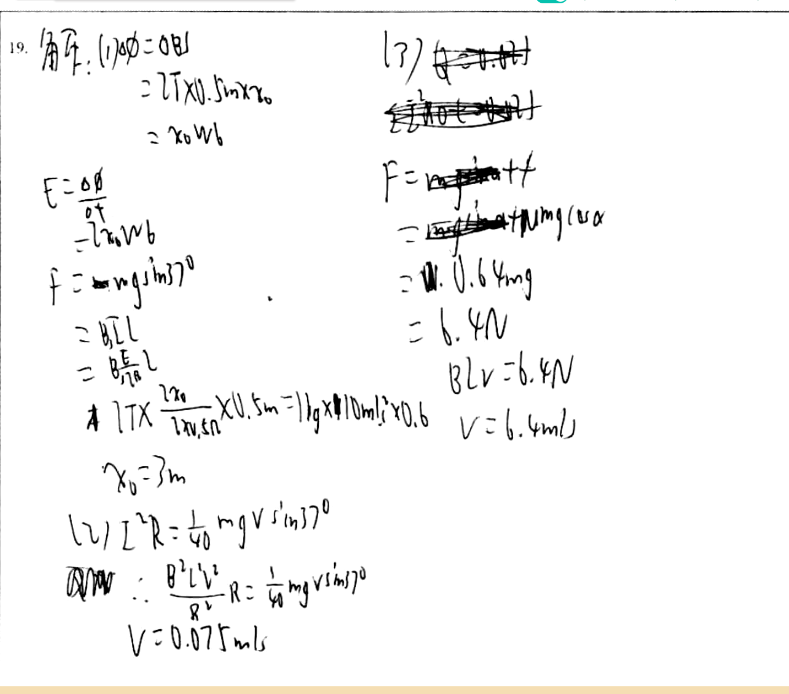

# 审查报告：stu_ans_18

## 1) 样本与任务元信息

- `db_id`: `18`
- `task_id`: `batch-question_19-2a4f3231`
- `question_id(DB)`: `question_19`
- `question_key(映射)`: `question_19`
- `created_at`: `2026-03-24 14:03:46`
- `is_pass`: **False**
- `total_deduction`: **11.0**

## 1.1 标准答案与学生作答图片

### 标准答案


### 学生作答



## 2) Qwen 感知层输出

- `readability_status`: **CLEAR**
- `global_confidence`: **0.95**

### 2.1 结构化元素明细

| element_id | content_type | confidence | raw_content |
|---|---|---:|---|
| `p0_1` | `plain_text` | 0.98 | 19. 角年: (1) φ = 0.8J |
| `p0_2` | `latex_formula` | 0.97 | = 2T \times 0.5m \times x_0 |
| `p0_3` | `latex_formula` | 0.96 | = x_0Wb |
| `p0_4` | `latex_formula` | 0.95 | E = \frac{\Delta \phi}{\Delta t} |
| `p0_5` | `latex_formula` | 0.94 | = 2x_0Wb |
| `p0_6` | `latex_formula` | 0.96 | f = mg\sin37^\circ |
| `p0_7` | `latex_formula` | 0.95 | = BIL |
| `p0_8` | `latex_formula` | 0.94 | = \frac{B^2L^2}{R}v |
| `p0_9` | `latex_formula` | 0.93 | A \quad 2T \times \frac{2x_0}{2x_0.5m} \times 0.5m = 1kg \times 10m/s^2 \times 0.6 |
| `p0_10` | `latex_formula` | 0.96 | x_0 = 3m |
| `p0_11` | `latex_formula` | 0.95 | I^2R = \frac{1}{40}mgv\sin37^\circ |
| `p0_12` | `latex_formula` | 0.94 | \therefore \quad \frac{B^2L^2v^2}{R} = \frac{1}{40}mgv\sin37^\circ |
| `p0_13` | `latex_formula` | 0.96 | v = 0.075m/s |
| `p0_14` | `plain_text` | 0.97 | (3) φ = 0.8J |
| `p0_15` | `latex_formula` | 0.95 | F = ma + f |
| `p0_16` | `latex_formula` | 0.94 | = mg\cos\alpha + \mu mg\cos\alpha |
| `p0_17` | `latex_formula` | 0.95 | = 0.64mg |
| `p0_18` | `latex_formula` | 0.96 | = 6.4N |
| `p0_19` | `latex_formula` | 0.95 | BLv = 6.4N |
| `p0_20` | `latex_formula` | 0.96 | v = 6.4m/s |

### 2.2 image_diagram 转译高亮

> 本样本无 `image_diagram` 节点。

## 3) DeepSeek 认知层输出

- 最终判定 `is_fully_correct`: **False**
- 扣分 `total_score_deduction`: **11.0**
- 人工复核标记 `requires_human_review`: **False**
- 系统置信度 `system_confidence`: **0.8**

### 3.1 逻辑推导（可审查视图）

```text
模型未显式输出思维链字段，以下为基于 `step_evaluations` 的可审查推导摘要：
[1] 锚点 `p0_1` -> 正确（NONE）：无补充说明。
[2] 锚点 `p0_2` -> 正确（NONE）：无补充说明。
[3] 锚点 `p0_3` -> 正确（NONE）：无补充说明。
[4] 锚点 `p0_4` -> 正确（NONE）：无补充说明。
[5] 锚点 `p0_5` -> 正确（NONE）：无补充说明。
[6] 锚点 `p0_6` -> 正确（NONE）：无补充说明。
[7] 锚点 `p0_7` -> 正确（NONE）：无补充说明。
[8] 锚点 `p0_8` -> 正确（NONE）：无补充说明。
[9] 锚点 `p0_9` -> 正确（NONE）：无补充说明。
[10] 锚点 `p0_10` -> 正确（NONE）：无补充说明。
[11] 锚点 `p0_11` -> 正确（NONE）：无补充说明。
[12] 锚点 `p0_12` -> 正确（NONE）：无补充说明。
[13] 锚点 `p0_13` -> 错误（CALCULATION）：解方程时出错。正确解应为 v = 0.3 m/s。检查代数步骤。
[14] 锚点 `p0_14` -> 错误（TRANSCRIPTION_ERROR）：标记可能为OCR错误，第三部分应关注力平衡和能量守恒。
[15] 锚点 `p0_15` -> 错误（LOGIC）：力平衡方程错误。正确方程应为 BIL + mg sinα = μ mg cosα。
[16] 锚点 `p0_16` -> 错误（CONCEPTUAL）：表达式错误。摩擦力为 μ mg cosα，但方程中应包含BIL和mg sinα。
[17] 锚点 `p0_17` -> 错误（CALCULATION）：基于错误方程的计算，需重新审视力平衡。
[18] 锚点 `p0_18` -> 错误（CALCULATION）：无补充说明。
[19] 锚点 `p0_19` -> 错误（CONCEPTUAL）：BLv 是电动势，不是力。应使用 BIL 表示力。
[20] 锚点 `p0_20` -> 错误（CALCULATION）：无补充说明。
```

### 3.2 最终反馈

> 学生正确完成了第一部分，得到 x0 = 3 m。第二部分功率方程设置正确，但解速度时出错，应为 v = 0.3 m/s。第三部分力平衡方程完全错误，导致错误的速度计算。第四部分未涉及。建议复习电磁感应中的力平衡和能量守恒应用。

### 3.3 错误步骤锚点

- 错误锚点数量：**8**
- 错误锚点列表：`p0_13`, `p0_14`, `p0_15`, `p0_16`, `p0_17`, `p0_18`, `p0_19`, `p0_20`

### 3.4 Step 级别明细

| 锚点(reference_element_id) | 正误 | error_type | correction_suggestion |
|---|---|---|---|
| `p0_1` | 正确 | `NONE` | None |
| `p0_2` | 正确 | `NONE` | None |
| `p0_3` | 正确 | `NONE` | None |
| `p0_4` | 正确 | `NONE` | None |
| `p0_5` | 正确 | `NONE` | None |
| `p0_6` | 正确 | `NONE` | None |
| `p0_7` | 正确 | `NONE` | None |
| `p0_8` | 正确 | `NONE` | None |
| `p0_9` | 正确 | `NONE` | None |
| `p0_10` | 正确 | `NONE` | None |
| `p0_11` | 正确 | `NONE` | None |
| `p0_12` | 正确 | `NONE` | None |
| `p0_13` | 错误 | `CALCULATION` | 解方程时出错。正确解应为 v = 0.3 m/s。检查代数步骤。 |
| `p0_14` | 错误 | `TRANSCRIPTION_ERROR` | 标记可能为OCR错误，第三部分应关注力平衡和能量守恒。 |
| `p0_15` | 错误 | `LOGIC` | 力平衡方程错误。正确方程应为 BIL + mg sinα = μ mg cosα。 |
| `p0_16` | 错误 | `CONCEPTUAL` | 表达式错误。摩擦力为 μ mg cosα，但方程中应包含BIL和mg sinα。 |
| `p0_17` | 错误 | `CALCULATION` | 基于错误方程的计算，需重新审视力平衡。 |
| `p0_18` | 错误 | `CALCULATION` | None |
| `p0_19` | 错误 | `CONCEPTUAL` | BLv 是电动势，不是力。应使用 BIL 表示力。 |
| `p0_20` | 错误 | `CALCULATION` | None |

## 4) 原始 JSON（审计留痕）

```json
{
  "perception_output": {
    "readability_status": "CLEAR",
    "elements": [
      {
        "element_id": "p0_1",
        "content_type": "plain_text",
        "raw_content": "19. 角年: (1) φ = 0.8J",
        "confidence_score": 0.98,
        "bbox": {
          "x_min": 0.02,
          "y_min": 0.03,
          "x_max": 0.25,
          "y_max": 0.12
        }
      },
      {
        "element_id": "p0_2",
        "content_type": "latex_formula",
        "raw_content": "= 2T \\times 0.5m \\times x_0",
        "confidence_score": 0.97,
        "bbox": {
          "x_min": 0.16,
          "y_min": 0.12,
          "x_max": 0.34,
          "y_max": 0.18
        }
      },
      {
        "element_id": "p0_3",
        "content_type": "latex_formula",
        "raw_content": "= x_0Wb",
        "confidence_score": 0.96,
        "bbox": {
          "x_min": 0.18,
          "y_min": 0.18,
          "x_max": 0.29,
          "y_max": 0.24
        }
      },
      {
        "element_id": "p0_4",
        "content_type": "latex_formula",
        "raw_content": "E = \\frac{\\Delta \\phi}{\\Delta t}",
        "confidence_score": 0.95,
        "bbox": {
          "x_min": 0.05,
          "y_min": 0.25,
          "x_max": 0.15,
          "y_max": 0.32
        }
      },
      {
        "element_id": "p0_5",
        "content_type": "latex_formula",
        "raw_content": "= 2x_0Wb",
        "confidence_score": 0.94,
        "bbox": {
          "x_min": 0.08,
          "y_min": 0.32,
          "x_max": 0.21,
          "y_max": 0.38
        }
      },
      {
        "element_id": "p0_6",
        "content_type": "latex_formula",
        "raw_content": "f = mg\\sin37^\\circ",
        "confidence_score": 0.96,
        "bbox": {
          "x_min": 0.05,
          "y_min": 0.38,
          "x_max": 0.23,
          "y_max": 0.45
        }
      },
      {
        "element_id": "p0_7",
        "content_type": "latex_formula",
        "raw_content": "= BIL",
        "confidence_score": 0.95,
        "bbox": {
          "x_min": 0.08,
          "y_min": 0.45,
          "x_max": 0.17,
          "y_max": 0.51
        }
      },
      {
        "element_id": "p0_8",
        "content_type": "latex_formula",
        "raw_content": "= \\frac{B^2L^2}{R}v",
        "confidence_score": 0.94,
        "bbox": {
          "x_min": 0.08,
          "y_min": 0.51,
          "x_max": 0.19,
          "y_max": 0.57
        }
      },
      {
        "element_id": "p0_9",
        "content_type": "latex_formula",
        "raw_content": "A \\quad 2T \\times \\frac{2x_0}{2x_0.5m} \\times 0.5m = 1kg \\times 10m/s^2 \\times 0.6",
        "confidence_score": 0.93,
        "bbox": {
          "x_min": 0.12,
          "y_min": 0.57,
          "x_max": 0.55,
          "y_max": 0.65
        }
      },
      {
        "element_id": "p0_10",
        "content_type": "latex_formula",
        "raw_content": "x_0 = 3m",
        "confidence_score": 0.96,
        "bbox": {
          "x_min": 0.14,
          "y_min": 0.65,
          "x_max": 0.25,
          "y_max": 0.71
        }
      },
      {
        "element_id": "p0_11",
        "content_type": "latex_formula",
        "raw_content": "I^2R = \\frac{1}{40}mgv\\sin37^\\circ",
        "confidence_score": 0.95,
        "bbox": {
          "x_min": 0.12,
          "y_min": 0.71,
          "x_max": 0.42,
          "y_max": 0.78
        }
      },
      {
        "element_id": "p0_12",
        "content_type": "latex_formula",
        "raw_content": "\\therefore \\quad \\frac{B^2L^2v^2}{R} = \\frac{1}{40}mgv\\sin37^\\circ",
        "confidence_score": 0.94,
        "bbox": {
          "x_min": 0.1,
          "y_min": 0.78,
          "x_max": 0.45,
          "y_max": 0.85
        }
      },
      {
        "element_id": "p0_13",
        "content_type": "latex_formula",
        "raw_content": "v = 0.075m/s",
        "confidence_score": 0.96,
        "bbox": {
          "x_min": 0.18,
          "y_min": 0.85,
          "x_max": 0.35,
          "y_max": 0.92
        }
      },
      {
        "element_id": "p0_14",
        "content_type": "plain_text",
        "raw_content": "(3) φ = 0.8J",
        "confidence_score": 0.97,
        "bbox": {
          "x_min": 0.48,
          "y_min": 0.03,
          "x_max": 0.65,
          "y_max": 0.12
        }
      },
      {
        "element_id": "p0_15",
        "content_type": "latex_formula",
        "raw_content": "F = ma + f",
        "confidence_score": 0.95,
        "bbox": {
          "x_min": 0.48,
          "y_min": 0.12,
          "x_max": 0.65,
          "y_max": 0.18
        }
      },
      {
        "element_id": "p0_16",
        "content_type": "latex_formula",
        "raw_content": "= mg\\cos\\alpha + \\mu mg\\cos\\alpha",
        "confidence_score": 0.94,
        "bbox": {
          "x_min": 0.48,
          "y_min": 0.18,
          "x_max": 0.75,
          "y_max": 0.25
        }
      },
      {
        "element_id": "p0_17",
        "content_type": "latex_formula",
        "raw_content": "= 0.64mg",
        "confidence_score": 0.95,
        "bbox": {
          "x_min": 0.48,
          "y_min": 0.25,
          "x_max": 0.65,
          "y_max": 0.32
        }
      },
      {
        "element_id": "p0_18",
        "content_type": "latex_formula",
        "raw_content": "= 6.4N",
        "confidence_score": 0.96,
        "bbox": {
          "x_min": 0.5,
          "y_min": 0.32,
          "x_max": 0.65,
          "y_max": 0.38
        }
      },
      {
        "element_id": "p0_19",
        "content_type": "latex_formula",
        "raw_content": "BLv = 6.4N",
        "confidence_score": 0.95,
        "bbox": {
          "x_min": 0.55,
          "y_min": 0.38,
          "x_max": 0.72,
          "y_max": 0.45
        }
      },
      {
        "element_id": "p0_20",
        "content_type": "latex_formula",
        "raw_content": "v = 6.4m/s",
        "confidence_score": 0.96,
        "bbox": {
          "x_min": 0.55,
          "y_min": 0.45,
          "x_max": 0.7,
          "y_max": 0.51
        }
      }
    ],
    "global_confidence": 0.95,
    "trigger_short_circuit": false
  },
  "evaluation_report": {
    "is_fully_correct": false,
    "total_score_deduction": 11.0,
    "step_evaluations": [
      {
        "reference_element_id": "p0_1",
        "is_correct": true,
        "error_type": "NONE",
        "correction_suggestion": null
      },
      {
        "reference_element_id": "p0_2",
        "is_correct": true,
        "error_type": "NONE",
        "correction_suggestion": null
      },
      {
        "reference_element_id": "p0_3",
        "is_correct": true,
        "error_type": "NONE",
        "correction_suggestion": null
      },
      {
        "reference_element_id": "p0_4",
        "is_correct": true,
        "error_type": "NONE",
        "correction_suggestion": null
      },
      {
        "reference_element_id": "p0_5",
        "is_correct": true,
        "error_type": "NONE",
        "correction_suggestion": null
      },
      {
        "reference_element_id": "p0_6",
        "is_correct": true,
        "error_type": "NONE",
        "correction_suggestion": null
      },
      {
        "reference_element_id": "p0_7",
        "is_correct": true,
        "error_type": "NONE",
        "correction_suggestion": null
      },
      {
        "reference_element_id": "p0_8",
        "is_correct": true,
        "error_type": "NONE",
        "correction_suggestion": null
      },
      {
        "reference_element_id": "p0_9",
        "is_correct": true,
        "error_type": "NONE",
        "correction_suggestion": null
      },
      {
        "reference_element_id": "p0_10",
        "is_correct": true,
        "error_type": "NONE",
        "correction_suggestion": null
      },
      {
        "reference_element_id": "p0_11",
        "is_correct": true,
        "error_type": "NONE",
        "correction_suggestion": null
      },
      {
        "reference_element_id": "p0_12",
        "is_correct": true,
        "error_type": "NONE",
        "correction_suggestion": null
      },
      {
        "reference_element_id": "p0_13",
        "is_correct": false,
        "error_type": "CALCULATION",
        "correction_suggestion": "解方程时出错。正确解应为 v = 0.3 m/s。检查代数步骤。"
      },
      {
        "reference_element_id": "p0_14",
        "is_correct": false,
        "error_type": "TRANSCRIPTION_ERROR",
        "correction_suggestion": "标记可能为OCR错误，第三部分应关注力平衡和能量守恒。"
      },
      {
        "reference_element_id": "p0_15",
        "is_correct": false,
        "error_type": "LOGIC",
        "correction_suggestion": "力平衡方程错误。正确方程应为 BIL + mg sinα = μ mg cosα。"
      },
      {
        "reference_element_id": "p0_16",
        "is_correct": false,
        "error_type": "CONCEPTUAL",
        "correction_suggestion": "表达式错误。摩擦力为 μ mg cosα，但方程中应包含BIL和mg sinα。"
      },
      {
        "reference_element_id": "p0_17",
        "is_correct": false,
        "error_type": "CALCULATION",
        "correction_suggestion": "基于错误方程的计算，需重新审视力平衡。"
      },
      {
        "reference_element_id": "p0_18",
        "is_correct": false,
        "error_type": "CALCULATION",
        "correction_suggestion": null
      },
      {
        "reference_element_id": "p0_19",
        "is_correct": false,
        "error_type": "CONCEPTUAL",
        "correction_suggestion": "BLv 是电动势，不是力。应使用 BIL 表示力。"
      },
      {
        "reference_element_id": "p0_20",
        "is_correct": false,
        "error_type": "CALCULATION",
        "correction_suggestion": null
      }
    ],
    "overall_feedback": "学生正确完成了第一部分，得到 x0 = 3 m。第二部分功率方程设置正确，但解速度时出错，应为 v = 0.3 m/s。第三部分力平衡方程完全错误，导致错误的速度计算。第四部分未涉及。建议复习电磁感应中的力平衡和能量守恒应用。",
    "system_confidence": 0.8,
    "requires_human_review": false
  }
}
```
