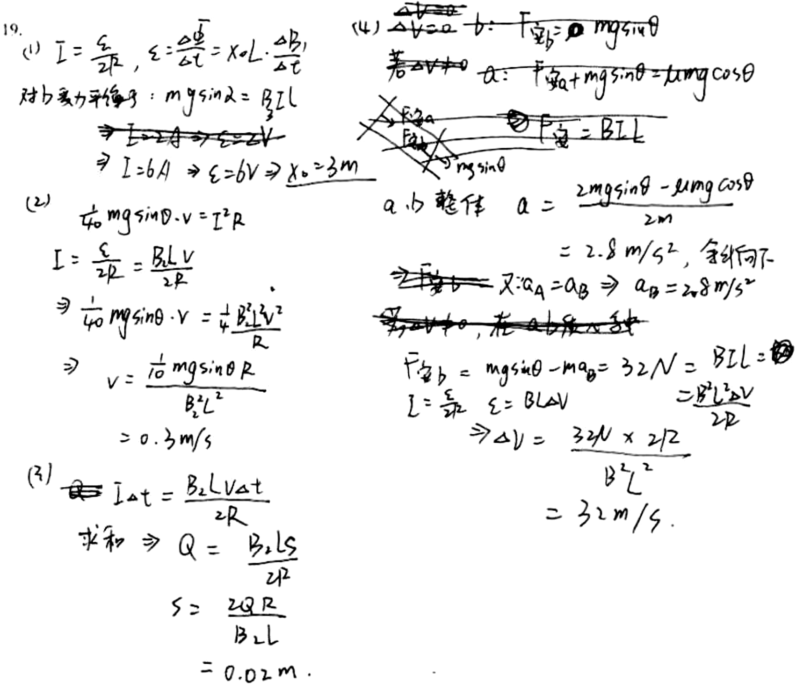

# 审查报告：stu_ans_19

## 1) 样本与任务元信息

- `db_id`: `19`
- `task_id`: `batch-question_19-2a4f3231`
- `question_id(DB)`: `question_19`
- `question_key(映射)`: `question_19`
- `created_at`: `2026-03-24 14:03:46`
- `is_pass`: **False**
- `total_deduction`: **4.0**

## 1.1 标准答案与学生作答图片

### 标准答案


### 学生作答



## 2) Qwen 感知层输出

- `readability_status`: **CLEAR**
- `global_confidence`: **0.95**

### 2.1 结构化元素明细

| element_id | content_type | confidence | raw_content |
|---|---|---:|---|
| `p0_1` | `plain_text` | 0.98 | 19. |
| `p0_2` | `latex_formula` | 0.97 | I = \frac{\varepsilon}{2R}, \quad \varepsilon = \frac{\Delta \Phi}{\Delta t} = x_0 L \cdot \frac{\Delta B}{\Delta t} |
| `p0_3` | `plain_text` | 0.96 | 对力矩平衡： |
| `p0_4` | `latex_formula` | 0.95 | mg\sin\lambda = B^2 I L |
| `p0_5` | `latex_formula` | 0.94 | \Rightarrow I = 2A \Rightarrow \varepsilon = 2V |
| `p0_6` | `latex_formula` | 0.93 | \Rightarrow I = 6A \Rightarrow \varepsilon = 6V \Rightarrow x_0 = 3m |
| `p0_7` | `plain_text` | 0.98 | (2) |
| `p0_8` | `latex_formula` | 0.95 | 若 mg\sin\theta \cdot v = I^2 R |
| `p0_9` | `latex_formula` | 0.96 | I = \frac{\varepsilon}{2R} = \frac{B L v}{2R} |
| `p0_10` | `latex_formula` | 0.94 | \Rightarrow \frac{1}{40} mg\sin\theta \cdot v = \frac{1}{4} \frac{B^2 L^2 v^2}{R} |
| `p0_11` | `latex_formula` | 0.95 | \Rightarrow v = \frac{10 \, mg\sin\theta \, R}{B^2 L^2} |
| `p0_12` | `latex_formula` | 0.96 | = 0.3 m/s |
| `p0_13` | `plain_text` | 0.98 | (3) |
| `p0_14` | `latex_formula` | 0.95 | I \Delta t = \frac{B L V \Delta t}{2R} |
| `p0_15` | `plain_text` | 0.96 | 求和 |
| `p0_16` | `latex_formula` | 0.94 | \Rightarrow Q = \frac{B L S}{2R} |
| `p0_17` | `latex_formula` | 0.95 | S = \frac{2Q R}{B L} |
| `p0_18` | `latex_formula` | 0.96 | = 0.02 m |
| `p0_19` | `latex_formula` | 0.94 | \frac{\Delta V}{\Delta t} = a \Rightarrow F_{\text{安}} = \mu mg\sin\theta |
| `p0_20` | `plain_text` | 0.95 | 若 ΔV ≠ 0 |
| `p0_21` | `latex_formula` | 0.94 | a: F_{\text{安}} + mg\sin\theta = \mu mg\cos\theta |
| `p0_22` | `image_diagram` | 0.96 | A hand-drawn diagram showing forces on an inclined plane with labeled vectors: F_安 (upward along incline), F_摩 (downward along incline), and mg sinθ (downward along incline). A cross indicates the direction of magnetic force perpendicular to motion. |
| `p0_23` | `latex_formula` | 0.95 | F_{\text{安}} = BIL |
| `p0_24` | `plain_text` | 0.96 | a、b 整体 |
| `p0_25` | `latex_formula` | 0.95 | a = \frac{2mg\sin\theta - \mu mg\cos\theta}{2m} |
| `p0_26` | `latex_formula` | 0.94 | = 2.8 \, m/s^2, \text{余斜向下} |
| `p0_27` | `latex_formula` | 0.93 | \Rightarrow a_A = a_B \Rightarrow a_B = 2.8 \, m/s^2 |
| `p0_28` | `plain_text` | 0.94 | 若 ΔV ≠ 0，在 a、b 段中 |
| `p0_29` | `latex_formula` | 0.95 | F_{\text{安}} = mg\sin\theta - ma_B = 32N = BIL |
| `p0_30` | `latex_formula` | 0.94 | I = \frac{\varepsilon}{2R}, \quad \varepsilon = BL\Delta V |
| `p0_31` | `latex_formula` | 0.93 | \Rightarrow \Delta V = \frac{32N \times 2R}{B^2 L^2} |
| `p0_32` | `latex_formula` | 0.95 | = 32 \, m/s |

### 2.2 image_diagram 转译高亮

#### image_diagram 高亮：`p0_22`

```text
A hand-drawn diagram showing forces on an inclined plane with labeled vectors: F_安 (upward along incline), F_摩 (downward along incline), and mg sinθ (downward along incline). A cross indicates the direction of magnetic force perpendicular to motion.
```

## 3) DeepSeek 认知层输出

- 最终判定 `is_fully_correct`: **False**
- 扣分 `total_score_deduction`: **4.0**
- 人工复核标记 `requires_human_review`: **False**
- 系统置信度 `system_confidence`: **0.9**

### 3.1 逻辑推导（可审查视图）

```text
模型未显式输出思维链字段，以下为基于 `step_evaluations` 的可审查推导摘要：
[1] 锚点 `p0_4` -> 正确（TRANSCRIPTION_ERROR）：The force balance equation should use B instead of B^2. Ensure to use the correct magnetic field symbol as given in the problem.
[2] 锚点 `p0_6` -> 正确（NONE）：无补充说明。
[3] 锚点 `p0_10` -> 正确（NONE）：无补充说明。
[4] 锚点 `p0_10` -> 正确（NONE）：无补充说明。
[5] 锚点 `p0_12` -> 正确（NONE）：无补充说明。
[6] 锚点 `p0_21` -> 正确（NONE）：无补充说明。
[7] 锚点 `p0_14` -> 错误（LOGIC）：Explicitly solve for the current I and speed v of rod b using the force balance equation. The correct values are I = 0.4 A and v = 0.4 m/s.
[8] 锚点 `p0_16` -> 错误（LOGIC）：Set up the energy conservation equation: mg sinα * s = (1/2) m v^2 + Q_total, where Q_total = 2Q. This step is missing in your work.
[9] 锚点 `p0_18` -> 正确（NONE）：无补充说明。
[10] 锚点 `p0_30` -> 正确（NONE）：无补充说明。
[11] 锚点 `p0_29` -> 正确（NONE）：无补充说明。
[12] 锚点 `p0_21` -> 错误（CONCEPTUAL）：The equation of motion for rod a when both are moving should be: mg sinα + B I L - μ mg cosα = m a. You have written a static force balance instead.
[13] 锚点 `p0_27` -> 正确（NONE）：无补充说明。
[14] 锚点 `p0_32` -> 错误（CALCULATION）：Recheck the calculation for the steady-state velocity difference Δv. The correct value is 3.2 m/s, not 32 m/s. Ensure to use consistent units and equations.
```

### 3.2 最终反馈

> You correctly solved parts (1) and (2), and obtained the correct distance in part (3). However, you missed key steps in part (3) by not explicitly solving for current and speed, and did not set up the energy conservation equation. In part (4), you made errors in the equation of motion for rod a and the final velocity difference. Review the force balances and steady-state conditions for both rods.

### 3.3 错误步骤锚点

- 错误锚点数量：**4**
- 错误锚点列表：`p0_14`, `p0_16`, `p0_21`, `p0_32`

### 3.4 Step 级别明细

| 锚点(reference_element_id) | 正误 | error_type | correction_suggestion |
|---|---|---|---|
| `p0_4` | 正确 | `TRANSCRIPTION_ERROR` | The force balance equation should use B instead of B^2. Ensure to use the correct magnetic field symbol as given in the problem. |
| `p0_6` | 正确 | `NONE` | None |
| `p0_10` | 正确 | `NONE` | None |
| `p0_10` | 正确 | `NONE` | None |
| `p0_12` | 正确 | `NONE` | None |
| `p0_21` | 正确 | `NONE` | None |
| `p0_14` | 错误 | `LOGIC` | Explicitly solve for the current I and speed v of rod b using the force balance equation. The correct values are I = 0.4 A and v = 0.4 m/s. |
| `p0_16` | 错误 | `LOGIC` | Set up the energy conservation equation: mg sinα * s = (1/2) m v^2 + Q_total, where Q_total = 2Q. This step is missing in your work. |
| `p0_18` | 正确 | `NONE` | None |
| `p0_30` | 正确 | `NONE` | None |
| `p0_29` | 正确 | `NONE` | None |
| `p0_21` | 错误 | `CONCEPTUAL` | The equation of motion for rod a when both are moving should be: mg sinα + B I L - μ mg cosα = m a. You have written a static force balance instead. |
| `p0_27` | 正确 | `NONE` | None |
| `p0_32` | 错误 | `CALCULATION` | Recheck the calculation for the steady-state velocity difference Δv. The correct value is 3.2 m/s, not 32 m/s. Ensure to use consistent units and equations. |

## 4) 原始 JSON（审计留痕）

```json
{
  "perception_output": {
    "readability_status": "CLEAR",
    "elements": [
      {
        "element_id": "p0_1",
        "content_type": "plain_text",
        "raw_content": "19.",
        "confidence_score": 0.98,
        "bbox": {
          "x_min": 0.01,
          "y_min": 0.02,
          "x_max": 0.05,
          "y_max": 0.06
        }
      },
      {
        "element_id": "p0_2",
        "content_type": "latex_formula",
        "raw_content": "I = \\frac{\\varepsilon}{2R}, \\quad \\varepsilon = \\frac{\\Delta \\Phi}{\\Delta t} = x_0 L \\cdot \\frac{\\Delta B}{\\Delta t}",
        "confidence_score": 0.97,
        "bbox": {
          "x_min": 0.05,
          "y_min": 0.04,
          "x_max": 0.38,
          "y_max": 0.12
        }
      },
      {
        "element_id": "p0_3",
        "content_type": "plain_text",
        "raw_content": "对力矩平衡：",
        "confidence_score": 0.96,
        "bbox": {
          "x_min": 0.03,
          "y_min": 0.12,
          "x_max": 0.18,
          "y_max": 0.16
        }
      },
      {
        "element_id": "p0_4",
        "content_type": "latex_formula",
        "raw_content": "mg\\sin\\lambda = B^2 I L",
        "confidence_score": 0.95,
        "bbox": {
          "x_min": 0.18,
          "y_min": 0.12,
          "x_max": 0.35,
          "y_max": 0.16
        }
      },
      {
        "element_id": "p0_5",
        "content_type": "latex_formula",
        "raw_content": "\\Rightarrow I = 2A \\Rightarrow \\varepsilon = 2V",
        "confidence_score": 0.94,
        "bbox": {
          "x_min": 0.08,
          "y_min": 0.16,
          "x_max": 0.35,
          "y_max": 0.2
        }
      },
      {
        "element_id": "p0_6",
        "content_type": "latex_formula",
        "raw_content": "\\Rightarrow I = 6A \\Rightarrow \\varepsilon = 6V \\Rightarrow x_0 = 3m",
        "confidence_score": 0.93,
        "bbox": {
          "x_min": 0.08,
          "y_min": 0.2,
          "x_max": 0.44,
          "y_max": 0.25
        }
      },
      {
        "element_id": "p0_7",
        "content_type": "plain_text",
        "raw_content": "(2)",
        "confidence_score": 0.98,
        "bbox": {
          "x_min": 0.03,
          "y_min": 0.26,
          "x_max": 0.07,
          "y_max": 0.3
        }
      },
      {
        "element_id": "p0_8",
        "content_type": "latex_formula",
        "raw_content": "若 mg\\sin\\theta \\cdot v = I^2 R",
        "confidence_score": 0.95,
        "bbox": {
          "x_min": 0.08,
          "y_min": 0.26,
          "x_max": 0.35,
          "y_max": 0.31
        }
      },
      {
        "element_id": "p0_9",
        "content_type": "latex_formula",
        "raw_content": "I = \\frac{\\varepsilon}{2R} = \\frac{B L v}{2R}",
        "confidence_score": 0.96,
        "bbox": {
          "x_min": 0.07,
          "y_min": 0.31,
          "x_max": 0.28,
          "y_max": 0.36
        }
      },
      {
        "element_id": "p0_10",
        "content_type": "latex_formula",
        "raw_content": "\\Rightarrow \\frac{1}{40} mg\\sin\\theta \\cdot v = \\frac{1}{4} \\frac{B^2 L^2 v^2}{R}",
        "confidence_score": 0.94,
        "bbox": {
          "x_min": 0.07,
          "y_min": 0.36,
          "x_max": 0.37,
          "y_max": 0.42
        }
      },
      {
        "element_id": "p0_11",
        "content_type": "latex_formula",
        "raw_content": "\\Rightarrow v = \\frac{10 \\, mg\\sin\\theta \\, R}{B^2 L^2}",
        "confidence_score": 0.95,
        "bbox": {
          "x_min": 0.08,
          "y_min": 0.42,
          "x_max": 0.35,
          "y_max": 0.48
        }
      },
      {
        "element_id": "p0_12",
        "content_type": "latex_formula",
        "raw_content": "= 0.3 m/s",
        "confidence_score": 0.96,
        "bbox": {
          "x_min": 0.12,
          "y_min": 0.48,
          "x_max": 0.25,
          "y_max": 0.52
        }
      },
      {
        "element_id": "p0_13",
        "content_type": "plain_text",
        "raw_content": "(3)",
        "confidence_score": 0.98,
        "bbox": {
          "x_min": 0.03,
          "y_min": 0.54,
          "x_max": 0.07,
          "y_max": 0.58
        }
      },
      {
        "element_id": "p0_14",
        "content_type": "latex_formula",
        "raw_content": "I \\Delta t = \\frac{B L V \\Delta t}{2R}",
        "confidence_score": 0.95,
        "bbox": {
          "x_min": 0.08,
          "y_min": 0.54,
          "x_max": 0.35,
          "y_max": 0.6
        }
      },
      {
        "element_id": "p0_15",
        "content_type": "plain_text",
        "raw_content": "求和",
        "confidence_score": 0.96,
        "bbox": {
          "x_min": 0.08,
          "y_min": 0.6,
          "x_max": 0.15,
          "y_max": 0.64
        }
      },
      {
        "element_id": "p0_16",
        "content_type": "latex_formula",
        "raw_content": "\\Rightarrow Q = \\frac{B L S}{2R}",
        "confidence_score": 0.94,
        "bbox": {
          "x_min": 0.15,
          "y_min": 0.6,
          "x_max": 0.35,
          "y_max": 0.65
        }
      },
      {
        "element_id": "p0_17",
        "content_type": "latex_formula",
        "raw_content": "S = \\frac{2Q R}{B L}",
        "confidence_score": 0.95,
        "bbox": {
          "x_min": 0.15,
          "y_min": 0.65,
          "x_max": 0.35,
          "y_max": 0.7
        }
      },
      {
        "element_id": "p0_18",
        "content_type": "latex_formula",
        "raw_content": "= 0.02 m",
        "confidence_score": 0.96,
        "bbox": {
          "x_min": 0.15,
          "y_min": 0.7,
          "x_max": 0.35,
          "y_max": 0.75
        }
      },
      {
        "element_id": "p0_19",
        "content_type": "latex_formula",
        "raw_content": "\\frac{\\Delta V}{\\Delta t} = a \\Rightarrow F_{\\text{安}} = \\mu mg\\sin\\theta",
        "confidence_score": 0.94,
        "bbox": {
          "x_min": 0.42,
          "y_min": 0.02,
          "x_max": 0.75,
          "y_max": 0.08
        }
      },
      {
        "element_id": "p0_20",
        "content_type": "plain_text",
        "raw_content": "若 ΔV ≠ 0",
        "confidence_score": 0.95,
        "bbox": {
          "x_min": 0.42,
          "y_min": 0.08,
          "x_max": 0.55,
          "y_max": 0.12
        }
      },
      {
        "element_id": "p0_21",
        "content_type": "latex_formula",
        "raw_content": "a: F_{\\text{安}} + mg\\sin\\theta = \\mu mg\\cos\\theta",
        "confidence_score": 0.94,
        "bbox": {
          "x_min": 0.55,
          "y_min": 0.08,
          "x_max": 0.88,
          "y_max": 0.14
        }
      },
      {
        "element_id": "p0_22",
        "content_type": "image_diagram",
        "raw_content": "A hand-drawn diagram showing forces on an inclined plane with labeled vectors: F_安 (upward along incline), F_摩 (downward along incline), and mg sinθ (downward along incline). A cross indicates the direction of magnetic force perpendicular to motion.",
        "confidence_score": 0.96,
        "bbox": {
          "x_min": 0.42,
          "y_min": 0.14,
          "x_max": 0.75,
          "y_max": 0.24
        }
      },
      {
        "element_id": "p0_23",
        "content_type": "latex_formula",
        "raw_content": "F_{\\text{安}} = BIL",
        "confidence_score": 0.95,
        "bbox": {
          "x_min": 0.65,
          "y_min": 0.18,
          "x_max": 0.85,
          "y_max": 0.22
        }
      },
      {
        "element_id": "p0_24",
        "content_type": "plain_text",
        "raw_content": "a、b 整体",
        "confidence_score": 0.96,
        "bbox": {
          "x_min": 0.42,
          "y_min": 0.24,
          "x_max": 0.55,
          "y_max": 0.28
        }
      },
      {
        "element_id": "p0_25",
        "content_type": "latex_formula",
        "raw_content": "a = \\frac{2mg\\sin\\theta - \\mu mg\\cos\\theta}{2m}",
        "confidence_score": 0.95,
        "bbox": {
          "x_min": 0.55,
          "y_min": 0.24,
          "x_max": 0.88,
          "y_max": 0.3
        }
      },
      {
        "element_id": "p0_26",
        "content_type": "latex_formula",
        "raw_content": "= 2.8 \\, m/s^2, \\text{余斜向下}",
        "confidence_score": 0.94,
        "bbox": {
          "x_min": 0.55,
          "y_min": 0.3,
          "x_max": 0.9,
          "y_max": 0.35
        }
      },
      {
        "element_id": "p0_27",
        "content_type": "latex_formula",
        "raw_content": "\\Rightarrow a_A = a_B \\Rightarrow a_B = 2.8 \\, m/s^2",
        "confidence_score": 0.93,
        "bbox": {
          "x_min": 0.55,
          "y_min": 0.35,
          "x_max": 0.88,
          "y_max": 0.4
        }
      },
      {
        "element_id": "p0_28",
        "content_type": "plain_text",
        "raw_content": "若 ΔV ≠ 0，在 a、b 段中",
        "confidence_score": 0.94,
        "bbox": {
          "x_min": 0.42,
          "y_min": 0.4,
          "x_max": 0.75,
          "y_max": 0.45
        }
      },
      {
        "element_id": "p0_29",
        "content_type": "latex_formula",
        "raw_content": "F_{\\text{安}} = mg\\sin\\theta - ma_B = 32N = BIL",
        "confidence_score": 0.95,
        "bbox": {
          "x_min": 0.42,
          "y_min": 0.45,
          "x_max": 0.88,
          "y_max": 0.5
        }
      },
      {
        "element_id": "p0_30",
        "content_type": "latex_formula",
        "raw_content": "I = \\frac{\\varepsilon}{2R}, \\quad \\varepsilon = BL\\Delta V",
        "confidence_score": 0.94,
        "bbox": {
          "x_min": 0.42,
          "y_min": 0.5,
          "x_max": 0.75,
          "y_max": 0.55
        }
      },
      {
        "element_id": "p0_31",
        "content_type": "latex_formula",
        "raw_content": "\\Rightarrow \\Delta V = \\frac{32N \\times 2R}{B^2 L^2}",
        "confidence_score": 0.93,
        "bbox": {
          "x_min": 0.55,
          "y_min": 0.55,
          "x_max": 0.85,
          "y_max": 0.6
        }
      },
      {
        "element_id": "p0_32",
        "content_type": "latex_formula",
        "raw_content": "= 32 \\, m/s",
        "confidence_score": 0.95,
        "bbox": {
          "x_min": 0.55,
          "y_min": 0.6,
          "x_max": 0.75,
          "y_max": 0.65
        }
      }
    ],
    "global_confidence": 0.95,
    "trigger_short_circuit": false
  },
  "evaluation_report": {
    "is_fully_correct": false,
    "total_score_deduction": 4.0,
    "step_evaluations": [
      {
        "reference_element_id": "p0_4",
        "is_correct": true,
        "error_type": "TRANSCRIPTION_ERROR",
        "correction_suggestion": "The force balance equation should use B instead of B^2. Ensure to use the correct magnetic field symbol as given in the problem."
      },
      {
        "reference_element_id": "p0_6",
        "is_correct": true,
        "error_type": "NONE",
        "correction_suggestion": null
      },
      {
        "reference_element_id": "p0_10",
        "is_correct": true,
        "error_type": "NONE",
        "correction_suggestion": null
      },
      {
        "reference_element_id": "p0_10",
        "is_correct": true,
        "error_type": "NONE",
        "correction_suggestion": null
      },
      {
        "reference_element_id": "p0_12",
        "is_correct": true,
        "error_type": "NONE",
        "correction_suggestion": null
      },
      {
        "reference_element_id": "p0_21",
        "is_correct": true,
        "error_type": "NONE",
        "correction_suggestion": null
      },
      {
        "reference_element_id": "p0_14",
        "is_correct": false,
        "error_type": "LOGIC",
        "correction_suggestion": "Explicitly solve for the current I and speed v of rod b using the force balance equation. The correct values are I = 0.4 A and v = 0.4 m/s."
      },
      {
        "reference_element_id": "p0_16",
        "is_correct": false,
        "error_type": "LOGIC",
        "correction_suggestion": "Set up the energy conservation equation: mg sinα * s = (1/2) m v^2 + Q_total, where Q_total = 2Q. This step is missing in your work."
      },
      {
        "reference_element_id": "p0_18",
        "is_correct": true,
        "error_type": "NONE",
        "correction_suggestion": null
      },
      {
        "reference_element_id": "p0_30",
        "is_correct": true,
        "error_type": "NONE",
        "correction_suggestion": null
      },
      {
        "reference_element_id": "p0_29",
        "is_correct": true,
        "error_type": "NONE",
        "correction_suggestion": null
      },
      {
        "reference_element_id": "p0_21",
        "is_correct": false,
        "error_type": "CONCEPTUAL",
        "correction_suggestion": "The equation of motion for rod a when both are moving should be: mg sinα + B I L - μ mg cosα = m a. You have written a static force balance instead."
      },
      {
        "reference_element_id": "p0_27",
        "is_correct": true,
        "error_type": "NONE",
        "correction_suggestion": null
      },
      {
        "reference_element_id": "p0_32",
        "is_correct": false,
        "error_type": "CALCULATION",
        "correction_suggestion": "Recheck the calculation for the steady-state velocity difference Δv. The correct value is 3.2 m/s, not 32 m/s. Ensure to use consistent units and equations."
      }
    ],
    "overall_feedback": "You correctly solved parts (1) and (2), and obtained the correct distance in part (3). However, you missed key steps in part (3) by not explicitly solving for current and speed, and did not set up the energy conservation equation. In part (4), you made errors in the equation of motion for rod a and the final velocity difference. Review the force balances and steady-state conditions for both rods.",
    "system_confidence": 0.9,
    "requires_human_review": false
  }
}
```
